# Attacking Crypto

## Encryption Fundamentals
### Cryptography

Cryptography is of paramount importance when it comes to storing and passing information in today’s dynamic web applications.

### Key Encryption Terms

Let’s start by explaining the terms below.

+ Encryption
+ Ciphers
+ ECB Electronic Code Book
+ CBC Cipher Block Chaining
+ Padding

#### Encryption

Encryption is defined as the transformation of plaintext into ciphertext. Ciphertext should not be easily comprehended by anyone except authorized parties.

- **Symmetric encryption** (also known as secret key cryptography): When a single key is used between the communication peers to encrypt and decrypt data
- **Asymmetric encryption** (also known as public key cryptography): When a public and private key pair is used between the communication peers to encrypt and decrypt data

#### Ciphers

Cipher is an algorithm for performing encryption or decryption of data with series of well defined procedures

- **Stream Ciphers:** When data are encrypted one by one
- **Block Ciphers:** When data are encrypted in blocks

#### Electronic Code Book (ECB)

- ECB is a mode of operation for a block cipher
- The plaintext to be encrypted is divided into blocks. Each block will result in a corresponding ciphertext block
- The same plaintext value will always produce the same ciphertext

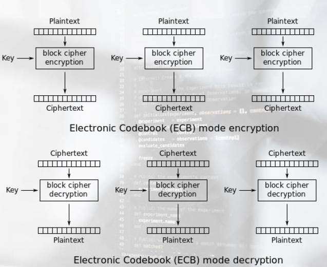

#### Cipher Block Chaining (CBC)

- CBC is a mode of operation for a block cipher
- Each block of plaintext is XORed with the previous ciphertext block before being encrypted
- An initialization vector (IV) is used to make each data unique

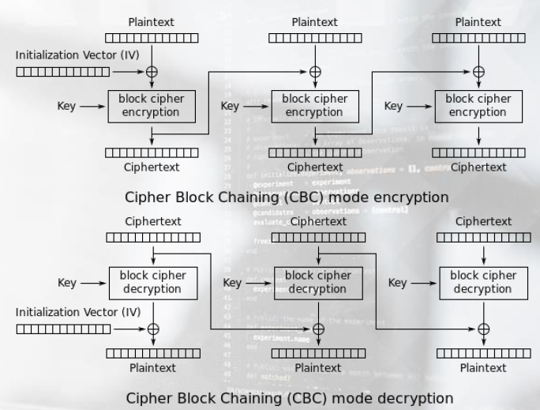

#### Padding

In block cipher mode, encryption takes place in the aforementioned fixed size blocks, and padding is used to ensure that the cleartext data (of arbitrary size) exactly fit in one or multiple blocks of fixed size input.

Padding is composed of the number of missing bytes and added into the plaintext. See an example below.

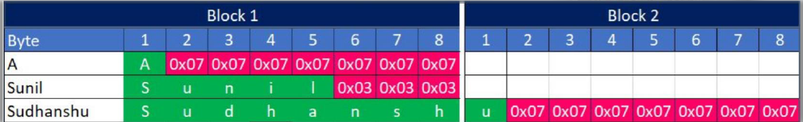

### Attacks Against Crypto

It is about time we start talking about identifying and exploiting insecure crypto implementations. The attacks against crypto implementations can be divided as follows.

- Ciphertext-Only Attack (COA)
  - The attacker has access to a set of ciphertext(s)
- Chosen-Ciphertext Attack (CCA)
  - The attacker can choose different ciphertexts to be decrypted and obtain the corresponding plain text
- Known Plaintext Attack (KPA)
  - The attacker knows the plaintext and its encrypted version (ciphertext)
- Chosen Plaintext Attack (CPA)
  - The attacker can encrypt plaintexts of his choice

## Insecure Password Reset
### Known Plaintext Attack Scenario

The first attack scenario we will cover is an insecure password reset implementation (thanks to NotSoSecure for the demo code and application).

Under the hood, the user’s email id is used and encrypted by the application to generate a password reset token. See the encryption implementation on your right ( AES encryption in ECB mode

### Exploitation

The aforementioned encryption implementation is unfortunately insecure, since it generates the same ciphertext for a given plaintext, not taking into account the "location"

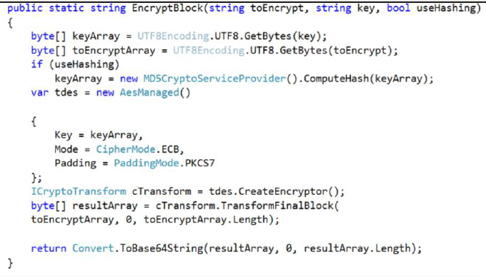

The above means that if an attacker wants to takeover the account sunil@notsosecure.com , he can register email
addresses such as bbbbbbbbbbbbbbbb sunil@notsosecure.com and xxxxxxxxxxxxxxxx sunil@notsosecure.com and then request for a password reset.

Due to the insecure encryption, the attacker will take the common portion from the received tokens, which will be a perfectly valid password reset token for sunil@notsosecure.com and successfully reset the targeted account’s password.

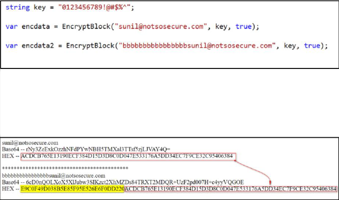

Even if you are not aware of the encryption being employed under the hood, make sure you try this method during your penetration tests.

As you may have already guessed we have just performed a Known Plaintext Attack (KPA) since we were in the position of knowing both the plaintext and the ciphertext.

## Padding Oracle Attack
### What is a Padding Oracle?

In Web Application Penetration Testing, an Oracle is any application functionality, error message or behavior that can reveal valuable information (as a response to different input) .

When it comes to attacks against crypto, one of the most known Oracle based attacks is the [Padding Oracle attack](https://robertheaton.com/2013/07/29/padding-oracle-attack/) , that leverages proper and improper padding as a means of gaining application information.

Specifically, [Padding Oracle attacks](https://seffyvon.github.io/cryptography/2014/08/20/CBC-Padding-Oracle-Attacks/) target CBC mode decryption functions operating with PKCS7 mode padding. A Padding Oracle can reveal if the padding is correct for a given ciphertext.

At this point we should also mention **Intermediate Values**.

Intermediate values are the output of the block cipher during the block cipher process.

Essentially, they can be seen as the state of a ciphertext block after decryption and before the XOR operation with the previous ciphertext block.

Once intermediate bytes are found, deciphering the plaintext of the corresponding ciphertext is easy.

### Padding Oracle Attack Scenario

Let’s now go through a Padding Oracle attack scenario against Apache Shiro.

Apache Shiro is a powerful and easy to use Java security framework that has functions to perform authentication, authorization, password, and session management.

Older Shiro versions suffered from a Padding Oracle vulnerability, that when chained with a another deserialization based vulnerability could result in remote code execution.

Specifically, Shiro used the AES 128 CBC mode to encrypt cookies enabling Padding Oracle attacks. (The RememberMe cookie is of interest in this case)

Shiro also used CookieRememberMeManager by default, which serialized, encrypted, and encoded the user's identity for later retrieval. See the flowchart on your right.

The Padding Oracle vulnerability can result in an attacker creating a malicious object, serializing it, encoding it and finally sending it as a cookie. Shiro will then decode and deserialize it.

Unfortunately, the deserialization implementation of the affected Shiro versions was also insecure. By chaining the Padding Oracle vulnerability with the
deserialization based one, remote code execution was possible.

The attack flow is as follows:

- First, we logged in to the website (sample credentials are provided in the log in page), checked "Remember Me" and obtained a legitimate cookie using Burp.
  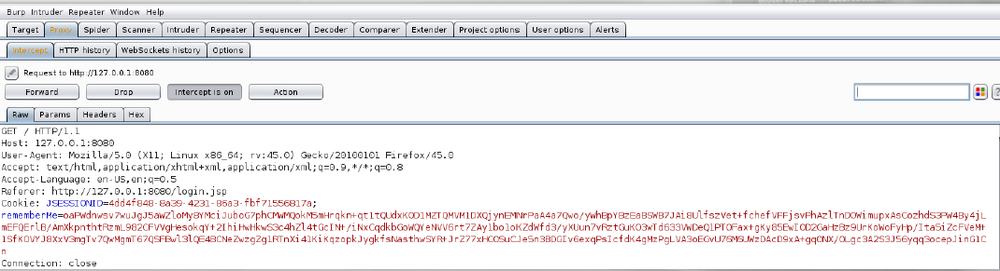

- Then, we used ysoserial to create our serialized payload (that simply creates a file named success inside the tmp directory) and save it to a file called payload.class

  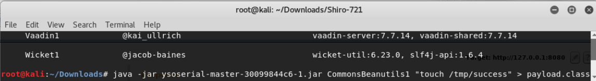

- Next, we downloaded the [publicly available exploit](https://github.com/wuppp/shiro_rce_exp/blob/master/shiro_exp.py) and used the captured rememberMe cookie as a prefix for the Padding Oracle attack, as
  follows.
  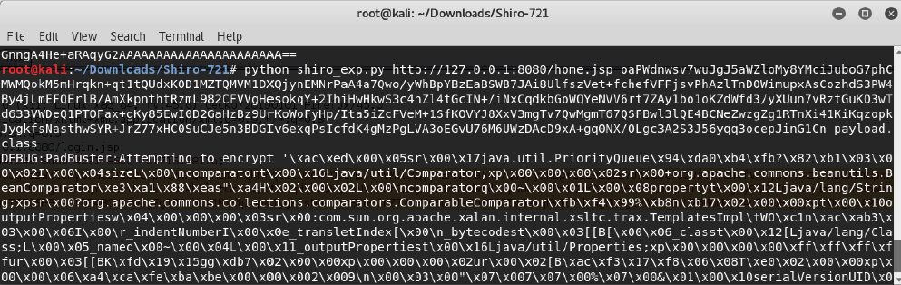

- After a couple of hours the exploit script provided us with a valid (properly encrypted due to the Padding Oracle attack) cookie containing our payload. This cookie will be deserialized by the vulnerable server.
  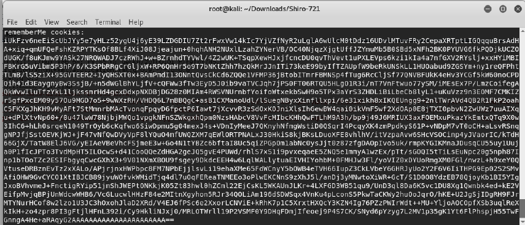

- Finally, using Burp’s Repeater, we issued a request with our crafted cookie. The result, was remote code execution. The Padding Oracle attack enabled the attack. Without it, crafting a properly encrypted cookie would not be possible.
  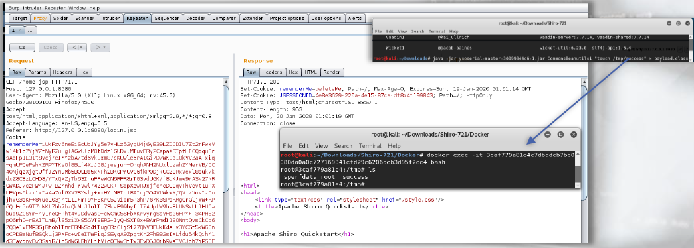

## Hash Length Extension Attack

### Hash Length Extension Attack Fundamentals

There are web applications that prepend a secret value to data, hash this value with a flawed algorithm and provides the user with both the data and the hash, but not the secret.

On the other part of the communication, the server relies on the secret for data validation purposes.

An attacker that doesn’t know the value of the secret can still generate a valid hash for {secret || data || attacker_controlled_data }}. This is possible because an attacker can pick up from where the hashing algorithm left off. The state that is needed in order to continue a hash is included in the output of the majority of the hashing algorithms. By loading that state into an appropriate hash structure, we can continue hashing.

In simpler terms, an attacker can calculate a valid hash for a message without knowing the value of the secret. He can do that by just guessing its length. Hashes are calculated in blocks and the hash of one block is the state for the next block.

The above attacker actions are known as a Hash Length Extension attack. Let’s see an example.

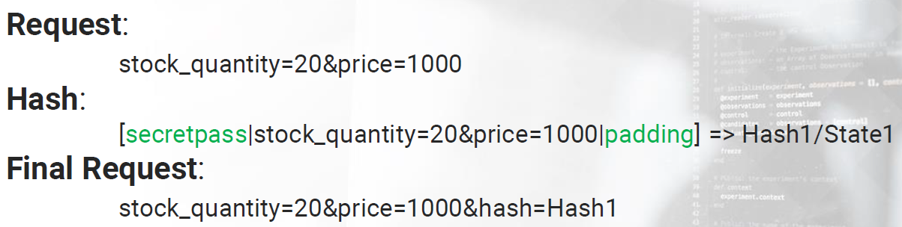

If an attacker manages to identify the length of padding, he will have all the info needed to calculate a new hash.

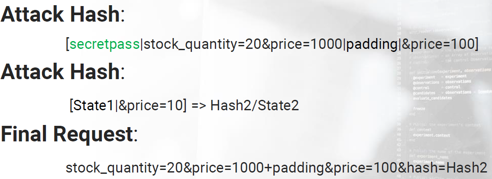

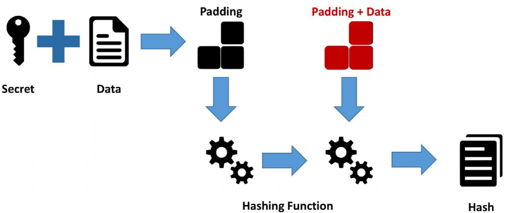

One of the best resources to dive into the calculations required during Hash Length Extension Attacks is [here](https://www.skullsecurity.org/2012/everything-you-need-to-know-about-hash-length-extension-attacks)

### Hash Length Extension Attack Scenario

Let’s now go through a Hash Length Extension attack scenario against the vulnerable [CryptOMG](https://github.com/SpiderLabs/CryptOMG) application.

Challenge 5 is what we need to witness how a Hash Length Extension can be performed.

By navigating to Challenge 5, we come across the below.

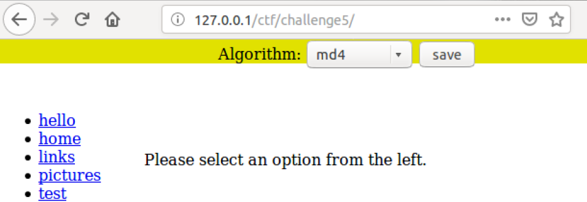

Clicking on "hello", "test" etc. and seeing both the responses and the requests makes us thing that the application "prints" the contents of local files.
By picking various algorithms we can also identify the possible parameters.

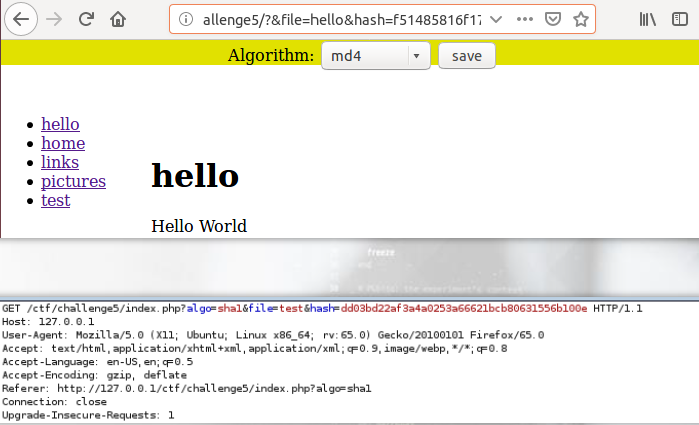

Something else that we should notice, is that regardless of the size of the file name input,
the output is the same size.

The above suggests that a hashing algorithm may be in use. This algorithm could be SHA1 (due to the fixed output length), but if we try ( echo -n pictures | sha1sum ) locally, the SHA1 sum we get is different from the one shown by the application.

We are most probably against Message Authentication Code, the application must be adding something to the hash apart from the file name. We remind 

you that during MAC a secret value is appended and the outcome is hashed.
Luckily, such an implementation is vulnerable to Hash Length Extension Attacks!

Let’s try reading the contents of /etc/passwd by executing a Hash Length Extension Attack.

As previously covered, we don’t need to know the secret value being used. We only need to successfully guess the length of the secret.

For this task we can use [hash_extender](https://github.com/iagox86/hash_extender) as follows.

- The specify a known hash value
- The specify an estimation regarding the secret’s length (between 10 and 40 bytes)
- We will have to experiment with the amount of ../../ to be used

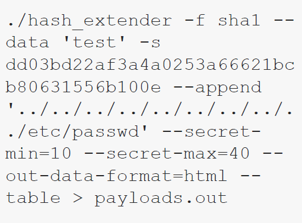

Let’s now use hash_extender’s output ( payloads.out ) inside Burp’s Intruder, in order to see if our guesses were successful. We will follow a Sniper approach, as follows.

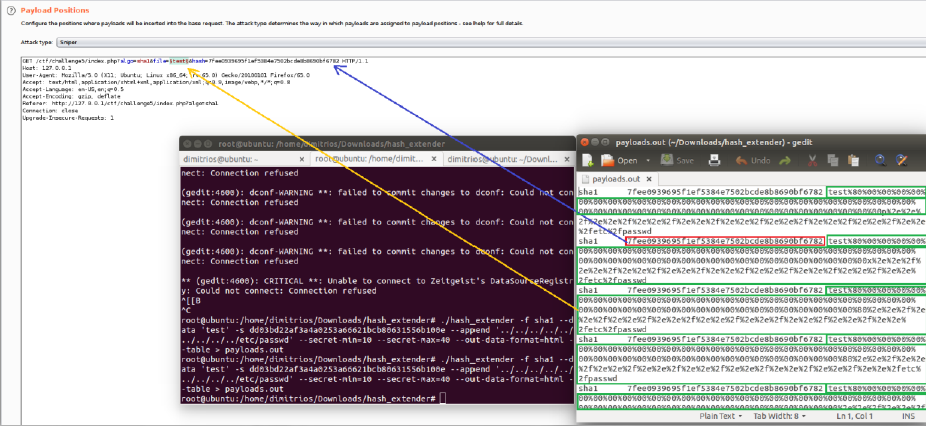

Eventually, we are able to see the content of /etc/passwd by means of a Hash Length Extension attack!

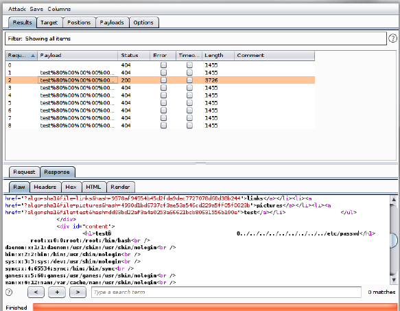

## Leveraging machineKey

### The importance of machineKey

The [Machine Key](https://learn.microsoft.com/en-us/previous-versions/dotnet/netframework-4.0/w8h3skw9(v=vs.100)?redirectedfrom=MSDN) , is the cardinal feature that is used to specify encryption settings for application services, such as view state, forms authentication and roles in a system.
Machine Key contains a set of fields like validation key, decryption key and so on where unique keys are to be entered. Specifying a machine key looks as follows.

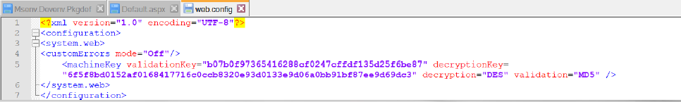

The attributes and elements of a machine key can be seen on your right.

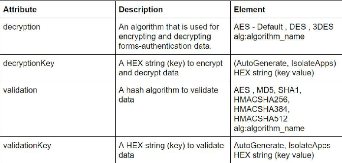

### Leveraging a leaked machineKey for RCE
Suppose we are pentesting a .NET application.

- The application offers file uploading functionality (the "aspx", ".config", ashx", asmx", aspq", axd ", cshtm", cshtml", ".rem", ".soap", vbhtm", vbhtml", "asa", ".asp" and "cer" extensions are blacklisted)
- Validation of viewstate MAC is performed (this prevents deserialization exploitation without knowing the cryptographic key machineKey)

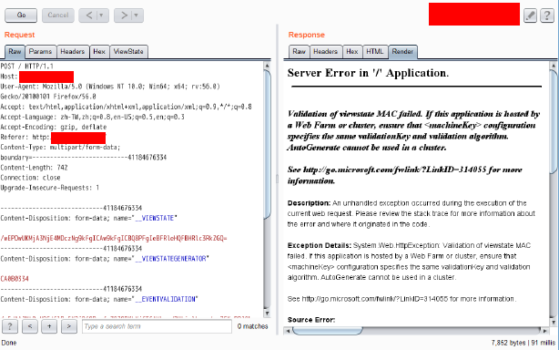

At this point, our only chance of bypassing authorization in general and achieving high impact exploitation, is by finding the machine key.

The vast majority of extensions that can help us are unfortunately black listed. That being said, the Server Side Attacks module includes nice trick that can help us move further in this situation, Server Side Include.

We can try uploading the following, in attempt to leak the machine key.

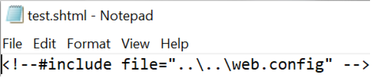

Thankfully, our attempt was successful. We got access to the web.config file (we used View Source Code to retrieve its contents).

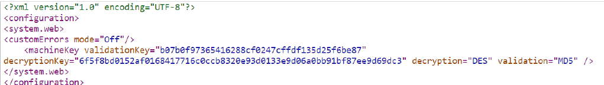

Now, the last obstacle to bypass. We need to figure out how the MAC generated and verified. To answer this we will need to dig into the code [here](https://referencesource.microsoft.com/#system.web/UI/ObjectStateFormatter.cs) (line 756- 812) and [here](https://referencesource.microsoft.com/#System.Web/Configuration/MachineKeySection.cs) (line 786 - 818 and 847-866 and 1211-1230) .

If you read the above, you will conclude to the below logic (pseudocode).
MAC_HASH = MD5(serialized_data_binary + validation_key + 0x00000000 )
VIEWSTATE = Base64_Encode(serialized_data_binary + MAC_HASH)

For the exploitation part, we will need ysoserial.net and to implement the MAC related logic of the previous slide.

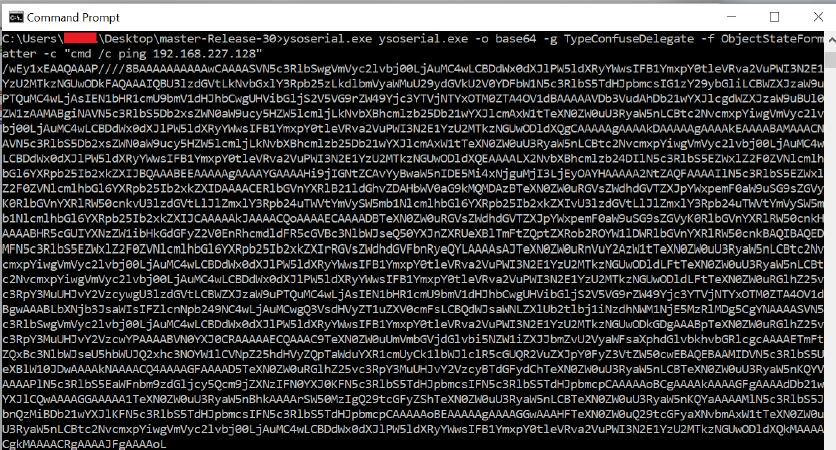

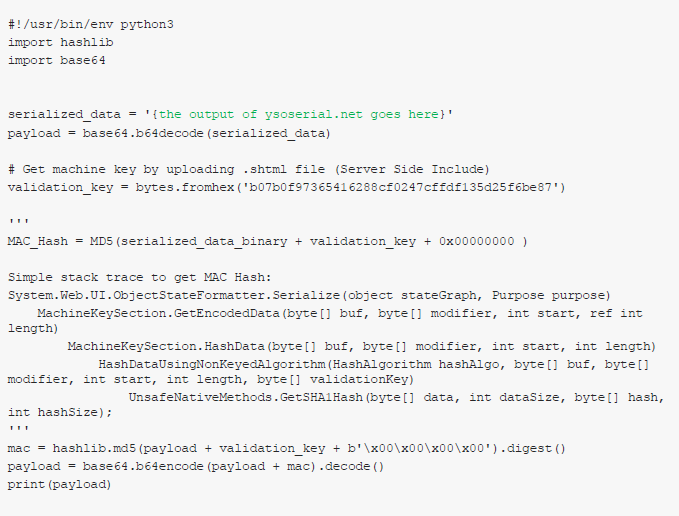

Remote code execution was achieved!

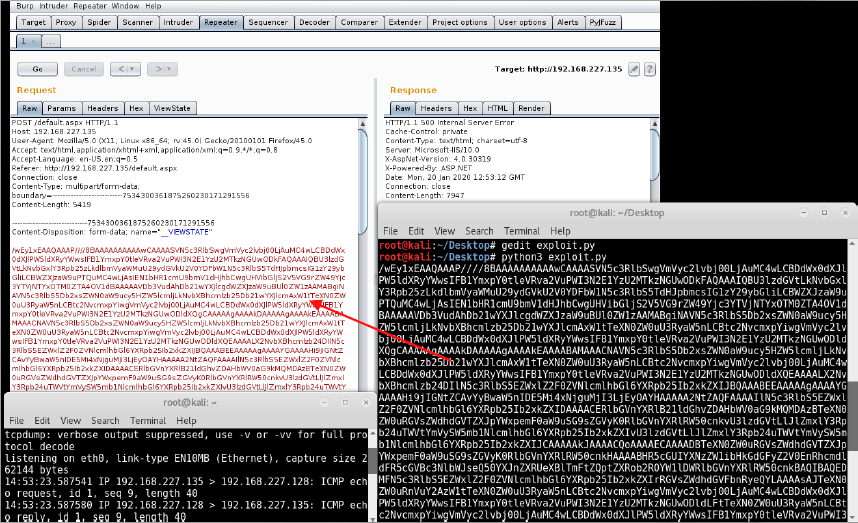

Implementing strong crypto is important, but protecting the cryptographic key is of equal importance!

