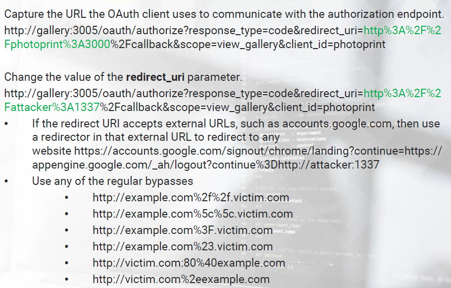
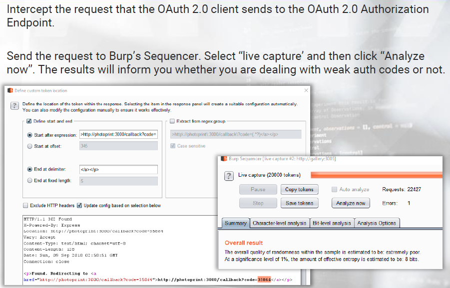
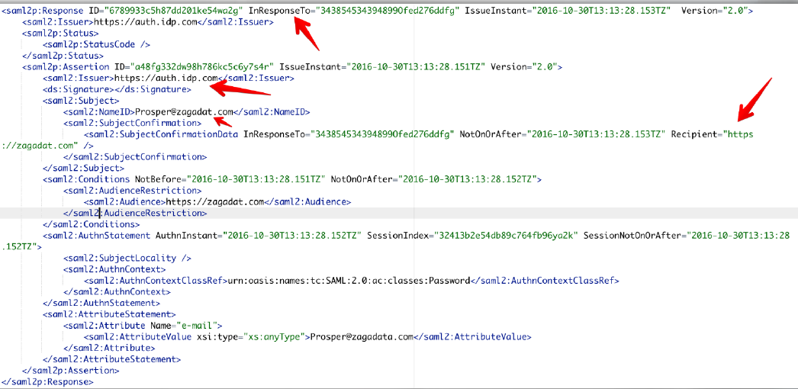

# Attacking Authentication & SSO


## Authentication in Web Apps

Authentication is the process of confirming a user's identity. Authentication in web applications is performed through user credentials and/or a secret token/pin code.


The most known attacks against authentication are:

- Brute Force / Dictionary Attack
- SQL Injection
- Weak/Predictable Session ID
- Subdomain takeover

Modern web applications utilize authentication/authorization mechanisms which provide Single Sign On (SSO) and similar features for sharing access with multiple applications.

+ JSON Web Tokens (JWT) :RFC7519: A compact mechanism used for transferring claims between two parties.

+ OAuth :RFC6749: Access delegation framework, usually used for providing application access to other applications without password sharing. OAuth 2.0 is not an authentication protocol.

- Security Assertion Markup Language (SAML) :RFC7522: An XML based single sign on login standard.


Modern web applications also utilize an extra layer of defense when it comes to authentication, 2 Factor Authentication (2FA).

2FA is a method to verify a user’s identity by utilizing a combination of two different factors.

- Something you know (password)
- Something you have (OTP)
- Something you are (biometric)


Usual 2FA Bypasses

- Brute Force (when a secret of limited length is utilized)
- Less common interfaces (mobile app, XMLRPC, API instead of web)
- Forced Browsing
- Predictable/Reusable Tokens

## Attacking JWT

### JSON Web Tokens (JWT)

- JSON Web Token (JWT) usually appear to users as JSON objects and can be signed to protect the integrity of the underlying message using a Message Authentication Code (MAC) and/or encrypted.
- When a JWT is signed you may see it referred to as JWS.
- A JWT consists of three parts; an encoded Header, an encoded Payload and the Signature.
- The header contains info about the token.
- The payload contains the actual data
- For the signature to be created we need to encode both the header and the payload using Base64 URL encoding, then we combine them with a dot (.).


To sign an unsigned token, the process is as follows.

unsignedToken = encodeBase64(header) + '.' + encodeBase64(payload)

signature_encoded = encodeBase64(HMAC-SHA256("secret", unsignedToken))

jwt_token = encodeBase64(header) + "." + encodeBase64(payload) + "." + signature_encoded


#### JWT Security Facts

- JWT is not vulnerable to CSRF (except when JWT is put in a cookie)
- Session theft through an XSS attack is possible when JWT is used
- Improper token storage (HTML5 storage/cookie)
- Sometimes the key is weak and can be brute forced
- Faulty token expiration
- JWT can be used as Bearer token in a custom authorization header
- JWT is being used for stateless applications. JWT usage results in no server side storage and database based session management. All info is put inside a signed JWT token.
  - Only relying on the secret key
  - Logging out or invalidating specific users is not possible due to the above stateless approach. The same signing key is used for everyone.
- JWT based authentication can become insecure when client side data inside the JWT are blindly trusted
  - Many apps blindly accept the data contained in the payload (no signature verification)
    - Try submitting various injection related strings
    - Try changing a user’s role to admin etc.
- Many apps have no problem accepting an empty signature (effectively no signature )
  - The above is also known as "The admin party in JWT"
  - This is by design, to support cases when tokens have already been verified through another way
  - When assessing JWT endpoints set the alg to none and specify anything in the payload


An interesting resource that consolidates a lot of JWT security information [here](An interesting resource that consolidates a lot of JWT
security information is the below.)


There is a variety of tools for assessing/attacking JWT. For example jwt_tool and [jwtear](https://github.com/KINGSABRI/jwtear)

HMAC SHA256 signed token creation example:

```bash
jwtear --generate-token --header '{"typ":"JWT","alg":"HS256"}' --payload '{"login":"admin"}' --key 'cr@zyp@ss'
```


Empty signature token creating example:

```bash
jwtear --generate-token --header '{"typ":"JWT","alg":"none"}' --payload '{"login":"admin"}' 
```


Testing for injection example:

```bash
jwtear --generate-token --header '{"typ":"JWT","alg":"none"}' --payload $'{"login":"admin\' or \'a\'=\'a"}' 
```

`$` is used to escape single quotes.


#### JWT Attack Scenario 

When attacking authentication through an XSS vulnerability, we usually try to capture a victim’s cookie as follows.

```html
<script>alert(1)</script>
```


When JWT is employed and localStorage is used, we can attack authentication through XSS using JSON.stringify

```html

```

If you obtain an IdToken , you can use it to authenticate and impersonate the victim.

If you obtain an accessToken , you can use it to generate a new IdToken with the help of the authentication endpoint.


## Attacking Oauth

### OAuth

OAuth2 is the main web standard for authorization between services. It is used to authorize 3rd party apps to access services or data from a provider with which you have an account.


**OAuth Components**

- **Resource Owner :** the entity that can grant access to a protected resource. Typically this is the end user.
- **Client :** an application requesting access to a protected resource on behalf of the Resource Owner. This is also called a Relying Party.
- **Resource Server :** the server hosting the protected resources. This is the API you want to access, in our case gallery.
- **Authorization Server :** the server that authenticates the Resource Owner, and issues access tokens after getting proper authorization. This is also called an identity provider ( IdP )
- **User Agent :** the agent used by the Resource Owner to interact with the Client, for example a browser or a mobile application.


OAuth Scopes (actions or privilege requested from the service visible through the scope parameter)

- Read
- Write
- Access Contacts


In OAuth 2.0, the interactions between the user and her browser, the Authorization Server, and the Resource Server can be performed in four different flows.

1. The **authorization code grant** : the Client redirects the user (Resource Owner) to an Authorization Server to ask the user whether the Client can access her Resources. After the user confirms, the Client obtains an Authorization Code that the Client can exchange for an Access Token. This Access Token enables the Client to access the Resources of the Resource Owner.
2. The **implicit grant** is a simplification of the authorization code grant. The Client obtains the Access Token directly rather than being issued an Authorization Code.
3. The **resource owner password credentials grant** enables the Client to obtain an Access Token by using the username and password of the Resource Owner.
4. The **client credentials grant** enables the Client to obtain an Access Token by using its own credentials.


- Clients can obtain Access Tokens via four different flows.
- Clients use these access tokens to access an API.
- The access token is almost always a bearer token.
- Some applications use JWT as access tokens.


#### Common OAuth Attacks

Let’s now go through the most common OAuth attacks.

- We have a web site that enables users to manage pictures, named gallery similar to flickr

- We have a third party website that allows users to print the pictures hosted at the gallery site, named photoprint

OAuth takes care of giving third party applications permission to access the pictures.

We will focus on the most common attacks, for more please refer to https://tools.ietf.org/html/rfc6819


**Unvalidated RedirectURI Parameter**

If the authorization server does not validate that the redirect URI belongs to the client, it is susceptible to two types of attacks.

- Open Redirect
- Account hijacking by stealing authorization codes. If an attacker redirects to a site under their control, the authorization code which is part of the URI is given to them. They may be able to exchange it for an access token and thus get access to the user's resources.




**Weak Authorization Codes**
If the authorization codes are weak, an attacker may be able to guess them at the token endpoint. This is especially true if the client secret is compromised, not used, or not validated.




**Everlasting Authorization Codes**
Expiring unused authorization codes limits the window in which an attacker can use captured or guessed authorization codes, but that’s not always the case.


**Authorization Codes Not Bound to Client**
An attacker can exchange captured or guessed authorization codes for access tokens by using the credentials for another, potentially malicious, client.


**Weak Handle Based Access and Refresh Tokens**
If the tokens are weak, an attacker may be able to guess them at the resource server or the token endpoint.


**Insecure Storage of Handle Based Access and Refresh Tokens**

If the handle based tokens are stored as plain text, an attacker may be able to obtain them from the database at the resource server or the token endpoint.


**Refresh Token not Bound to Client**

If the binding between a refresh token and the client is not validated, a malicious client may be able to exchange captured or guessed refresh tokens for access tokens. This is especially problematic if the application allows automatic registration of clients.


## Attacking SAML

### Security Assertion Markup Language (SAML)

In SAML based authentication the user provides credentials at a login interface. Based on these credentials the identity provider (IDP) provides a SAML response containing assertions with NameID attributes, which in turn contain user information and a signed message in XML.

The base64 encoded XML document is further passed on to the service the user needs to access. The service provider (SP) validates the provided XML and allows access to user based on the validity.

**SAML Workflow**


**SAML Response**




### SAML Security Considerations

- An attacker may interfere during step 5 in the SAML Workflow and tamper with the SAML response sent to the service provider (SP). Values of the assertions released by IDP may be replaced this way.
- An insecure SAML implementation may not verify the signature, allowing account hijacking.
- An XML canonicalization transform is employed while signing the XML document, to produce the identical signature for logically or semantically similar documents.
  - In case a canonicalization engine ignores comments and whitespaces while creating a signature the XML parser will return the last child node


Suppose that we are assessing a SAML implementation. We want to check if an attacker is able to successfully tamper with the SAML response sent to the service provider (SP). In essence, we want to check if an attacker can replace the values of the assertions released by the IDP.

So, we copy the SAMLResponse and programmatically change the username in the XML to one of an identified admin. The attack wasn’t successful.

Does this mean that the SAML implementation is secure? Let’s try performing a signature stripping attack before saying so.

During signature stripping attacks against SAML, we simply remove the value of SignatureValue (the tag remains).


All we have to do is encode everything again and submit our crafted SAMLResponse . To our surprise, the remote server accepted our crafted request letting us log in as the targeted admin user!

Have signature stripping attacks in mind, when assessing SAML implementations.

Two great resource on attacking SAML can be found below.

- https://epi052.gitlab.io/notes-to-self/blog/2019-03-07-how-to-test-saml-a-methodology/
- https://epi052.gitlab.io/notes-to-self/blog/2019-03-13-how-to-test-saml-a-methodology-part-two/
- https://epi052.gitlab.io/notes-to-self/blog/2019-03-16-how-to-test-saml-a-methodology-part-three/
- https://www.economyofmechanism.com/github-saml
- https://portswigger.net/bappstore/c61cfa893bb14db4b01775554f7b802e


## Bypassing 2FA

### 2FA Bypasses

common 2FA bypasses include:

- Brute Force (when a secret of limited length is utilized)
- Less common interfaces (mobile app, XMLRPC, API instead of web)
- Forced Browsing
- Predictable/Reusable Tokens


**How attackers usually bypass 2FA during MS Exchange attacks**

Valid credentials are not enough in case an account has Two Factor Authentication (2FA) configured. We will have to find a way to get around this protection mechanism.
Fortunately for a Red Team member, a great number of 2FA software vendors do not cover all available protocols of a solution. This was the case with Microsoft’s Exchange.

Specifically, access to OWA can be protected by 2FA but a mailbox may be accessed via EWS, without entering any 2FA derived One Time Password.
Exchange Web Services (EWS) is a remote access protocol. It is essentially SOAP over HTTP and is used prevalently across applications, Windows mobile devices etc., and especially in newer versions of Exchange.


Such an attack against Exchange can be performed using the [MailSniper](https://github.com/dafthack/MailSniper) tool, as follows ( after identifying valid credentials


