# Pentesting APIs & Cloud Applications


## Introduction to APIs

API stands for Application Programming Interface. It is a non GUI collection of endpoints in a standardized form so it can be used by human user as well as a machine. It is often accompanied by documentation that can be in both a machine and a human readable form.

There are lots of APIs, for example Windows API, remote APIs like RPC (Remote Procedure Call), but we will focus on web APIs, mainly:

- Web services (SOAP/XML)
- REST APIs (JSON)

From a technical standpoint, API differs from a website because:

- It has a standardized input/output form so that it can be scripted.
- It is language independent (it should work on each platform in the same way).
- It aims to be secure (e.g., it allows only some predefined methods).

SOAP API utilizes the Simple Object Access Protocol to define communication standard so how the request and response looks, as well as the parameters can be passed in them.


SOAP Messages (HTTP Requests) are an XML type and must contain some special elements.

- **Content type** text/xml is also allowed.
- **SOAPAction** is sometimes used just for the standard and sometimes needs to hold the called method name.

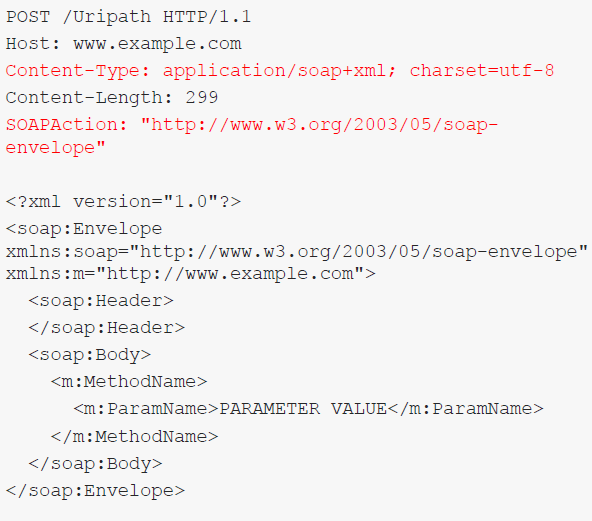


Here is the sample response which follows the SOAP standard and is in XML format.

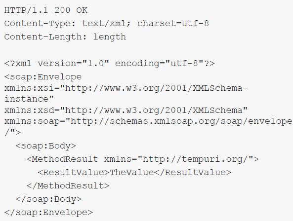


As said previously, API contains both human and machine readable documentation. For SOAP based APIs, the documentation is stored in WSDL files. Usually, these files are stored under the "?wsdl" path, for example,
https://api.example.com/api/?wsdl

You can take a look at an exemplary calculator service online at address:
http://www.dneonline.com/calculator.asmx

At the following address, http://www.dneonline.com/calculator.asmx?op=Add , you can see an exemplary SOAP request that was issued in order to speak to the calculator service.
You can also see the full WSDL file at: http://www.dneonline.com/calculator.asmx?wsdl

As you can see, reconstructing each method separately to create a valid request would be a time consuming task. To Turn the WSDL document into a working request, we can use some automated tools, which will be presented in the next chapter.

This kind of interface, equipped with documentation that can be parsed by a machine, allows us to expose a large number of methods where each of them has its own purpose.

Another type of API is REST (Representational State Transfer) APIs. Usually, the method client is about to call is in the resource path:

```http
GET /api/methodName
```


Depending on the request type, the parameters might be passed differently.

In REST APIs, HTTP methods have some special meaning:

- **GET** Read resource
- **POST** Create resource
- **PUT** Update resource
- **DELETE** Delete resource
- **PATCH** Update resource partially


Except for GET requests, API methods parameters are passed in the request body.

Remember, that the meaning of these methods is a common practice and not a requirement, so technically it is possible that a method you encounter does something different (e.g., POST is used for logging in).


An exemplary REST API request can be seen to the right:

- Path often contains the API version
- Content Type application/json header is required
- Parameters are passed as JSON array

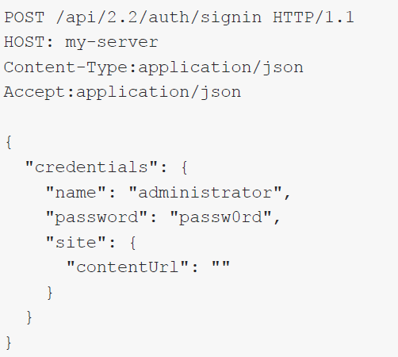


It is also often possible to pass the REST API parameters as XML, so the equivalent of the request from the previous image would look like this

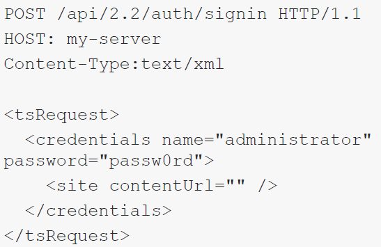


REST API also has a documentation standard called the WADL file. A sample WADL can be viewed here:
https://www.w3.org/Submission/wadl/

Similar to WSDL, we will shortly present tools that help to parse the lengthy file in order not to rewrite all the methods manually.

In order to make developer’s (and penetration testers’) lives easier, some APIs include a more human friendly API representation. For example, a very popular API engine named Swagger is often found with its demo page, which contains forms with description and possibility to issue a request to each method.

You can see sample Swagger API here: https://swagger.io/tools/swagger-ui/.


## API Testing & Attacking

APIs are built in a way that one request path (one endpoint ) allows us to call one method (execute one type of action).

The path we are requesting is an abstract mapping to some resources; that means, when requesting the endpoint `/api/v3/methodName` , it does not reflect file/directory structure on the server.

The request is processed by a special component that maps the path to certain operation handlers and not to physical file/directory resources.

However, do not be discouraged from using your favorite content discovery tools on the API enabled server. Some server paths can be mapped to the API routines, but still, some requests can be handled by the server in an original way allowing it to expose files and directories to the user.

It is possible than when you request `/api /anything` then every character past „anything” is parsed by the API engine, but you can still find interesting files on the server under, for example `/version.txt`
Regardless of the fact that APIs make use of predefined methods, you should be aware that there can still be vulnerabilities related to:

- Parameters to these predefined functions
- The API parsing itself
- Access to sensitive methods


First, as you encounter an API during a penetration test, you should focus on the proper reconnaissance of the API interface, which includes:

- What is the API name and version? Is it a custom implementation or, for example, an open source product?
- Is there any online documentation available? Are there any interesting methods?
- Does the documentation exist on the target server ( ?wsdl , ?wadl , or simailar )
- Does the API require authentication, or is publicly available?
- If there is both local and public documentation for an API, do they match? Maybe some methods were hidden from local users (typically ones that allow insecure operations).


Your purpose is to gather as many API endpoints as possible and to be able to speak to them. You should also be able to get the WSDL/WADL file for further testing.

Reconstructing API calls from a raw WSDL/WADL file would be time consuming, so a proper tool might help you to do it faster. For API testing and parsing WSDL/WADL files into a ready to use method set, you might want to use **Postman**, the free edition of **SOAPUI** , or the Burp Pro extension called **WSDLer**

You can download a standalone installer of SoapUI from its [homepage](https://www.soapui.org/downloads/latest-release/) .We will present its usage on Kali Linux.

SoapUI can be launched from its default location `/usr /local/bin/SoapUI-5.5.0`
Otherwise, use the "$ locate SoapUI" command to find the software.

As the software is launched, you can first connect it to the proxy, in this case, the burpsuite instance. This way, you will be able to replay and change requests issued to the API. To set up the proxy, you need to go to File >> Preferences >> Proxy Settings and point it to the burp instance.

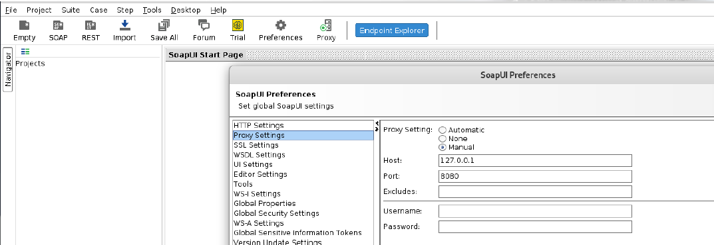


You can then switch the proxying on and off by clicking the Proxy button on the upper menu.

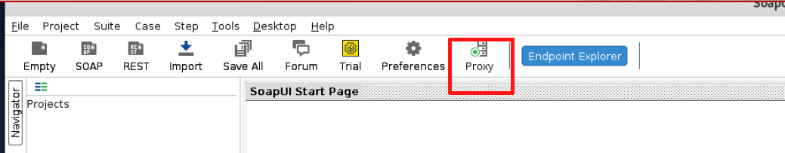


Let’s now try to parse the sample WSDL/WADL file. There are sample files shipped with the software itself.

In order to load a WSDL (for SOAP) or WADL (for REST), click the respective buttons in the SoapUI on the upper menu.

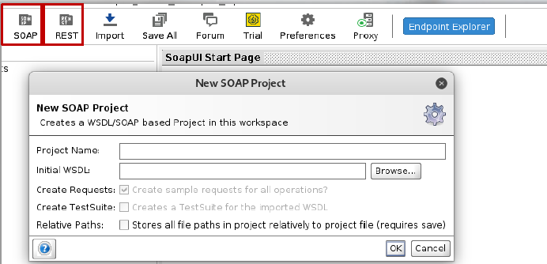


By default, you can find example WSDL/WADL files in `/root/SoapUI-Tutorials/WSDL-WADL/`

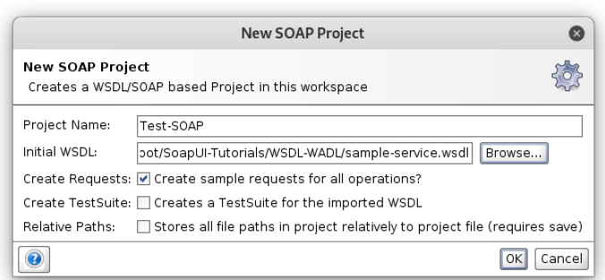


If you now click on a tree node and then double click on "Request", a request window will appear. In this case, we are viewing the "login" method.

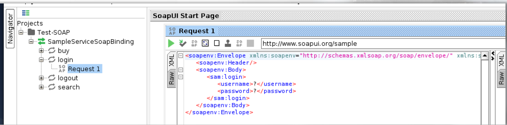


The method can be found in the WSDL file as well. SoapUI automatically fills argument placeholders with "?". It is you who should decide what to fill in there. In that case, we see that the application expects the argument of type "String".

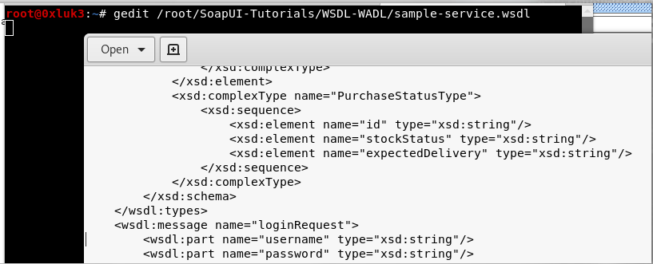


If you press the green button, the request will be issued and, in this case, will be proxied through Burp Suite.

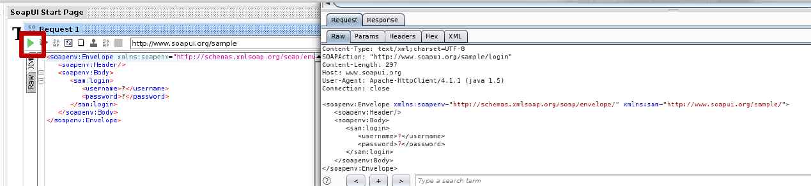


Testing REST APIs can be done exactly in the same way; the difference is you import a WADL file instead of WSDL.

So, once you encounter a WSDL on the web application, you can copy its source (Open it in a browser, go to Source, and select all >> copy & paste to a file) and import it to SoapUI.

Remember that API is another transport mechanism for some information that is sent to the API Consumer (i.e., the application back end).

With this in mind, you can try to tamper with everything that is transported by the API - for example, in case of a request similar to the previously presented one, you are free to check if the username or passwords field is vulnerable to injection attacks.

Here we see what a sample request might look like.

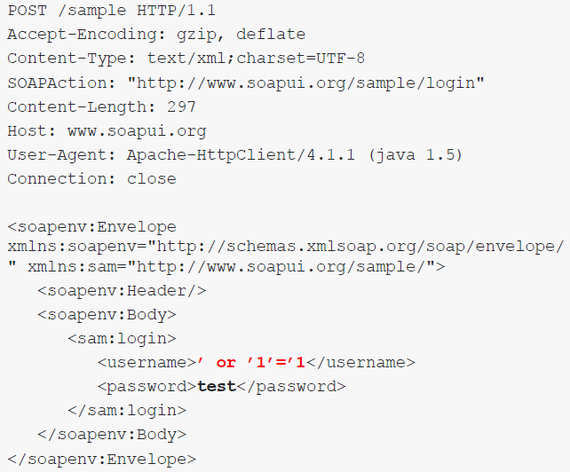


Of course, the API implementation itself might be vulnerable to XXE attacks; however, modern APIs usually disallow DTD declarations.

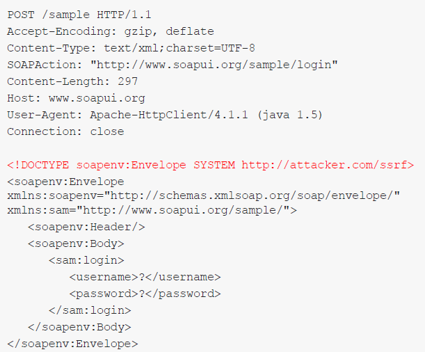


Basically, you are free to tamper with any of the API parameters as long as the SOAP message structure is correct.
In case you want to smuggle XML style data, you can wrap them up in CDATA tags (XML comments), so the SOAP message is valid.

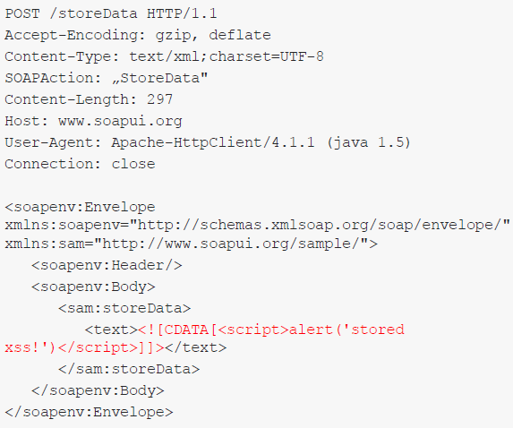


## API Access Control

In larger APIs, not every method is designed to be used by each user. For example, the most common split is between read only users and read+write users. The latter has the possibility to modify the contents of the API backend.

In APIs, you will rarely see cookies being used. More often, the authentication mechanism will be basic authorization or a kind of token it can be a pre-generated token that will be equivalent of a cookie, for example in the form of a header, like `X-Api-Token: adk32Kds38au39aU0s`

Due to API requirements some specific content types or custom headers are used along with the non cookie authentication, as they are less likely to be vulnerable to Cross Site Request Forgery attacks.

However, what often is found in the APIs is broken access control. For example, Authorization Bypasses are very common.

In order to test an API in a complex way for Access control flaws, one needs to:

- Prepare a working request to each API endpoint
- Generate a token (or authorization header) for each of the API users
- Combine each API request with each token to see which will work and which do not
- Remember to test each request, also without any token

Again, such test cases might be generated using SoapUI, which allows us to issue a request to each API endpoint. Also, as a reminder, double check if the API implementation uses all the methods provided by the original version.

API tokens are susceptible to vulnerabilities commonly diagnosed in session cookies, for example:

- Low entropy or predictable value
- Lack of invalidation
- Possible token leaks from the application infrastructure or possibility to generate tokens in advance

Specific tokens that might grant you access to an API interface are JWT tokens, as well as the so called Bearer Authentication.


## Resource Sharing

As APIs are often used both by humans and machines, the latter have to be able to read the API results using scripted solutions.

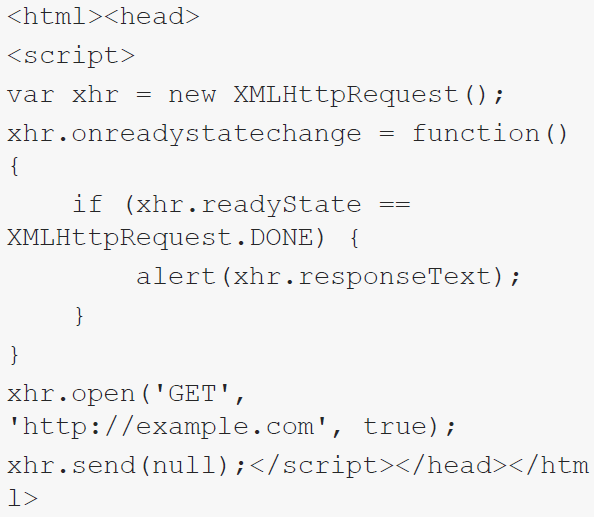


If you now try to receive the response content of the example.com page, it will be blocked by the browser.

Accordingly, if someone enters a site with a similar script and the response content will be attempted to be sent instead of just displayed, the same constraint appears. It will not be possible for the client side javascript to read the response due to Same Origin Policy restrictions.

As APIs are meant to be also accessed by automated agents in order to lose SOP constraints a bit, the Cross-Origin Resource Sharing standard was implemented.

Simply put, CORS can add some exceptions to SOP by specifying some special headers in the server response.

We will be interested in two of these headers:

- Access-Control-Allow-Origin: [value]
- Access-Control-Allow-Credentials: [true/false]

The first one specifies a domain that can access a certain website’s response, while the second one specifies if it is possible to add credentialing information (e.g., Cookies) to the request.

Access-Control-Allow-Origin value can be a domain, a wildcard, or null.

A wildcard means that a script hosted on any domain can access a response from that webpage.

A certain domain value means that scripts (or any other user) from that domain can access the response.

For example, if the page victim.com sends back the header Access Control Allow Origin: example.com , that means that if an XHR requesting victim.com script is hosted on example.com , and if the user visits example.com , the script will access victim.com as that user and receive the response.

However, if it is a static page, then nothing special happens unless the victim.com allows another header Access-Control-Allow-Credentials: true

In that case, if the user is logged on on victim.com and visits the mentioned script on example.com , victim.com will be visited in the context of logged in users (the cookies will be sent with an XHR request) and restricted content can be stolen!

Browsers by default block responses if a site is overly permissive if they allow wildcard origin together with credentials).

In that case, if the user is logged on on victim.com and visits the mentioned script on example.com , victim.com will be visited in the context of logged in users (the cookies will be sent with an XHR request) and restricted content can be stolen!

Browsers by default block responses if a site is overly permissive if they allow wildcard origin together with credentials).

Trust with credentials to the arbitrary origin is a common vulnerability, not only in APIs. That means if a page is accessible only for logged in users and it trusts the arbitrary origin, an exploit script can be hosted on an attacker controlled domain. Once visited by a user logged in on the target website, it can steal sensitive information - user data or CSRF tokens.

Let’s take a look at a simple exploitation case. We will issue a similar XHR request to a CORS enabled page.

A file is hosted on a php enabled apache server:

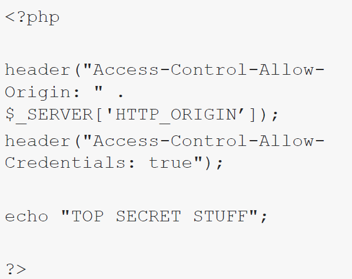


If you now navigate to that page while using Burp Suite as a proxy, you can observe how it reacts to a custom "Origin" header.

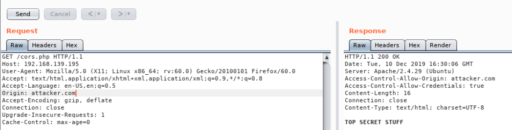


The XHR script is now modified and example.com is replaced with the CORS enabled page:

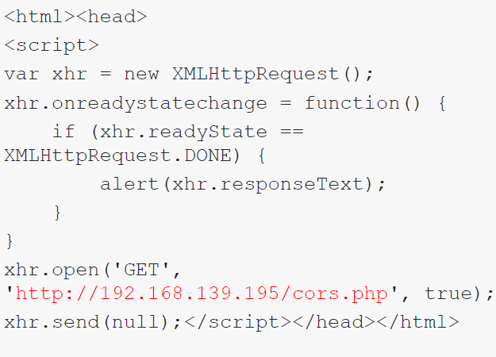

You can now observe that access to the response was gained. In an exploitation scenario, you may instead want to send this data to your controlled server in a similar way that you would steal a cookie using an XSS vulnerability.

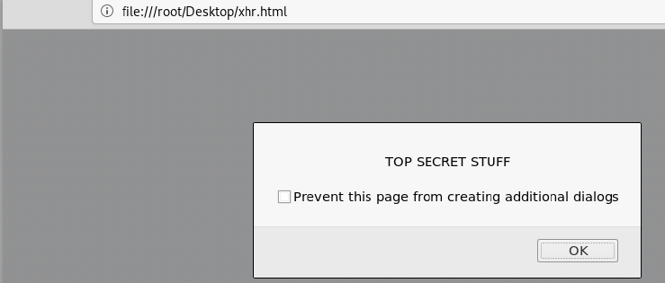


## Attacking Cloud Based Applications

Different cloud providers have different vulnerabilities or default configurations that can be abused from a penetration testing perspective, offering a whole new attack surface.

### Microservices
Different architectures and design evolution:
**Monolithic design:** One server is used for holding the web application and needed services such as databases. This offers an easy setup and ease of maintenance at a relatively cheap price but introduces several disadvantages. Monolithic designs are difficult to scale and although the maintenance is relatively easy, updating the server could cause downtimes and having a single point of failure can be a disaster if there is no backup plan in place.

**Tiered Monolithic:** Services are separated, the web server is holding the web application while a different server is holding the database or required services. Tiered monolithic architecture offers the possibility of performing updates without downtime and if servers are clustered and load balanced the performance improves over the previous approach. Tiered monolithic designs are still hard to scale this is something that cannot be automated and if the cluster itself can be a single point of failure that can only be recovered from backups in case a disaster occurs.

**Cloud solutions:** Cloud solutions are build into elastic servers or services. This means horizontal scaling is possible to implement and fully automate, giving a better performance as new instances are created based on the resources needed. Updates can also be performed without downtime and disasters do not involve backups in most of the cases. Although there are a lot of advantages over the previous designs, there are still problems at the application layer as it is still one big codebase (monolithic) and costs can be hard to foreseen depending on the services needed.


### S3 Buckets

Simple Storage Service (S3) is an AWS scalable and distributed file system. These filesystems root folder are referred as buckets while everything else (files, subfolders) are referred as objects. Misconfigured S3 buckets have been the principal cause of many information leaks and attacks against organizations.

Common S3 attacks consist in unauthorized access to objects. These attacks often gives the capability of modifying and creating new objects and changing existing policies and permissions on S3 buckets.

#### Tool: s3recon

Automating the discovery of misconfigured buckets can be done using [S3Recon](https://github.com/clarketm/s3recon) . Instructions on how to clone and install the tool are provided in the Github repository.

Python pip can be used to install S3Recon, although you might be aware of missing dependencies during the process and install them too.

```bash
pip install s3recon
pip3 install pymongo
```


S3Recon needs a wordlist, there is one in the Github repository or a personalized one can be created based on your needs. At this moment the one from the repository will be used.

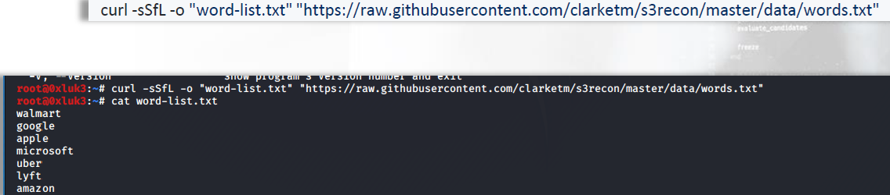


Running S3 recon with the wordlist file can be done with the following command:

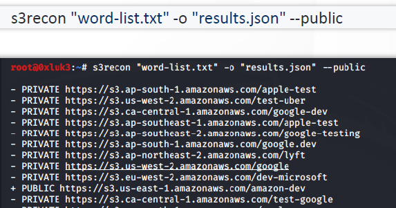

Buckets marked as "public" could give access to restricted content. Objects could be accessed via aws-cli.


S3Recon can be integrated with MongoDB for scraping large results. This proves useful in bug bounty programs where any assets belonging to the company are within the scope.


### S3 AWS Signed URLs

AWS Signed URLS can be used to give objects temporary access. Any user having this URL will be able to download the object for a limited time. They are commonly used by streaming providers.

When trying to reach any off these URLs, an "AccessDenied" error will appear because the bucket has been set as private.

Using aws cli, you should be able to access these objects once it has been configured via ” aws-cli configure” command. Files can be copied using 

```
aws-cli cp <S3URI> <LOCAPATH>
```

