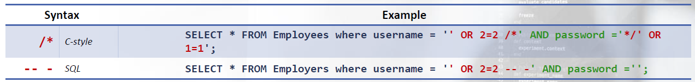
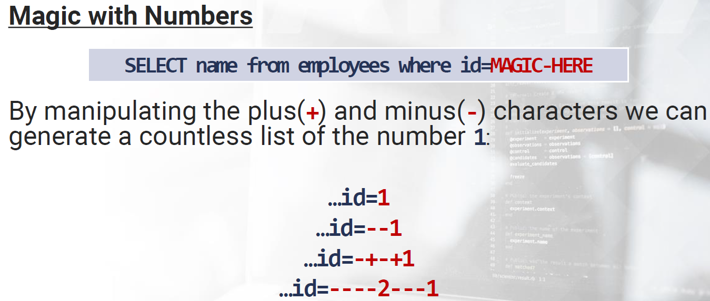

# SQLi - Filter Evasion and WAF Bypassing


## DBMS Gadgets

### Comments

Comments are useful to developers for clarifying particular SQL statements.

They are often used for commenting a portion of code during developer testing; however, for our purposes, there are two specific use cases: commenting out the query and obfuscating portions of our code.


#### MySQL

MySQL comments syntax defines 3 official comment styles in conjunction with another unofficial technique. We can see these listed in the table below:


#### MSSQL

SQL Server defines two official comment styles and like MySQL’s documentation, an unofficial one as well:


#### Oracle

In Oracle , a comment can appear between any keywords, parameters, or punctuation marks in a statement. You can include a comment in a statement in two ways:




### Functions and Operators

One of the most important elements programming languages contain are operators. They are constructs which behave generally like functions, but which differ syntactically or  semantically from usual functions. They are nothing more than symbols that tell the compiler to perform specific manipulations.

These manipulations can be asked to perform arithmetic operations ( 1+2 , 1*2 , …), logical, comparison, assignment and many other operations. Let's take a look at the main operators and why they can be useful in our evasion techniques.

#### MySQL

Here, we can find the defined MySQL Functions and Operators . For our purposes, if we are dealing with numbers and comparisons, the most useful “gadgets” are the Arithmetic operators in conjunction with Bit Functions .




#### Oracle


### Intermediary Characters

Blank spaces are useful in separating functions, operators, declarations, and so forth, basically intermediary characters.

#### MySQL


#### Oracle


The characters we've seen in the previous examples are UNIVERSAL " because they can be used everywhere in a query without breaking it. In addition, there are other characters that can be used is specific places.


#### MySQL/MSSQL/Oracle


### Constants and Variables

Every SQL implementation has its own Reserved Words (aka Constants). Within the SQL query these words require special treatment (e.g. SELECT).


For evasion purposes, knowing the SQL keywords is a must. This is due to the fact that they are part of the underlying language; therefore, they can be extremely useful during the generation of strings, comparisons, etc.


Another precious resource are system variables. Every DBMS maintains these in order to indicate its configuration. Usually these variables have a default value, and some of them can be changed dynamically at runtime.


#### MySQL

The list of Reserved Words in MySQL is defined [here](https://dev.mysql.com/doc/refman/8.4/en/keywords.html). It's important to note that since MySQL 4 1 it is no longer possible to obfuscate these keywords

Previously, in order to obfuscate the SELECT keyword, we could use techniques like `S/**/EL/**/ECT` combined with other creative derivatives manipulations

Since there are no eval like functions in the more modern MySQL systems, the only way to " keywords is by manipulating upper/lower case variations like `sELeCt`, `SELect` etc


**System Variables**

In addition to the online reference, if we wish to show the list of [MySQL Server System Variables](https://dev.mysql.com/doc/refman/5.7/en/server-system-variables.html) (in order to see the current values used by a running server), we can use the following statement

```sql
SHOW VARIABLES
```


Do you remember `@@version` !? The list of system variables is extremely large and if you wish to retrieve a specific value just add two `@@` before the variable name. For example, in `ft_boolean_syntax` we can retrieve the list of operators supported by the Boolean full text search feature.


**User Variables**
If we want to define a custom variable, then we need the following notation:

```sql
SET @myvar={expression}
SET @myvar:={expression}
```


#### MSSQL

In MSSQL, the list of Reserved Keywords is defined [here](https://learn.microsoft.com/en-us/sql/t-sql/language-elements/reserved-keywords-transact-sql?view=sql-server-ver16&redirectedfrom=MSDN) and, as you will see, this list displays not only SQL reserved words, but also system functions.

**System Variables**

In MSSQL information about configuration and more is organized as [Built in Functions](https://learn.microsoft.com/en-us/previous-versions/sql/sql-server-2012/ms174318(v=sql.110)?redirectedfrom=MSDN) There are primarily four types of functions and the ones that are much closer to variables are the Scalar Functions

For example, `@@version` is a scalar function that returns information about the current configuration (the version, build date, OS, etc )


#### Oracle

Oracle however, has a [particular management of Words](https://docs.oracle.com/cd/B10501_01/appdev.920/a42525/apb.htm)

There are the both Reserved Words the words that cannot be redefined, and Keywords words always important but can be redefined by the user

For example, we can create a table DATABASE because the keyword is not Reserved; see below:

```sql
CREATE TABLE DATABASE (id number);
```


### Strings

In SQL context, another important rule is represented by Strings and that everything, except for numerical values, must be passed to a database query as a string. Naturally, strings need to be delimited in some way and respectively, these characters need to be escaped as required.
Let's see some techniques that are helpful in the creation, manipulation and, of course, obfuscation of strings.

#### Regular Notations

In MySQL , to define a string we can use two types of quotes: single quote (') and double quote (").


Furthermore, we can also define string literals with the following character set:

```sql
_latin1'string'
```


The character set that can be used has approximately 40 possible values and you can use any of them preceded by an underscore character.


[The National Character Set](https://dev.mysql.com/doc/refman/5.7/en/charset-national.html)


#### Unicode

MySQL supports different collations and, of course, there is also Unicode.

One of the interesting quirks of MySQL is documented here: [Examples of the Effect of Collation](https://dev.mysql.com/doc/refman/8.4/en/charset-collation-effect.html)


#### Escaping

[special characters used to escape](https://dev.mysql.com/doc/refman/8.0/en/string-literals.html)


#### Concatenation

We have seen how to generate strings; now, let's look at string concatenation. For quoted strings, concatenation can be performed by placing the strings next to each other, as we see in the following example:


As an alternative, we can use the functions [CONCAT](https://dev.mysql.com/doc/refman/5.7/en/string-functions.html#function_concat) and [CONCAT_WS](https://dev.mysql.com/doc/refman/5.7/en/string-functions.html#function_concat-ws), where the WS stands for With Separator and is the first parameter of the function:


It is not documented, but it is possible to concatenate quoted strings by mixing comments in C style notation:


In SQL Server the concatenation can be done by using both the + operator and the function CONCAT


In addition, we can obfuscate by using C style comments:


In Oracle , the [Concatenation Operator](https://docs.oracle.com/cd/B28359_01/server.111/b28286/operators003.htm#SQLRF51156) is and, from the function perspective, we can use [CONCAT](https://docs.oracle.com/cd/B28359_01/server.111/b28286/functions026.htm#SQLRF00619) and [NVL](https://docs.oracle.com/cd/B28359_01/server.111/b28286/functions110.htm#SQLRF00684) . Both functions expect only two parameters; see below:


Obfuscating the string concatenation by using comments can also be done in Oracle


#### Integers

Numbers rule the world and also the filters. Typically, we use digits to represent numbers; however, there are other interesting and useful methods used during the obfuscation process.

A generic example that can be useful in understanding how to construct a number is using the PI function. This function returns the value of π ( pi 3.141593…) We can use this result mixed with either FLOOR and obtain the value 3 , or with CEIL and obtain the value 4

We can continue using system functions like version() and obtain 5 6 or also continue to perform arithmetic operations.

For example, we can do ceil(pi()*3) to obtain the number 10


#### MySQL Type Conversion

In MySQL , there is a special behavior when combining arithmetic operations with different types. It's very similar to what we already seen in previous modules with JavaScript and PHP.

Let's take a look at some examples.


**Numbers vs Booleans**

Something that you are probably already familiar with are the implicit type conversions when comparing Numbers to Booleans:


**Strings vs Numbers vs Booleans**

The same is true if we try to compare either Strings to Numbers or if we use Operators:


**Bypassing Authentication**

Now, put all of this together and try and think of some alternatives to the classic `x' OR 1='1` authentication bypass!


### Bypassing Keyword Filters

The first limitation that we may encounter when dealing with a filter are restriction on keywords. SQL uses well known words; therefore, “defenders” usually simply block these values.

#### Case Changing

The simplest and weakest filters are the ones that perform case sensitive checks (IE: if the filter blocks all the SELECT and select keywords).

SQL Keywords are case insensitive; therefore, these types of filters can be easily bypassed by simply changing the cases of each character:

```sql
SeLeCt
SELect
sElECt
SEleCT
```


Changing each keyword manually is a real challenge, but luckily for us, sqlmap has a tampering script for this called [randomcase.py](https://github.com/sqlmapproject/sqlmap/blob/master/tamper/randomcase.py) .
Basically, this script will replace each keyword character with random case value.


#### Using Intermediary Characters

Sometimes filters use spaces to delimit a specific keyword. In this case, as discussed in the DBMS Gadget chapter, we can use both comments instead of spaces and, depending on the DBMS version, a list of the whitespace that are not matched as spaces. See the following example below:


#### Using Alternative Techniques

We have seen comments and valid spaces as intermediary characters, but we can also use many other alternatives:


#### Circumventing by Encoding

Encoding is another handy trick we can leverage in our arsenal. It all depends on how the application processes data.

Remember that between you and the application, there are many layers, such as a proxy, firewall, etc. If some of these layers handle the encoding differently, there could be a possible bypass right in front of us.


**URL Encoding**

Usually when the requests are sent through the internet via HTTP, they are URL encoded. If the filter doesn't decode the request, it is possible to bypass it by sending a character or the entire string URL encoded.

Of course, on the other side of our attack payload, the application must decode the query before process it.


**Double URL Encoding**

If you encode a URL Encoded string, then you are performing a Double URL Encoding.

Basically, this process re-encodes the percent sign with a %25:

```
s = %73 >> %2573
```


In this case, if the filter decodes the request the first time and applies the rules, it will not find anything dangerous.

Then when the application receives the request, it will decode the contents and trigger the malicious request.
