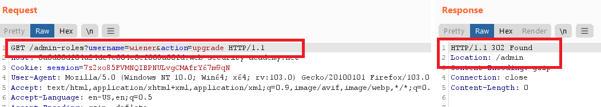

## Access control vulnerabilities


### [Unprotected admin functionality](https://portswigger.net/web-security/access-control/lab-unprotected-admin-functionality)

Goal : delete the user `carlos` by accessing the admin panel

- go to `/robots.txt` , you will find the admin panel path

- ```
  User-agent: *
  Disallow: /administrator-panel
  ```

- go to `/administrator-panel` and delete `carlos`


------


### [Unprotected admin functionality with unpredictable URL](https://portswigger.net/web-security/access-control/lab-unprotected-admin-functionality-with-unpredictable-url)

Goal : delete the user `carlos` by accessing the admin panel

- view the page source , you will find this javascript code 

````javascript
var isAdmin = false;
if (isAdmin) {
   var topLinksTag = document.getElementsByClassName("top-links")[0];
   var adminPanelTag = document.createElement('a');
   adminPanelTag.setAttribute('href', '/admin-h49xc1');
   adminPanelTag.innerText = 'Admin panel';
   topLinksTag.append(adminPanelTag);
   var pTag = document.createElement('p');
   pTag.innerText = '|';
   topLinksTag.appendChild(pTag);
}
````

- go to the admin panel `/admin-h49xc1` and delete `carlos`

 

------


### [User role controlled by request parameter](https://portswigger.net/web-security/access-control/lab-user-role-controlled-by-request-parameter)

Goal : delete the user `carlos` by accessing the admin panel

- go to `/login` , login with your credentials `wiener : peter`
- modify `Admin` in the cookies from `false` to `true`
- go to `/admin`  and delete `carlos`


------


### [User role can be modified in user profile](https://portswigger.net/web-security/access-control/lab-user-role-can-be-modified-in-user-profile)

Goal : delete the user `carlos` by accessing the admin panel

- go to `/login` , login with your credentials `wiener : peter`
- update your email , you will find that your account info are exist in the response


- send the request to burp repeater and add `"roleid" : 2` to the request


- go to `/admin`  and delete `carlos`


------


### [User ID controlled by request parameter](https://portswigger.net/web-security/access-control/lab-user-id-controlled-by-request-parameter)

Goal : obtain the API key for the user `carlos` and submit it as the solution.

- go to `/login` , login with your credentials `wiener : peter`
- click `My account`  , notice that `id` parameter is `?id=wiener `
- change `wiener` to `carlos`


------


### [User ID controlled by request parameter, with unpredictable user IDs](https://portswigger.net/web-security/access-control/lab-user-id-controlled-by-request-parameter-with-unpredictable-user-ids)

Goal : find the GUID for `carlos`, then submit his API key as the solution.

- go to `/login` , login with your credentials `wiener : peter`
- click `My account`  , notice that `id` parameter

```
/my-account?id=9afc9f90-2dc9-443d-b6e4-2bd1b5c6a2a5
```

- return to home page ,open any post that `carlos` posted and get his GUID from the url
- go to `my-account` and change your GUID with carlos 's GUID


------


### [User ID controlled by request parameter with data leakage in redirect](https://portswigger.net/web-security/access-control/lab-user-id-controlled-by-request-parameter-with-data-leakage-in-redirect)

Goal : obtain the API key for the user `carlos` and submit it as the solution.

- go to `/login` , login with your credentials `wiener : peter`
- click `My account`  , notice that `id` parameter
- change value of `id` to `carlos` , you will be redirected to the `login` page but `carlos`'s information will be exposed in the response

 


------


### [User ID controlled by request parameter with password disclosure](https://portswigger.net/web-security/access-control/lab-user-id-controlled-by-request-parameter-with-password-disclosure)

Goal : retrieve the administrator's password, then use it to delete `carlos`.

- go to `/login` , login with your credentials `wiener : peter`
- click `My account`  , notice that `id` parameter 
- change `id ` to `administrator` , change `type` in the `input` from `password` to `text` to see the password in clear text


- login with `administrator` account ,go to `admin panel` and delete `carlos`'s account


------


### [Insecure direct object references](https://portswigger.net/web-security/access-control/lab-insecure-direct-object-references)

Goal : find the password for the user `carlos`, and log into their account.

- go to `Live chat` and send any message

- click `view transcript` to download a txt file with your chat

- view it in burp and you will see that it send `GET` to `/download-transcript/2.txt`

  ```http
  GET /download-transcript/2.txt HTTP/1.1
  ```

- send the request to burp repeater and change `2.txt` to `1.txt` to see `carlos` 's chat

 


- login with `carlos` account


------


### [Method-based access control can be circumvented](https://portswigger.net/web-security/access-control/lab-method-based-access-control-can-be-circumvented)

Goal : exploit the flawed access controls to promote yourself to become an administrator.

- go to `/login` , login with your admin credentials `administrator:admin`.
- go to the admin panel and downgrade `wiener`  , send the request to burp repeater


- logout and login with your credentials `wiener : peter`
- from burp repeater change the method from `POST` to `GET`


- add username parameter and the action to the request




------


### [Multi-step process with no access control on one step](https://portswigger.net/web-security/access-control/lab-multi-step-process-with-no-access-control-on-one-step)

Goal : log in using the credentials `wiener:peter` and exploit the flawed access controls to promote yourself to become an administrator.

- go to `/login` , login with your admin credentials `administrator:admin`.
- go to the admin panel and upgrade `carlos` to admin , and confirm  then logout
- notice the requests and responses from burp history
- login with your credentials `wiener : peter`.
- send the request to burp repeater
- if you try to upgrade your account , you will get `401 Unauthorized` , so this step requires admin privileges


- however if you send the confirmation request , you will get `200 OK ` , so this step has flawed access control and you are an admin 


 

------


### [Referer-based access control](https://portswigger.net/web-security/access-control/lab-referer-based-access-control)

Goal : log in using the credentials `wiener:peter` and exploit the flawed access controls to promote yourself to become an administrator.

- go to `/login` , login with your admin credentials `administrator:admin`.
- go to the admin panel and upgrade `carlos` to admin , and logout
- notice the requests and responses from burp history
- login with your credentials `wiener : peter`
- send the request to burp repeater
- try to send request after changing username to `wiener` , you will get `401` because the `referer header` is required
- copy the `referer header` from pervious request when you logged in as an administrator
- send the request and you will be an admin


