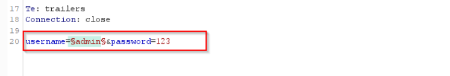

## Authentication vulnerabilities


### [Username enumeration via different responses](https://portswigger.net/web-security/authentication/password-based/lab-username-enumeration-via-different-responses)

**Goal** :  login into the website by brute-force usernames and passwords

-  go to the login page , submit any credentials , intercept the request, and send it to the intruder
-  select the value of username and click `add §`




- from options menu , load the [usernames ](https://portswigger.net/web-security/authentication/auth-lab-usernames)wordlist . 
- check the length of the response , you will notice that all similar lengths gives you invalid username except one with unique length gives you Incorrect password . this means that this user is exist (user enumeration)


- repeat these steps with value of password . load the [passwords](https://portswigger.net/web-security/authentication/auth-lab-passwords) wordlist and check the response lengths


- Only one response will have a `302` HTTP response status code, which means that the password is correct 


------


### [2FA simple bypass](https://portswigger.net/web-security/authentication/multi-factor/lab-2fa-simple-bypass)

**Goal** :  login into `carlos` account by bypassing 2FA

-  go to the login page ,submit your valid credentials `wiener:peter`,intercept the request and send it to the repeater
-  you will notice that when you enter : 
   - wrong credentials , it gives `Invalid username or password.`
   - valid credentials , it redirects to `/login2` and generate security code

-  click `Email client` to get the security code and login to your account
-  logout and login with `carlos:montoya` 
-  change the URL from `/login2` to `/my-account`


------


### [Password reset broken logic](https://portswigger.net/web-security/authentication/other-mechanisms/lab-password-reset-broken-logic)

**Goal** : reset Carlos's password then log in and access his "My account" page.

- go to the login page ,submit your valid credentials `wiener:peter`,intercept the request and send it to the repeater
- you will notice that when you enter : 

  - wrong credentials , it gives `Invalid username or password.`
  - valid credentials , it redirects to ` /my-account`
- logout and click forget password ,enter your username `peter` , go to **Email client** to get the password reset link

```apl
https://your-own.web-security-academy.net/forgot-password?temp-forgot-password-token=FiakmpwsOuDA1Ao6mrp6ivtJYuv3galm
```


- enter your new password and intercept the request , you will notice that the username is exist 
- change the value of username to `carlos` and login with the new carlos 's password
  NOTE : you can delete the token from the request ,that means you can reset the password without any token


------


### [Username enumeration via subtly different responses](https://portswigger.net/web-security/authentication/password-based/lab-username-enumeration-via-subtly-different-responses)

**Goal** :  login into the website by brute-force usernames and passwords

-  go to the login page ,submit any credentials ,intercept the request and send it to the intruder
-  select the value of username ,password and click `add §`
-  choose attack type `cluster bomb`  because now we have two payloads


- from options menu , load the [usernames ](https://portswigger.net/web-security/authentication/auth-lab-usernames) and  [passwords](https://portswigger.net/web-security/authentication/auth-lab-passwords) wordlists . 


- All responses will give an `invalid username or password`, except only one response will have a `302` HTTP response status code, which means that the username and password are correct


------
