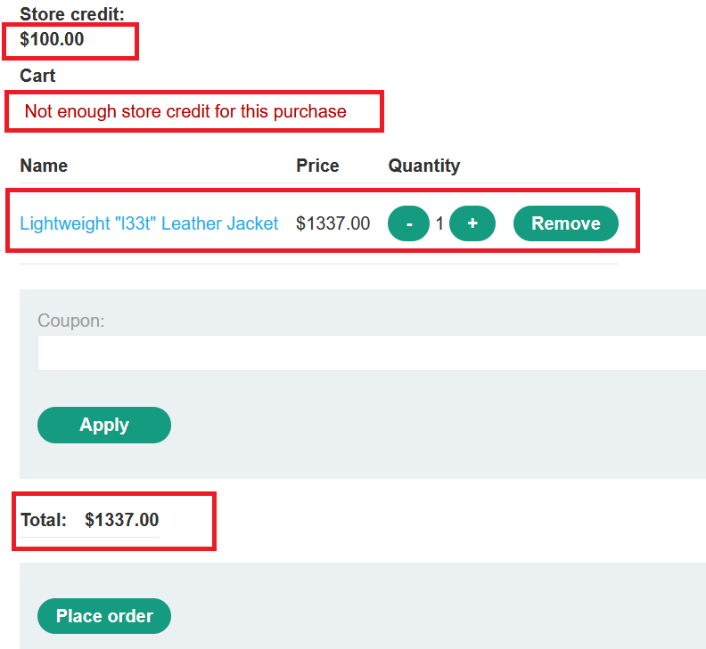

# Business logic


### [Excessive trust in client-side controls](https://portswigger.net/web-security/logic-flaws/examples/lab-logic-flaws-excessive-trust-in-client-side-controls)

Goal : buy a "Lightweight l33t leather jacket".

- login with your credentials `wiener : peter`
- add `Lightweight "l33t" Leather Jacket` to your cart
- try to checkout the order and you will get `Not enough store credit for this purchase` because you only have `$100.00`




- notice that the request has the price in the request and it didn't perform any validation in the backend , so you can change the price to any value


- send the request ,follow redirections and continue the confirmation 
  ```http
  GET /cart/order-confirmation?order-confirmed=true HTTP/1.1
  ```

  


------


### [High-level logic vulnerability](https://portswigger.net/web-security/logic-flaws/examples/lab-logic-flaws-high-level)

Goal : buy a "Lightweight l33t leather jacket".

- login with your credentials `wiener : peter`
- add any product to your cart 
- open the request in burp and change the quantity to negative value


- add `Lightweight l33t leather jacket` to your cart

  


- notice that when you increase the other product quantity the price increses


- you can confirm the checkout now


------


### [Low-level logic flaw](https://portswigger.net/web-security/logic-flaws/examples/lab-logic-flaws-low-level)

Goal : buy a "Lightweight l33t leather jacket".

- login with your credentials `wiener : peter`
- add `Lightweight "l33t" Leather Jacket` to your cart
- notice that the maximum quantity you can add in one request is 99


- Send the request to Burp Intruder , click `clear § `  
- Go to payloads tab , choose `Null payloads` , from `payloads options` choose `continue indefinitely` .**This will essentially allow us to repeat our same request in bulk a certain, or infinite, number of times.**
- click `start attack` , keep refreshing the `cart` page and keep your eyes on the `total price` 
- we have now added a ton of items to the cart, and cause the Total Price to return a negative value.


- the total price became negative because it exceeded the max allowed integer number , to make it clear let's explain this with c++ code


```c++
unsigned  int x = 0 , y = 0 , z=0;
x = pow(2,32)-1;
y = 1;
cout<<"X = "<<x<<endl<<"Y  = "<<y<<endl<<"X + Y = "<<x+y<<endl<<endl;

int a = 0 , b = 0 , c=0;
a = pow(2,31)-1;
b = 1;
cout<<"A = "<<a<<endl<<"B  = "<<b<<endl<<"A + B = "<<a+b<<endl;
    
OUTPUT :     
X = 4294967295
Y  = 1
X + Y = 0

A = 2147483647
B  = 1
A + B = -2147483648

```


In most programming languages, integer values are usually allocated a certain number of bits in memory. For example, space reserved for a 32-bit integer data type may store an unsigned integer between 0 and 4,294,967,295 or a signed integer between −2,147,483,648 and 2,147,483,647. In the case of signed integers, the most significant (first) bit usually signifies whether the integer is a positive value or a negative value.

However, what happens when you perform the calculation *4,294,967,295 + 1* and attempt to store the result that is greater than the maximum value for the integer type? It depends completely on the language and the compiler. For the above example, the result is most often 0.

Results can be even more unexpected for signed integers. When you go above the maximum value of the signed integer, the result usually becomes a negative number. For example, *2,147,483,647 +1* is usually *−2,147,483,648*. When you go below the minimum value (underflow), the result usually becomes a positive number. For example, *−2,147,483,648* − 1 is usually *2,147,483,647.*


------


- Clear your cart , add any other product to your cart 


- Create the same Intruder attack again, go to payloads tab , choose `Null payloads` , from `payloads options`  choose to generate exactly `323` payloads. 

  

  >The total sum of $ have to be bigger than max integer, which validates this field. Looks like it's 4-byte Int, but last two signs are dedicated to cents, so the amount of $ you need "to cross over" is more than 42 949 672.95 As each our payloads are worth of $1337*99 = $132 363 to cross the border you need to perform 42 949 672.95/132 363 = 324.48.. attacks. so, he started from he first one and added 323 on top and boom, the total sum overflowed 


- Use Burp Repeater to add a suitable quantity of another item to your cart so that the total falls between $0 and $100.


- click `place order` to buy the jacket


------


### [Inconsistent handling of exceptional input](https://portswigger.net/web-security/logic-flaws/examples/lab-logic-flaws-inconsistent-handling-of-exceptional-input)

Goal :  access the admin panel and delete Carlos.

- register a new account with any username , password but the email should be `anything@<your-exploit-server.web-security-academy.net>`

- if you go to `/admin` ,you will get 
  ```
  Admin interface only available if you logged in as a DontWannaCry user
  ```

- so , you should login with an email that ends with  `@dontwannacry.com ` , but if try to login with , for example , user@dontwannacry.com you will not receive the confirmation email because it should be @<your-exploit-server.web-security-academy.net>

- after several tries , i noticed that when i logged in with long email , the email has been cropped to 258 character

  ```
  // it was 269 char
  thisshouldbeverylongemailthisshouldbeverylongemailthisshouldbeverylongemailthisshouldbeverylongemailthisshouldbeverylongemailthisshouldbeverylongemailthisshouldbeverylongemailthisshouldbeverylongemail@exploit-0a3000cb04bf7e6dc00cbf2a01310025.web-security-academy.net
  
  // but it has been cropped to 258 char
  thisshouldbeverylongemailthisshouldbeverylongemailthisshouldbeverylongemailthisshouldbeverylongemailthisshouldbeverylongemailthisshouldbeverylongemailthisshouldbeverylongemailthisshouldbeverylongemail@exploit-0a3000cb04bf7e6dc00cbf2a01310025.web-security-
  ```

  

  

  

- so, you need to login with an email that ends with `@dontwannacry.com` at the position 258th and also you should append your exploit server mail to receive the confirmation mail

-  the final email which i used is 

  ```
  thisshouldbeverylongemailthisshouldbeverylongemailthisshouldbeverylongemailthisshouldbeverylongemailthisshouldbeverylongemailthisshouldbeverylongemailthisshouldbeverylongemailthisshouldbeverylongemailthisshouldbeverylongemailkhvkhvakavjfv@dontwannacry.com.exploit-0a3000cb04bf7e6dc00cbf2a01310025.web-security-academy.net
  ```

- notice that after truncation the mail ends with `@dontwannacry.com`


- go to the admin panel and delete `carlos`


------


### [Inconsistent security controls](https://portswigger.net/web-security/logic-flaws/examples/lab-logic-flaws-inconsistent-security-controls)

Goal : access the admin panel and delete Carlos.

- register a new account with any username , password but the email should be `anything@<your-exploit-server.web-security-academy.net>`

- go to `/admin` and you will get 

  ```
  Admin interface only available if logged in as a DontWannaCry user 
  ```

- update your email to `anything@dontwannacry.com`

- click `update email`

- go to the admin panel and delete `carlos`


------


### [Weak isolation on dual-use endpoint](https://portswigger.net/web-security/logic-flaws/examples/lab-logic-flaws-weak-isolation-on-dual-use-endpoint)

Goal : access the `administrator` account and delete Carlos.

- login with your credentials `wiener : peter`

- if you go to `/admin` ,you will get 
  ```
  Admin interface only available if logged in as an administrator 
  ```

- try to change you password and notice the request

- send the request to burp repeater

- remove `current-password` parameter from the request and send it

- notice that it accepts the request because the you can submit the form with not completing all mandatory input fields and there is no validation in the server side


- logout and login with the administrator account
- go to the admin panel and delete `carlos`


------


### [Insufficient workflow validation](https://portswigger.net/web-security/logic-flaws/examples/lab-logic-flaws-insufficient-workflow-validation)

Goal : buy a "Lightweight l33t leather jacket".

- login with your credentials `wiener : peter`

- add any product less than `$100` to your cart

- notice requests in burp history
  `POST /cart/checkout`  => performs validation (your cart is not empty & you have enough money)

  `GET /cart/order-confirmation?order-confirmed=true`  => doesn't perform validation again

- send the confirmation request `GET /cart/order-confirmation?order-confirmed=true` to burp repeater

- add `Lightweight "l33t" Leather Jacket` to your cart

- send the  confirmation request from burp repeater 


------


### [Authentication bypass via flawed state machine](https://portswigger.net/web-security/logic-flaws/examples/lab-logic-flaws-authentication-bypass-via-flawed-state-machine)

Goal : bypass the lab's authentication, access the admin interface, and delete Carlos.

- login with your credentials `wiener : peter`

- if you go to `/admin` ,you will get 

  ```
  Admin interface only available if logged in as an administrator 
  ```

- notice that there is no difference if you choose user role or content author role

- turn on burp intercept 

- login with your credentials `wiener : peter`

- forward the request `POST /login HTTP/1.1`

- drop the next request `GET /role-selector HTTP/1.1`


- turn off burp intercept and click back button in the browser


- you didn't set your role , so you got the default role as an administrator !
- go to the admin panel and delete `carlos`


------


### [Flawed enforcement of business rules](https://portswigger.net/web-security/logic-flaws/examples/lab-logic-flaws-flawed-enforcement-of-business-rules)

Goal: buy a "Lightweight l33t leather jacket".

- login with your credentials `wiener : peter`
- go to home page 
- enter any email at the form in the bottom and you will get `Use coupon SIGNUP30 at checkout!`
- go to your cart
- notice that you can use another coupon `New customers use code at checkout: NEWCUST5`
- if you try to use the same coupon again in a row , you will get `Coupon already applied`
- you should apply one coupon and apply the other then repeat untill you can buy the jacket

  


------


### [Infinite money logic flaw](https://portswigger.net/web-security/logic-flaws/examples/lab-logic-flaws-infinite-money)

Goal : buy a "Lightweight l33t leather jacket".

- login with your credentials `wiener : peter`
- go to `home`  and add`gift card` to your cart
- go to home page 
- enter any email at the form in the bottom and you will get `Use coupon SIGNUP30 at checkout!`
- go to `/cart` and apply the coupon 


- click `place order` to buy it


- go to `My account`  , enter the gift code and click `Redeem`
- notice that the `Store credit ` became **$103.00** not **$93.00** , so this process has added `$3` to your store credit

- Because there are no limits to the number of times we can place an order with this code, we can place multiple orders and make $3 off of each transaction.

  To do this, we’ll configure a Burp Suite macro that will add the gift card to our cart, apply the coupon, check out, retrieve the gift card code, apply it to our account, and then use that money to repeat the process.

  i copied the macro setup from their lab writeup.

- Go to "Project options" > "Sessions". In the "Session handling rules" panel, click "Add". The "Session handling rule editor" dialog opens.

- In the dialog, go to the "Scope" tab. Under "URL Scope", select "Include all URLs".

- Go back to the "Details" tab. Under "Rule actions", click "Add" > "Run a macro". Under "Select macro", click "Add" again to open the Macro Recorder.

- Select the following sequence of requests:

  ```
  POST /cart
  POST /cart/coupon
  POST /cart/checkout
  GET /cart/order-confirmation?order-confirmed=true
  POST /gift-card
  ```

  Then, click "OK". The Macro Editor opens.

- In the list of requests, select `GET /cart/order-confirmation?order-confirmed=true`. Click "Configure item". In the dialog that opens, click "Add" to create a custom parameter. Name the parameter `gift-card` and highlight the gift card code at the bottom of the response. Click "OK" twice to go back to the Macro Editor.

- Select the `POST /gift-card` request and click "Configure item" again. In the "Parameter handling" section, use the drop-down menus to specify that the `gift-card` parameter should be derived from the prior response (response 4). Click "OK".

- In the Macro Editor, click "Test macro". Look at the response to `GET /cart/order-confirmation?order-confirmation=true` and note the gift card code that was generated. Look at the `POST /gift-card` request. Make sure that the `gift-card` parameter matches and confirm that it received a `302` response. Keep clicking "OK" until you get back to the main Burp window.


- Send the `GET /my-account` request to Burp Intruder. Use the "Sniper" attack type and clear the default payload positions.
- On the "Payloads" tab, select the payload type "Null payloads". Under "Payload options", choose to generate `500` payloads.
- Go to the "Resource pool" tab and add the attack to a resource pool with the "Maximum concurrent requests" set to `1`. Start the attack.
- When the attack finishes, you will have enough store credit to buy the jacket and solve the lab.


```

Admin interface only available if logged in as an administrator 
GET /role-selector HTTP/1.1
drop turn off back

x2vnuHbnyg
```

