## Proxies


- A web proxy/interception proxy is a tool that is used to capture, analyze and modify requests and responses exchanged between an HTTP client
  and a server.
- By intercepting HTTP/HTTPS requests and responses, a pentester can analyze and study the behaviour and functionality of a web application.
- Proxies are a fundamental component of web application penetration tests and will become one of your most trusted allies when assessing and testing web apps.
- The most popular and widely utilized web proxies used today are:
  - Burp Suite
  - OWASP ZAP


### Web Proxy vs Web Proxy Server

- It is important to distinguish between web proxies and proxy servers.
- A web proxy is used to intercept, analyze or modify HTTP/HTTPS requests sent between a client and server (Burp Suite or OWASP ZAP).
- A web proxy server is used to proxy internet traffic, filter specific traffic and optimize bandwidth (Squid Proxy).
- The next two illustrations will clarify this distinction.


### Web Proxy

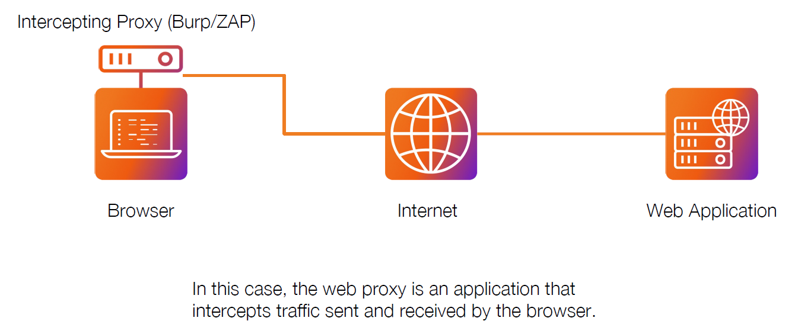


### Web Proxy Server

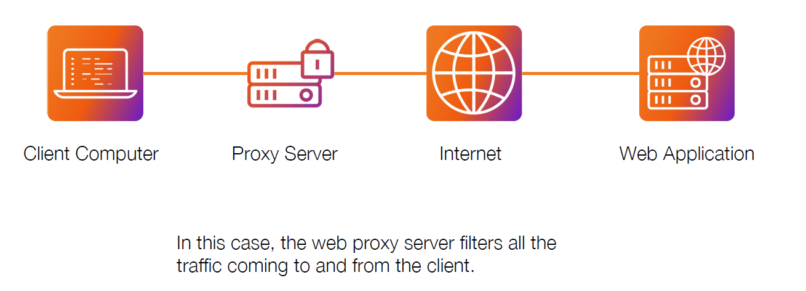


## Burpsite


**increase number of concurrent requests or delay between requests if there is a waf or for any reason**

Dashboard > setting > Resourse pool 


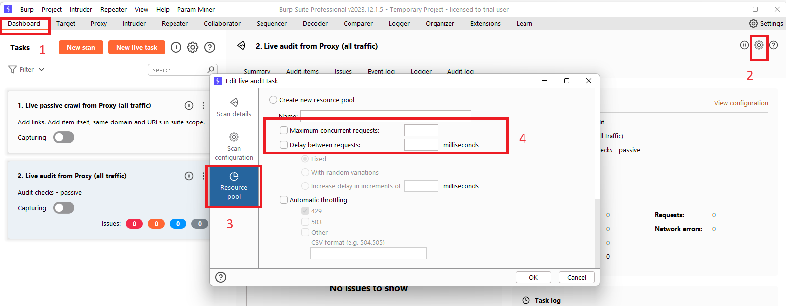


**Add target and its subdomains to scope** 

1- dashboard > enable passive crawler

2- target > scope setting > check `use advanced scope control` > add

Host or ip range:

```bash
.*\.domian\.com$
```

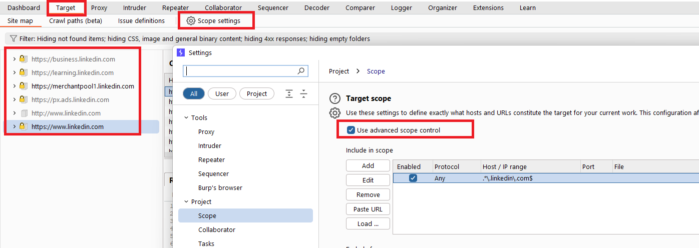


### Attack Types

The **Positions** tab of Burp Suite Intruder has a dropdown menu for selecting the attack type. Intruder offers four attack types, each serving a specific purpose. Let's explore each of them:

1. **Sniper**: The Sniper attack type is the default and most commonly used option. It cycles through the payloads, inserting one payload at a time into each position defined in the request. Sniper attacks iterate through all the payloads in a linear fashion, allowing for precise and focused testing.
2. **Battering ram**: The Battering ram attack type differs from Sniper in that it sends all payloads simultaneously, each payload inserted into its respective position. This attack type is useful when testing for race conditions or when payloads need to be sent concurrently.
3. **Pitchfork**: The Pitchfork attack type enables the simultaneous testing of multiple positions with different payloads. It allows the tester to define multiple payload sets, each associated with a specific position in the request. Pitchfork attacks are effective when there are distinct parameters that need separate testing.
4. **Cluster bomb**: The Cluster bomb attack type combines the Sniper and Pitchfork approaches. It performs a Sniper-like attack on each position but simultaneously tests all payloads from each set. This attack type is useful when multiple positions have different payloads, and we want to test them all together.

Each attack type has its advantages and is suitable for different testing scenarios. Understanding their differences helps us select the appropriate attack type based on the testing objectives.


###  Sniper

The **Sniper** attack type is the default and most commonly used attack type in Burp Suite Intruder. It is particularly effective for single-position attacks, such as password brute-force or fuzzing for API endpoints. In a Sniper attack, we provide a set of payloads, which can be a wordlist or a range of numbers, and Intruder inserts each payload into each defined position in the request.

Let's refer to our example template from before:

Example Positions


```http
POST /support/login/ HTTP/1.1
Host: 10.10.59.121
User-Agent: Mozilla/5.0 (X11; Ubuntu; Linux x86_64; rv:80.0) Gecko/20100101 Firefox/80.0
Accept: text/html,application/xhtml+xml,application/xml;q=0.9,image/webp,*/*;q=0.8
Accept-Language: en-US,en;q=0.5
Accept-Encoding: gzip, deflate
Content-Type: application/x-www-form-urlencoded
Content-Length: 37
Origin: http://10.10.59.121
Connection: close
Referer: http://10.10.59.121/support/login/
Upgrade-Insecure-Requests: 1

username=§pentester§&password=§Expl01ted§              
```

In this example, we have two positions defined for the `username` and `password` body parameters. In a Sniper attack, Intruder takes each payload from the payload set and substitutes it into each defined position in turn.

Assuming we have a wordlist with three words: `burp`, `suite`, and `intruder`, Intruder would generate six requests:

| Request Number | Request Body                           |
| -------------- | -------------------------------------- |
| 1              | `username=burp&password=Expl01ted`     |
| 2              | `username=suite&password=Expl01ted`    |
| 3              | `username=intruder&password=Expl01ted` |
| 4              | `username=pentester&password=burp`     |
| 5              | `username=pentester&password=suite`    |
| 6              | `username=pentester&password=intruder` |

Observe how Intruder starts with the first position (`username`) and substitutes each payload into it, then moves to the second position (`password`) and performs the same substitution with the payloads. The total number of requests made by Intruder Sniper can be calculated as `requests = numberOfWords * numberOfPositions`.

The Sniper attack type is beneficial when we want to perform tests with single-position attacks, utilizing different payloads for each position. It allows for precise testing and analysis of different payload variations.


###  Battering Ram

The **Battering ram** attack type in Burp Suite Intruder differs from Sniper in that it places the same payload in every position simultaneously, rather than substituting each payload into each position in turn.

Let's refer back to our previous example template:

Example Positions


```http
POST /support/login/ HTTP/1.1
    Host: 10.10.59.121
    User-Agent: Mozilla/5.0 (X11; Ubuntu; Linux x86_64; rv:80.0) Gecko/20100101 Firefox/80.0
    Accept: text/html,application/xhtml+xml,application/xml;q=0.9,image/webp,*/*;q=0.8
    Accept-Language: en-US,en;q=0.5
    Accept-Encoding: gzip, deflate
    Content-Type: application/x-www-form-urlencoded
    Content-Length: 37
    Origin: http://10.10.59.121
    Connection: close
    Referer: http://10.10.59.121/support/login/
    Upgrade-Insecure-Requests: 1
    
    username=§pentester§&password=§Expl01ted§              
```

Using the Battering Ram attack type with the same wordlist from before (`burp`, `suite`, and `intruder`), Intruder would generate three requests:

| Request Number | Request Body                          |
| -------------- | ------------------------------------- |
| 1              | `username=burp&password=burp`         |
| 2              | `username=suite&password=suite`       |
| 3              | `username=intruder&password=intruder` |

As shown in the table, each payload from the wordlist is inserted into every position for each request made. In a Battering Ram attack, the same payload is thrown at every defined position simultaneously, providing a brute-force-like approach to testing.

The Battering Ram attack type is useful when we want to test the same payload against multiple positions at once without the need for sequential substitution.


###  Pitchfork

The **Pitchfork** attack type in Burp Suite Intruder is similar to having multiple Sniper attacks running simultaneously. While Sniper uses one payload set to test all positions simultaneously, Pitchfork utilises one payload set per position (up to a maximum of 20) and iterates through them all simultaneously.

To better understand Pitchfork, let us revisit our brute-force example, but this time with two wordlists:

1. The first wordlist contains usernames: `joel`, `harriet`, and `alex`.
2. The second wordlist contains passwords: `J03l`, `Emma1815`, and `Sk1ll`.

We can use these two lists to perform a Pitchfork attack on the login form. Each request made during the attack would look like this:

| Request Number | Request Body                         |
| -------------- | ------------------------------------ |
| 1              | `username=joel&password=J03l`        |
| 2              | `username=harriet&password=Emma1815` |
| 3              | `username=alex&password=Sk1ll`       |

As shown in the table, Pitchfork takes the first item from each list and substitutes them into the request, one per position. It then repeats this process for the next request by taking the second item from each list and substituting it into the template. Intruder continues this iteration until one or all of the lists run out of items. It's important to note that Intruder stops testing as soon as one of the lists is complete. Therefore, in Pitchfork attacks, it is ideal for the payload sets to have the same length. If the lengths of the payload sets differ, Intruder will only make requests until the shorter list is exhausted, and the remaining items in the longer list will not be tested.

The Pitchfork attack type is especially useful when conducting credential-stuffing attacks or when multiple positions require separate payload sets. It allows for simultaneous testing of multiple positions with different payloads.


### Cluster Bomb

The **Cluster bomb** attack type in Burp Suite Intruder allows us to choose multiple payload sets, one per position (up to a maximum of 20). Unlike Pitchfork, where all payload sets are tested simultaneously, Cluster bomb iterates through each payload set individually, ensuring that every possible combination of payloads is tested.

To illustrate the Cluster bomb attack type, let's use the same wordlists as before:

- Usernames: `joel`, `harriet`, and `alex`.
- Passwords: `J03l`, `Emma1815`, and `Sk1ll`.

In this example, let's assume that we don't know which password belongs to which user. We have three users and three passwords, but the mappings are unknown. In this case, we can use a Cluster bomb attack to try every combination of values. The request table for our username and password positions would look like this:

| Request Number | Request Body                         |
| -------------- | ------------------------------------ |
| 1              | `username=joel&password=J03l`        |
| 2              | `username=harriet&password=J03l`     |
| 3              | `username=alex&password=J03l`        |
| 4              | `username=joel&password=Emma1815`    |
| 5              | `username=harriet&password=Emma1815` |
| 6              | `username=alex&password=Emma1815`    |
| 7              | `username=joel&password=Sk1ll`       |
| 8              | `username=harriet&password=Sk1ll`    |
| 9              | `username=alex&password=Sk1ll`       |

As shown in the table, the Cluster bomb attack type iterates through every combination of the provided payload sets. It tests every possibility by substituting each value from each payload set into the corresponding position in the request.

Cluster bomb attacks can generate a significant amount of traffic as it tests every combination. The number of requests made by a Cluster bomb attack can be calculated by multiplying the number of lines in each payload set together. It's important to be cautious when using this attack type, especially when dealing with large payload sets. Additionally, when using Burp Community and its Intruder rate-limiting, the execution of a Cluster bomb attack with a moderately sized payload set can take a significantly longer time.

The Cluster bomb attack type is particularly useful for credential brute-forcing scenarios where the mapping between usernames and passwords is unknown.


### Burp Macros

In this extra-mile exercise, we will tackle a more challenging variant of the credential-stuffing attack we previously performed. However, this time, additional measures have been implemented to make brute-forcing more difficult. If you are comfortable using Burp Macros, you can attempt this challenge without the instructions below. Otherwise, let's proceed with the step-by-step approach.

#### Catching the Request

Begin by capturing a request to `http://10.10.59.121/admin/login/` and reviewing the response. Here is an example of the response:

Example Response

``

```http
HTTP/1.1 200 OK
Server: nginx/1.18.0 (Ubuntu)
Date: Fri, 20 Aug 2021 22:31:16 GMT
Content-Type: text/html; charset=utf-8
Connection: close
Set-Cookie: session=eyJ0b2tlbklEIjoiMzUyNTQ5ZjgxZDRhOTM5YjVlMTNlMjIzNmI0ZDlkOGEifQ.YSA-mQ.ZaKKsUnNsIb47sjlyux_LN8Qst0; HttpOnly; Path=/
Vary: Cookie
Front-End-Https: on
Content-Length: 3922
---
<form method="POST">
    <div class="form-floating mb-3">
        <input class="form-control" type="text" name=username  placeholder="Username" required>
        <label for="username">Username</label>
    </div>
    <div class="form-floating mb-3">
        <input class="form-control" type="password" name=password  placeholder="Password" required>
        <label for="password">Password</label>
    </div>
    <input type="hidden" name="loginToken" value="84c6358bbf1bd8000b6b63ab1bd77c5e">
    <div class="d-grid"><button class="btn btn-warning btn-lg" type="submit">Login!</button></div>
</form>
```

In this response, we notice that alongside the username and password fields, there is now a session cookie set, as well as a CSRF (**Cross-Site Request Forgery**) token in the form as a hidden field. Refreshing the page reveals that both the **session** cookie and the **loginToken** change with each request. This means that for every login attempt, we need to extract valid values for both the session cookie and the loginToken.

To accomplish this, we will use **Burp Macros** to define a repeated set of actions (macro) to be executed before each request. This macro will extract unique values for the session cookie and loginToken, replacing them in every subsequent request of our attack.

#### Tutorial

1. Navigate to `http://10.10.59.121/admin/login/`. Activate **Intercept** in the Proxy module and attempt to log in. Capture the request and send it to Intruder.

2. Configure the positions the same way as we did for brute-forcing the support login:

   - Set the attack type to "Pitchfork".
   - Clear all predefined positions and select only the username and password form fields. Our macro will handle the other two positions.
   - 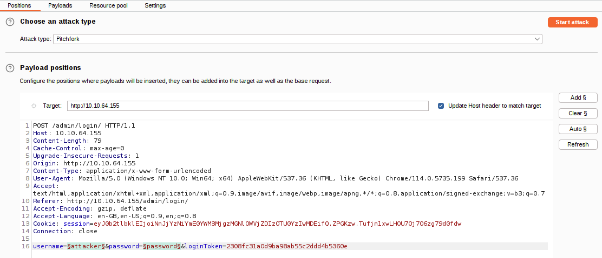

3. Now switch over to the Payloads tab and load in the same username and password wordlists we used for the support login attack.

   Up until this point, we have configured Intruder in almost the same way as our previous credential stuffing attack; this is where things start to get more complicated.

4. With the username and password parameters handled, we now need to find a way to grab the ever-changing loginToken and session cookie. Unfortunately, "recursive grep" won't work here due to the redirect response, so we can't do this entirely within Intruder – we will need to build a macro.

   Macros allow us to perform the same set of actions repeatedly. In this case, we simply want to send a GET request to `/admin/login/`.

   Fortunately, setting this up is a straightforward process.

   - Switch over to the main "Settings" tab at the top-right of Burp.
   - Click on the "Sessions" category.
   - Scroll down to the bottom of the category to the "Macros" section and click the **Add** button.
   - The menu that appears will show us our request history. If there isn't a GET request to `http://10.10.59.121/admin/login/` in the list already, navigate to this location in your browser, and you should see a suitable request appear in the list.
   - With the request selected, click **OK**.
   - Finally, give the macro a suitable name, then click **OK** again to finish the process.

   There are a lot of steps here, comparatively speaking, so the following GIF shows the entire process:

   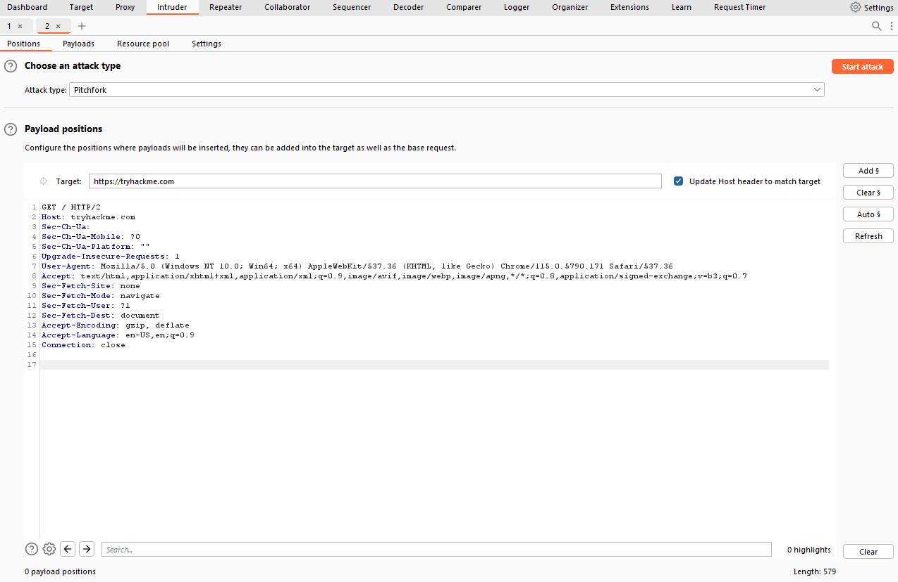

5. Now that we have a macro defined, we need to set Session Handling rules that define how the macro should be used.

   - Still in the "Sessions" category of the main settings, scroll up to the "Session Handling Rules" section and choose to **Add** a new rule.

   - A new window will pop up with two tabs in it: "Details" and "Scope". We are in the Details tab by default.

   - 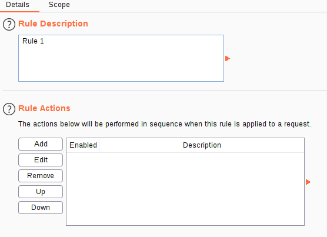

   - Fill in an appropriate description, then switch to the Scope tab.

   - In the "Tools Scope" section, deselect every checkbox other than Intruder – we do not need this rule to apply anywhere else.

   - In the "URL Scope" section, choose "Use suite scope"; this will set the macro to only operate on sites that have been added to the global scope (as was discussed in [Burp Basics](https://tryhackme.com/room/burpsuitebasics)). If you have not set a global scope, keep the "Use custom scope" option as default and add `http://10.10.59.121/` to the scope in this section.

     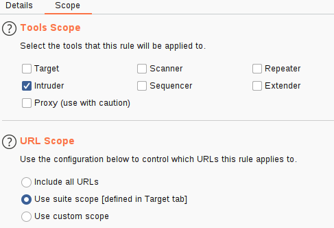

6. Now we need to switch back over to the Details tab and look at the "Rule Actions" section.

   - Click the **Add** button – this will cause a dropdown menu to appear with a list of actions we can add.
   - Select "Run a Macro" from this list.
   - In the new window that appears, select the macro we created earlier.

   As it stands, this macro will now overwrite all of the parameters in our Intruder requests before we send them; this is great, as it means that we will get the loginTokens and session cookies added straight into our requests. That said, we should restrict which parameters and cookies are being updated before we start our attack:

   - Select "Update only the following parameters and headers", then click the **Edit** button next to the input box below the radio button.
   - In the "Enter a new item" text field, type "loginToken". Press **Add**, then **Close**.
   - Select "Update only the following cookies", then click the relevant **Edit** button.
   - Enter "session" in the "Enter a new item" text field. Press **Add**, then **Close**.
   - Finally, press **OK** to confirm our action.

   The following GIF demonstrates this final stage of the process:

   

7. Click **OK**, and we're done!

8. You should now have a macro defined that will substitute in the CSRF token and session cookie. All that's left to do is switch back to Intruder and start the attack!

   **Note:** You should be getting 302 status code responses for every request in this attack. If you see 403 errors, then your macro is not working properly.

9. As with the support login credential stuffing attack we carried out, the response codes here are all the same (302 Redirects). Once again, order your responses by length to find the valid credentials. Your results won't be quite as clear-cut as last time – you will see quite a few different response lengths: however, the response that indicates a successful login should still stand out as being significantly shorter.

10. Use the credentials you just found to log in (you may need to refresh the login page before entering the credentials).


### Decoder

#### Hashing in Decoder

Decoder allows us to create hashsums for data directly within Burp Suite; it operates similarly to the encoding/decoding options we discussed earlier. Specifically, we click on the **Hash** dropdown menu and select an algorithm from the list:

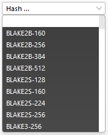

**Note:** This list is significantly longer than the encoding/decoding algorithms – it's worth scrolling through to see the many available hashing algorithms.

Continuing with our earlier example, let's enter "MD5sum" into the input box, then scroll down the list until we find "MD5". Applying this automatically takes us into the Hex view:

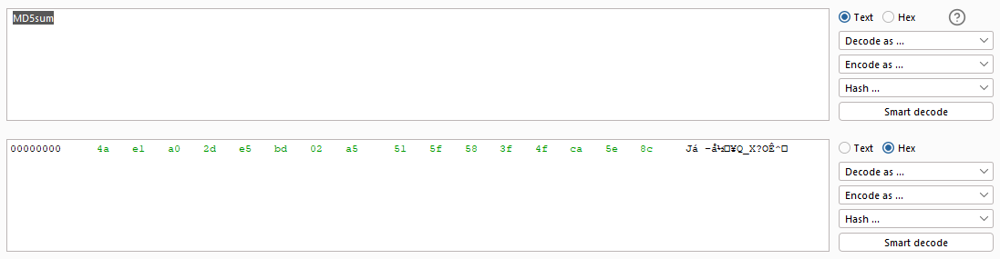

A hashing algorithm's output does not yield pure ASCII/Unicode text. Hence, it's customary to convert the algorithm's output into a hexadecimal string; this is the "hash" form you might be familiar with.

Let's complete this by applying an "ASCII Hex" encoding to the hashsum to create the neat hex string from our initial example.

Here's the full process:

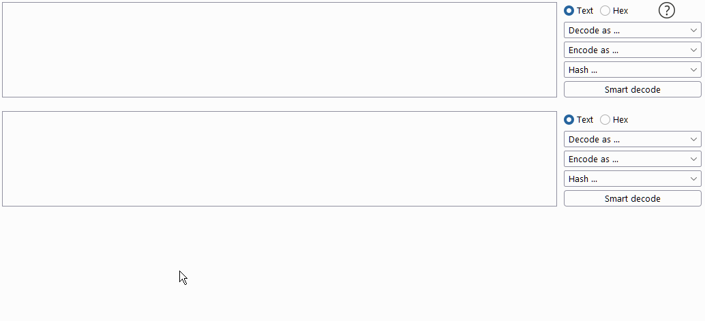


### Comparer

Comparer, as the name implies, lets us compare two pieces of data, either by ASCII words or by bytes.

Let's first check out the interface:

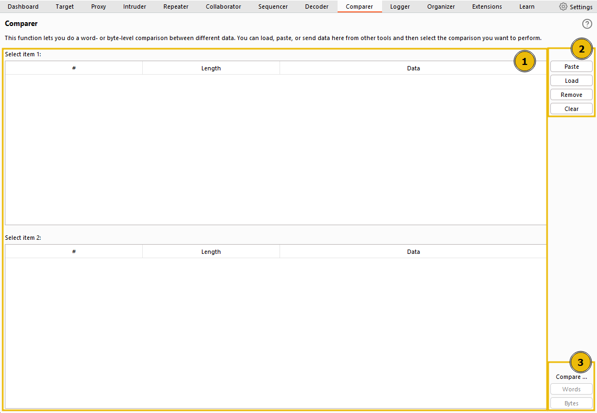

The interface can be divided into three main sections:

1. On the left, we see the items to be compared. When we load data into Comparer, it appears as rows in these tables. We select two datasets to compare.
2. On the upper right, we have options for pasting data from the clipboard (Paste), loading data from a file (Load), removing the current row (Remove), and clearing all datasets (Clear).
3. Lastly, on the lower right, we can choose to compare our datasets by either words or bytes. It doesn't matter which of these buttons you select initially because this can be changed later. These are the buttons we click when we're ready to compare the selected data.

Just like most Burp Suite modules, we can also load data into Comparer from other modules by right-clicking and choosing **Send to Comparer**.

Once we've added at least 2 datasets to compare and press on either **Words** or **Bytes**, a pop-up window shows us the comparison:

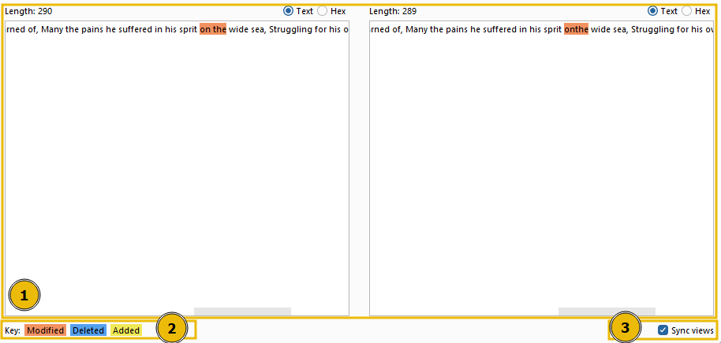

This window also has three distinct sections:

1. The compared data occupies most of the window; it can be viewed in either text or hex format. The initial format depends on whether we chose to compare by words or bytes in the previous window, but this can be overridden by using the buttons above the comparison boxes.
2. The comparison key is at the bottom left, showing which colors represent modified, deleted, and added data between the two datasets.
3. The **Sync views** checkbox is at the bottom right of the window. When selected, it ensures that both sets of data will sync formats. In other words, if you change one of them into Hex view, the other will adjust to match.

The window title displays the total number of differences found.


### Sequencer

Sequencer allows us to evaluate the entropy, or randomness, of "tokens". Tokens are strings used to identify something and should ideally be generated in a cryptographically secure manner. These tokens could be session cookies or **C**ross-**S**ite **R**equest **F**orgery (CSRF) tokens used to protect form submissions. If these tokens aren't generated securely, then, in theory, we could predict upcoming token values. The implications could be substantial, for instance, if the token in question is used for password resets.

Let's start by looking at the Sequencer interface:

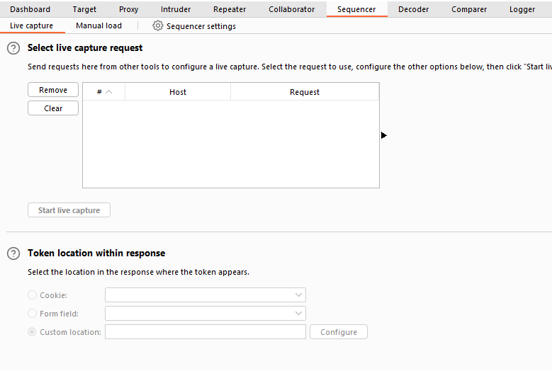

We have two main ways to perform token analysis with Sequencer:

- **Live Capture**: This is the more common method and is the default sub-tab for Sequencer. Live capture lets us pass a request that will generate a token to Sequencer for analysis. For instance, we might want to pass a POST request to a login endpoint to Sequencer, knowing that the server will respond with a cookie. With the request passed in, we can instruct Sequencer to start a live capture. It will then automatically make the same request thousands of times, storing the generated token samples for analysis. After collecting enough samples, we stop the Sequencer and allow it to analyze the captured tokens.
- **Manual Load**: This allows us to load a list of pre-generated token samples directly into Sequencer for analysis. Using Manual Load means we don't need to make thousands of requests to our target, which can be noisy and resource-intensive. However, it does require that we have a large list of pre-generated tokens.


In the "Token Location Within Response" section, we can select between **Cookie**, **Form field**, and **Custom location**. Since we're testing the loginToken in this case, select the "Form field" radio button and choose the loginToken from the dropdown menu:

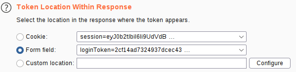

In this situation, we can safely leave all other options at their default values. So, click on the **Start live capture** button.

A new window will pop up indicating that a live capture is in progress and displaying the number of tokens captured so far. Wait until a sufficient number of tokens are captured (approximately 10,000 should suffice); the more tokens we have, the more precise our analysis will be.

Once around 10,000 tokens are captured, click on **Pause** and then select the **Analyze now** button:

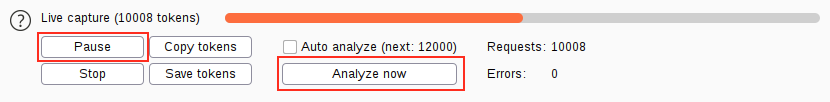

It's important to note that we could have also chosen to **Stop** the capture. However, by opting to pause, we keep the option to resume the capture later if the report doesn't have enough samples to accurately calculate the token's entropy.

If we wished for periodic updates on the analysis, we could have also selected the "Auto analyze" checkbox. This option tells Burp to perform the entropy analysis after every 2000 requests, providing frequent updates that will become increasingly accurate as more samples are loaded into Sequencer.

At this point, it's also worth noting that we could choose to copy or save the captured tokens for further analysis at a later time.

Upon clicking the **Analyze now** button, Burp will analyze the token's entropy and generate a report.


The generated entropy analysis report is split into four primary sections. The first of these is the **Summary** of the results. The summary gives us the following:

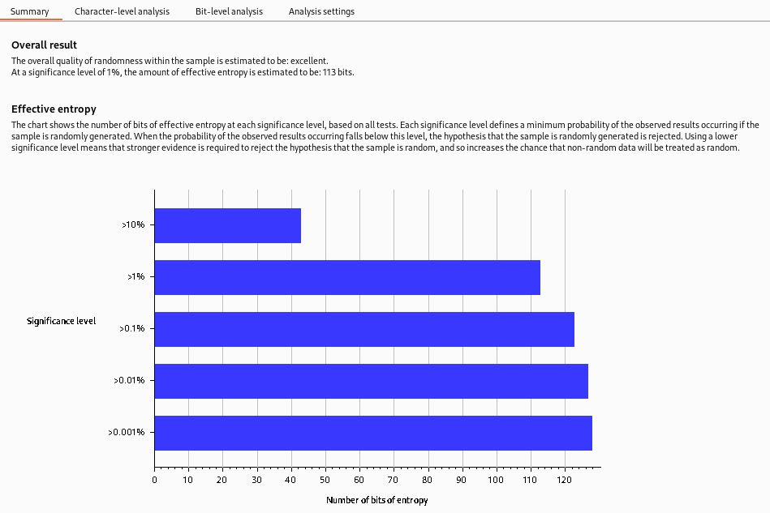

- **Overall result**: This gives a broad assessment of the security of the token generation mechanism. In this case, the level of entropy indicates that the tokens are likely securely generated.
- **Effective entropy**: This measures the randomness of the tokens. The effective entropy of 117 bits is relatively high, indicating that the tokens are sufficiently random and, therefore, secure against prediction or brute force attacks.
- **Reliability**: The significance level of 1% implies that there is 99% confidence in the accuracy of the results. This level of confidence is quite high, providing assurance in the accuracy of the effective entropy estimation.
- **Sample**: This provides details about the token samples analyzed during the entropy testing process, including the number of tokens and their characteristics.

While the summary report often provides enough information to assess the security of the token generation process, it's important to remember that further investigation may be necessary in some cases. The character-level and bit-level analysis can provide more detailed insights into the randomness of the tokens, especially when the summary results raise potential concerns.

While the entropy report can provide a strong indicator of the security of the token generation mechanism, there needs to be more definitive proof. Other factors could also impact the security of the tokens, and the nature of probability and statistics means there's always a degree of uncertainty. That said, an effective entropy of 117 bits with a significance level of 1% suggests a robustly secure token generation process.


###  Organizer

The Organizer module of Burp Suite is designed to help you store and annotate copies of HTTP requests that you may want to revisit later. This tool can be particularly useful for organizing your penetration testing workflow. Here are some of its key features:

- You can store requests that you want to investigate later, save requests that you've already identified as interesting, or save requests that you want to add to a report later.

- You can send HTTP requests to Burp Organizer from other Burp Modules such as **Proxy** or **Repeater**. You can do this by right-clicking the request and selecting **Send to Organizer** or using the default hotkey `Ctrl + O`. Each HTTP request that you send to Organizer is a read-only copy of the original request saved at the point you sent it to Organizer.

  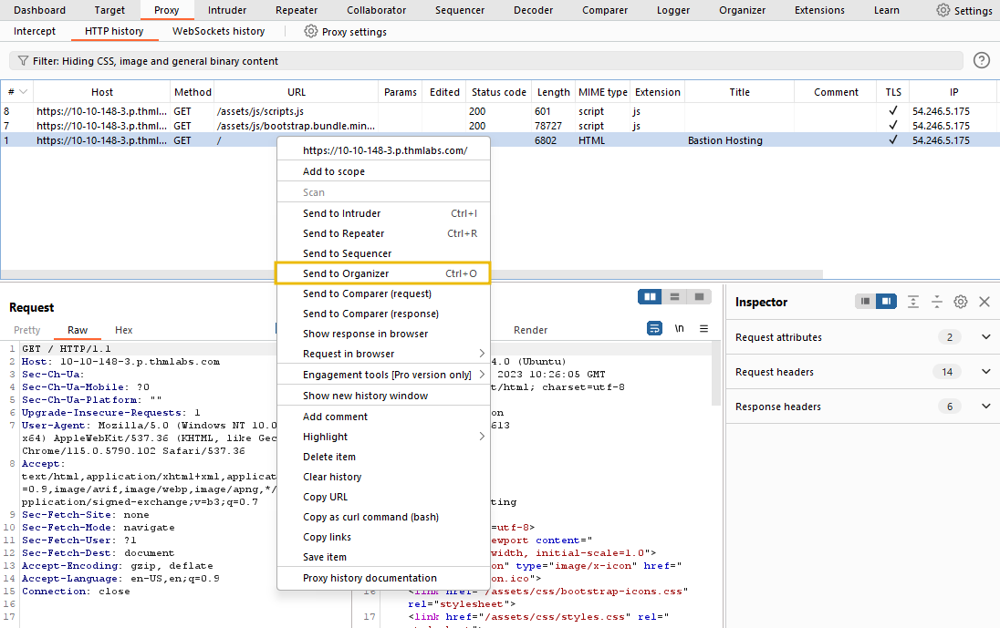

- Requests are stored in a table, which contains columns such as the request index number, the time the request was made, workflow status, Burp tool that the request was sent from, HTTP method, server hostname, URL file path, URL query string, number of parameters in the request, HTTP status code of the response, length of the response in bytes, and any notes that you have made.

  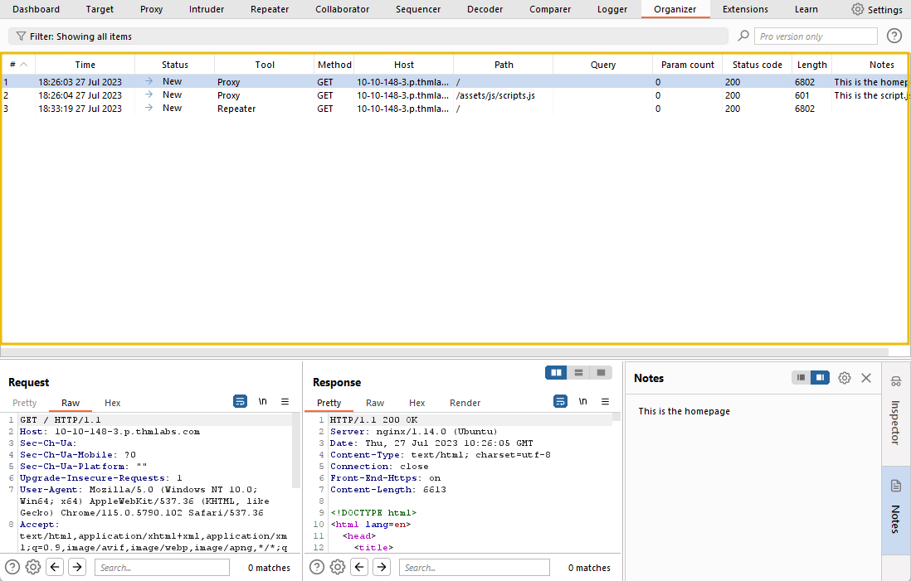

To view the request and response:

1. Click on any Organizer item.

2. The request and response are both read-only. You can search within the request or response, select the request, and then use the search bar below the request.

   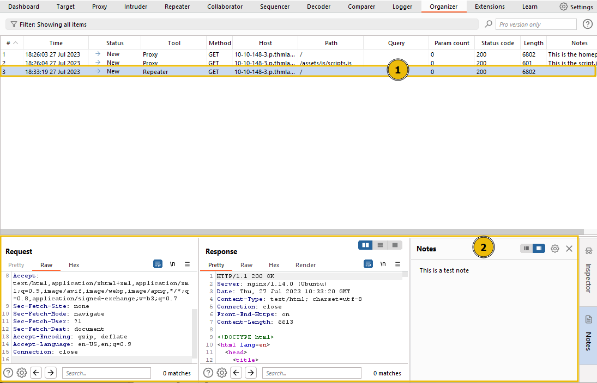


### Reference:

- https://tryhackme.com/room/burpsuiteintruder
- https://tryhackme.com/room/burpsuiteom
